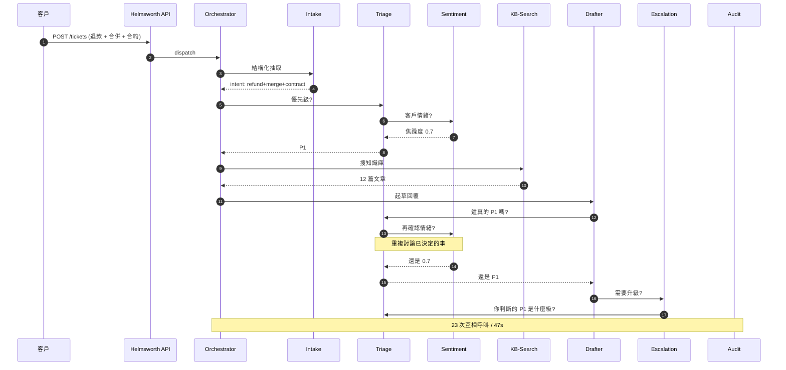
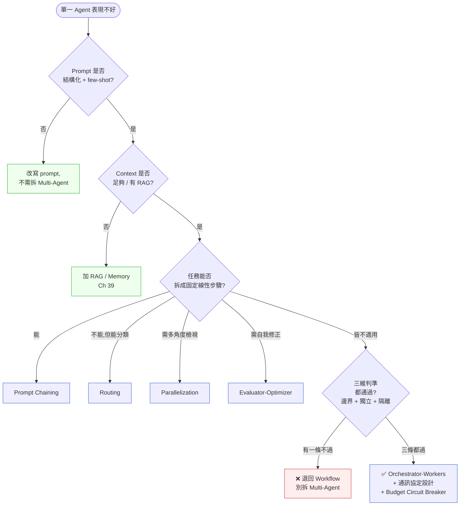

# 第 40 章|Multi-Agent 系統設計
## ⸺ 不是更多 Agent 解決問題,是更窄的 Agent 解決問題

> **前置閱讀**:[Ch 37 AI-Native 架構](./ch-37-ai-native-architecture.md)、[Ch 38 Context-Driven Engineering](./ch-38-context-driven-engineering.md)、[Ch 39 RAG / Memory / Tool](./ch-39-rag-memory-tool.md)
> **下游章節**:[Ch 41 Multi-Agent 共識、衝突與仲裁](./ch-41-multi-agent-consensus.md)、[Ch 44 AI Coding Agent](./ch-44-coding-agent.md)、[Ch 45 Eval、Drift 與 Red Team](./ch-45-ai-eval-drift-redteam.md)

---

## 40.1 冷觀察 ⸺ 七個 Agent 上線當天,P95 從 8 秒變 47 秒

我在 2026 年 2 月看過一個案例。

虛構 B2B SaaS 平台 **Helmsworth**(`CASE-SAS-009`),做中型企業的客戶運營(Customer Operations)整合,客戶含 SaaS、訂閱型媒體、線上教育三類,平台月活躍租戶約 3,400。技術棧:Python 3.13 + FastAPI + PostgreSQL 17 + Redis 7 + Anthropic Claude Sonnet 4.5,Agent 框架選的是 LangGraph 0.2。產品定位寫得很響亮 ⸺「**Multi-Agent 客戶成功平台**」⸺ 內部投影片畫了七個圓,每個圓是一個 Agent:**Intake / Triage / Sentiment / KB-Search / Resolution-Drafter / Escalation / Audit**。架構圖在 Pre-Series-B 投資人面前簡報過三次,每次都拿到正面回饋。

2026 年 1 月底,團隊把這套 Multi-Agent 工單回覆系統推上 production,取代原本「單一 Agent + RAG」的舊版。原本舊版的 P95 工單回覆時間是 8.2 秒,客戶滿意度(CSAT)穩定在 4.4 / 5.0。

上線當天,P95 從 8.2 秒飆到 47 秒,P99 衝到 90 秒以上(有些工單直接超時被丟掉)。客戶開始在 Slack Connect 頻道抱怨「機器人怎麼變慢了」。第三天,工程主管把 LangSmith 的 trace 拉出來看,發現一個工單的回覆,**七個 Agent 之間互相呼叫了 23 次**,其中有 9 次是 Sentiment Agent 跟 Triage Agent 在重複討論同一封信的優先級。第七天,QA 跑完抽樣 evaluation,**回覆品質分數從 0.81 掉到 0.56,「驢頭不對馬嘴」的比例從 4% 升到 31%**。

事故覆盤會上,CTO 把那張七個圓的架構圖再看一次,指著中間那條最粗的箭頭問了一句被原樣記下來的話:

> 「我們花三個月把單一 Agent 拆成七個,結果是慢三倍、爛兩倍。我們到底是在解決什麼問題?」

沒人答得出來。因為當初決定「拆成 Multi-Agent」的真正原因不是「業務邊界自然分成七塊」⸺ 而是 Q4 那場 Sprint 結束時,單一 Agent 對某類複雜工單(混合退款 + 帳號合併 + 合約條款釐清)的回覆品質一直壓不上去。團隊試了三輪 prompt tuning 沒解決,最後一場架構會議上有人提議「**乾脆拆成多個 Agent,讓各自專心做一件事**」⸺ 那一刻,Multi-Agent 從「解法選項之一」升格成「**唯一被討論的方向**」,沒人停下來問「prompt chaining、routing、parallelization 試過了嗎」。



那場覆盤會議的最後,工程主管在白板上寫了一行字,後來成了 Helmsworth 工程組的內部口號:

> 「我們以為 Multi-Agent 是『更多 Agent 解決問題』。它不是。它是『更窄的 Agent 解決問題』⸺ 而我們從來沒讓任何一個 Agent 變窄。」

刺耳的不是「拆錯了」,是 ⸺ 事故後的根因分析顯示,Helmsworth 同時碰到了**三種不同性質的失敗**,卻在架構會議上被混成同一個問題:

1. **效能失敗(P95 8s → 47s)**:根因是 Agent 之間的同步 Direct Call 串成了 23 跳,每跳都要等回傳。這本質上是 **coordination overhead + 沒有 circuit breaker**,跟「要不要用 Multi-Agent」是不同的問題 ⸺ 即使是設計良好的 Multi-Agent 系統,如果改用非同步 message queue + 嚴格 budget 上限,47s 是可以壓回去的。

2. **品質失敗(0.81 → 0.56)**:根因是七個 Agent 的 prompt **各自設計得不夠窄** ⸺ Triage Agent 和 Drafter Agent 各自對同一封工單做了獨立的「意圖判斷」,結論不一致卻沒有仲裁機制,導致 Drafter 起草時依賴的前提錯誤。這是 **Agent prompt 設計問題**,不是 Multi-Agent 架構本身的問題。如果每個 Agent 有明確的輸入 schema 並嚴格讀取前一個 Agent 已寫進 state 的結論(而非重新推理),品質降幅會小得多。

3. **工作流程失敗(Sentiment + Triage 重複討論優先級)**:那 9 次重複呼叫的根因是**兩個 Agent 的職責邊界未分清**。Sentiment 判情緒,Triage 判優先級 ⸺ 這本來可以是兩個獨立的 prompt chaining step,而非兩個互相查詢對方的 Agent。這是 **workflow 設計問題**,對應的解是讓 Sentiment 先執行、把情緒分數寫進 state,Triage 直接讀數字做決策,不需要問 Sentiment「你確定嗎」。

這三種失敗分別對應三個不同的修正方向。把它們混在一起說「Multi-Agent 拆錯了」是不精確的 ⸺ 準確的診斷是:**Helmsworth 在沒有工程把關的情況下同時犯了三個錯,任何一個單獨修正都只能解決部分問題**。他們確實不需要七個 Agent,但結論「Multi-Agent 本身是錯的」仍是過度推論 ⸺ 真正的問題是沒有走完判斷流程就動手。

Ch 37 的 NorthVale 是把 LLM 用錯地方;這一章的 Helmsworth 是把 Multi-Agent 拆錯時機。**錯位的不是工具,是判斷拆分時機的能力**。

---

## 40.2 真問題 ⸺ Multi-Agent 不是更多 Agent,是 Anthropic 的決定階梯

把 Helmsworth 的事拆開來看,問題不是 LangGraph 不夠好、也不是 Claude 不夠強 ⸺ 問題是團隊**跳過了 Anthropic 在 *Building Effective Agents* 裡反覆強調的核心原則**[^CIT-360]。Anthropic 在那篇文章裡說得很直接:**從最簡單可行的方案開始;只有當你已經嘗試更簡單的選項並能說清楚它為什麼不夠用時,才往更複雜的方向走**。把這個原則落地,可以排出下面這個從簡單到複雜的決定序列:

```
Augmented LLM     →  Workflow         →  Workflow            →  Workflow            →  Multi-Agent
                     (Prompt Chaining)   (Routing)              (Parallelization)      (Orchestrator-Workers)
                                                                                       (Evaluator-Optimizer)
                                                                                       (Autonomous)
─────────────────    ────────────────    ────────────────       ────────────────       ─────────────────
單一 LLM + 工具       線性串接固定步驟      條件分流到子流程         並行 + 投票/聚合         Agent 動態規劃流程
+ 記憶 + 檢索

確定性最高           確定性高              確定性中                 確定性中                 確定性最低
最便宜               便宜                  中等                     中等                     昂貴
```

**這個序列不是你必須依序走過的升級路徑。** 它是一份「排除清單」⸺ 你應該從左邊開始考慮,如果最左邊的選項已經足夠,就停在那裡,不管 Multi-Agent 聽起來多先進。只有在你能明確回答「**我試過 Prompt Chaining,它卡在 X;我試過 Routing,它卡在 Y;Parallelization 也不夠,因為 Z**」之後,Multi-Agent 才是合理的選項。

Anthropic 的原始文章甚至用更強烈的措辭:「Multi-Agent 架構帶來顯著的複雜度與成本,應該在更簡單的方案確實不夠用之後才採用。」[^CIT-360] 這不是謹慎的建議,是設計準則。Helmsworth 直接從 Augmented LLM 跳到 Orchestrator-Workers Multi-Agent,中間三級 Workflow 完全沒試過 ⸺ 換言之,他們的問題不是選錯了工具,是**連「應不應該選這個工具」這個問題都沒問過**。

要具體理解這個跳躍有多危險:如果 Helmsworth 當時走完排除清單,他們會在哪一格停下來?答案很可能是 Routing ⸺ 工單依類型分流(退款 / 合約 / 帳號合併),每條路走獨立的 Prompt Chaining。這不需要七個 Agent 互相溝通,只需要一個 Router LLM 跟三條固定子流程。品質問題會用「每條路的 prompt 針對該類型工單調校」解決,而不是靠 Agent 之間的協調。

### 40.2.1 為什麼「拆成 Multi-Agent」常常變成把問題搬家

把 Helmsworth 的真問題拆開來看,它不是「Multi-Agent 不好」⸺ 而是團隊把「單一 Agent 表現不好」當成了「應該拆成 Multi-Agent」的訊號。這兩件事之間沒有因果關係。

換句話說,單一 Agent 表現不好的真正原因有四種,每一種對應的解法都不是 Multi-Agent:

| 單一 Agent 表現不好的成因 | 對應正解 | 為什麼不是 Multi-Agent |
|---|---|---|
| **Prompt 寫得不夠結構化** | 改寫 prompt + few-shot examples | 拆成多個 Agent 等於把同樣的 prompt 問題複製七份 |
| **Context 不夠(缺知識來源)** | 加 RAG / Memory(Ch 39) | 拆成多個 Agent 不會憑空多出脈絡 |
| **任務在一次 LLM call 裡塞太多步驟** | Prompt Chaining 或 Routing(Workflow) | 線性 Workflow 比 Multi-Agent 簡單 80%,通常已經夠用 |
| **單次推理可信度不夠** | Evaluator-Optimizer Workflow | 用同一個 LLM 自己 evaluate 自己,不需要拆 Agent |

Helmsworth 的工單問題其實落在第三格 ⸺「混合退款 + 合併 + 合約」是三個獨立決策塞在一個 prompt 裡。**正確解法是 prompt chaining(三個 step 線性串接)或 routing(先分類再走專屬子流程),不是七個並行 Agent 互相溝通**。

### 40.2.2 真正在處理的是「責任邊界 + 上下文獨立性」

進一步拆開來看,Multi-Agent 真正適用的時機,本質上跟 DDD 的 Bounded Context 是同一回事:**當「責任邊界」明確、且「上下文相互獨立」時,才值得拆分**。

換句話說,Multi-Agent 的拆分不是「按任務 step 拆」⸺ 那是 Workflow 的工作。Multi-Agent 的拆分是「按**領域責任**拆」,每個 Agent 對應一塊**穩定的業務子域**,擁有自己的 context window、自己的工具集、自己的記憶,跨 Agent 的溝通**有限、結構化、低頻率**。

把這條判準套回 Helmsworth 那七個 Agent:Intake / Triage / Sentiment 三者其實是「同一個工單的三個面向」,**沒有獨立 context**(它們讀的都是同一封信);KB-Search / Drafter 是「先查再寫」,**是 Workflow 不是 Agent**;Escalation / Audit 倒是有獨立邊界(escalation 跨組織、audit 是合規領域),這兩塊勉強算合理拆分。換句話說,**七個 Agent 中只有兩個拆對了,其他五個應該是同一個 Agent 內部的 prompt chain**。

### 40.2.3 Multi-Agent 是進入更高複雜度的決定,不是省事的捷徑

很多團隊把 Multi-Agent 當成「**避開單一 Agent 的限制**」的捷徑,但 Anthropic 的觀察是反過來的:**Multi-Agent 是顯著拉高系統複雜度的決定**[^CIT-360]。具體的代價有四項,每一項都是事故風險:

1. **Coordination overhead**:Agent 之間要溝通(同步等待、訊息序列化、context 重組),延遲乘以 N。
2. **Token cost 倍增**:同一段 context 在多個 Agent 之間 broadcast,token 成本是單一 Agent 的 3–8 倍。
3. **失敗模式爆炸**:不只是「某個 Agent 失敗」,還有「Agent A 給 B 錯誤訊息」「兩個 Agent 對同一決策結論不同」「Agent 互相觸發無限迴圈」。
4. **可觀測性難度躍升**:trace 從「一條鏈」變「一張圖」,debug 從「看 prompt」變「看對話協議」。

Helmsworth 上線當天的 P95 從 8 秒變 47 秒,正是這四項代價同時出現的結果。換句話說,**Multi-Agent 是進入更高複雜度層級的決定,不是繞過單一 Agent 限制的捷徑**。對應到 Ch 1 的 S/M/L 模式,Multi-Agent 大致只在 L 級複雜度且確認低階模式都不夠用時才合理。

---

## 40.3 決策框架 ⸺ Anthropic 五模式、拆分判準、通訊協定

下面這幾張表跟兩張 Mermaid,在現場相當好用。它們的共同前提是:**Multi-Agent 不是預設選項,是排除其他選項後的最後一站**。

### 40.3.1 Anthropic 五種 Agentic 模式對照表

把 *Building Effective Agents* [^CIT-360] 的七種模式收斂成現場最常用的五種(Augmented LLM 是 Ch 37 的範圍,Autonomous 是 Ch 40 的範圍,本章聚焦中間五種):

| 模式 | 一句話定義 | 控制流誰決定 | 適用情境 | 不適用情境 |
|---|---|---|---|---|
| **Prompt Chaining** | 任務拆成固定線性步驟,前一步輸出餵下一步 | 開發者預先寫死 | 步驟順序穩定(摘要 → 翻譯 → 校對) | 步驟順序需依輸入動態決定 |
| **Routing** | 先分類輸入,再導向對應子流程 | 開發者寫 router + 預定義路徑 | 客服分流(技術 / 帳務 / 退款) | 分類本身需要多輪推理 |
| **Parallelization** | 同任務並行多次 + 投票 / 聚合 | 開發者預先決定平行度 | 多角度檢視(安全審查、多語翻譯) | 並行任務有強耦合 |
| **Orchestrator-Workers** | 主 Agent 動態拆解任務交給 Worker | LLM 在 runtime 決定 | 任務拆解依輸入而異(coding agent) | 子任務數量可預測 → 用 Workflow |
| **Evaluator-Optimizer** | Generator 產出 → Evaluator 給 feedback → 循環 | LLM 自我循環 | 有明確品質標準(翻譯、程式碼 review) | 沒有可量化的評分軸 |

這張表的關鍵在最後兩欄。**「不適用情境」比「適用情境」更重要** ⸺ 它告訴你什麼時候該降級到上一階。Helmsworth 那七個 Agent 應該降級成 Routing(先分類工單)+ Prompt Chaining(查 KB → 起草 → 檢查),完全不需要 Orchestrator-Workers 的拓樸。

### 40.3.2 五種模式的架構圖

```mermaid
flowchart TB
    subgraph PC[Prompt Chaining · 線性確定]
        direction LR
        Pa[LLM Step 1]:::cold --> Pb[LLM Step 2]:::cold --> Pc[LLM Step 3]:::cold
    end

    subgraph RT[Routing · 條件分流]
        direction LR
        Ra[Router LLM]:::cold --> Rb[Path A]:::cold
        Ra --> Rc[Path B]:::cold
        Ra --> Rd[Path C]:::cold
    end

    subgraph PR[Parallelization · 並行投票]
        direction LR
        Pra[Splitter]:::cold --> Prb[LLM A]:::cold
        Pra --> Prc[LLM B]:::cold
        Pra --> Prd[LLM C]:::cold
        Prb --> Pre[Aggregator]:::cold
        Prc --> Pre
        Prd --> Pre
    end

    subgraph OW[Orchestrator-Workers · 動態規劃]
        direction LR
        Oa[Orchestrator LLM]:::hot --> Ob[Worker 1]:::cold
        Oa --> Oc[Worker 2]:::cold
        Oa --> Od[Worker N]:::cold
        Ob --> Oa
        Oc --> Oa
        Od --> Oa
    end

    subgraph EO[Evaluator-Optimizer · 自我循環]
        direction LR
        Ea[Generator LLM]:::cold --> Eb[Evaluator LLM]:::cold
        Eb -.feedback.-> Ea
        Eb --> Ec[Output]:::goal
    end

    classDef hot fill:#fee,stroke:#c33
    classDef cold fill:#eef,stroke:#36c
    classDef goal fill:#efe,stroke:#3a3
```



**這張圖的關鍵在顏色分布**。前三種模式(Prompt Chaining / Routing / Parallelization)整張圖都是 cold(藍),代表**控制流是確定性的** ⸺ 開發者寫死了拓樸,LLM 只在節點內推理。Orchestrator-Workers 中間那塊是 hot(紅),代表**Orchestrator 在 runtime 動態決定要派幾個 Worker、做什麼任務**,這是真正的 Agentic 行為,也是複雜度躍升的位置。Evaluator-Optimizer 雖然有迴圈,但兩邊都是 cold ⸺ 因為迴圈本身是預先寫死的(while quality < threshold)。

### 40.3.3 Agent 拆分三維判準

當判斷「這次該不該拆成 Multi-Agent」時,有三個維度可以套用。三條都通過,才值得拆;有一條不過,就降回 Workflow。

| 維度 | 必要條件 | Helmsworth 七個 Agent 對照 |
|---|---|---|
| **責任邊界明確** | 每個 Agent 對應一塊穩定的業務子域(類比 DDD Bounded Context),邊界用「能不能獨立寫一份 spec」測試 | Intake/Triage/Sentiment 邊界互相重疊 ❌;Audit 邊界清楚 ✅ |
| **上下文獨立性** | 兩個 Agent 看的脈絡幾乎不重疊;若 80% 以上的 context 必須 broadcast,代表沒有獨立性 | Triage 跟 Sentiment 讀同一封信 ❌;Escalation 看的是跨組織狀態 ✅ |
| **失敗隔離** | 一個 Agent 失敗時,其他 Agent **能繼續或可降級**,而不是整條鏈崩潰 | KB-Search 掛掉 → Drafter 也掛掉 ❌;Audit 可獨立非同步 ✅ |

**這三條判準必須一起看**。單一條過關不算數 ⸺ 例如 Sentiment Agent 看起來「責任邊界清楚」(只判情緒),但它跟 Triage 共讀同一封信,**上下文獨立性不成立**,所以不該拆;反過來 Audit Agent 三條都過,才是合理的拆分。

### 40.3.4 通訊協定取捨

一旦決定要拆 Multi-Agent,下一個關卡是 Agent 之間怎麼溝通。現場常用的有三種,各有各的場景:

| 通訊協定 | 一句話定義 | 適合場景 | 風險 / 代價 |
|---|---|---|---|
| **Direct Call(同步直呼)** | Agent A 呼叫 Agent B 並等回傳 | Worker 數少(≤ 3)、延遲敏感 | 強耦合、N+1 級聯失敗、易出無限迴圈 |
| **Message Queue(非同步訊息)** | Agent 透過 queue / event bus 互傳 | Worker 數多、容忍延遲、需要重試 | 需要 outbox / saga / idempotency 配套 |
| **Shared State(共享狀態)** | Agent 讀寫同一份 state(如 LangGraph 的 GraphState) | 任務有強共享上下文、需 checkpoint | 寫衝突、stale read、需要版本控制 |

LangGraph 預設用 Shared State [^CIT-361];AutoGen 預設用 Direct Call(GroupChat)[^CIT-362];CrewAI 兩者混用 [^CIT-363];Anthropic 在 Multi-Agent Research 系統 [^CIT-364] 採用 Orchestrator + 子 Agent 各自非同步的混合模式。**選擇通訊協定本質上是在 trade-off 一致性、延遲、與失敗隔離**,沒有銀彈。一個堪用的拇指法則:**Worker ≤ 3 用 Direct Call,Worker ≥ 5 走 Message Queue,需要 checkpoint / replay 走 Shared State**。

### 40.3.5 主流框架對照

| 框架 | 抽象層 | 通訊協定 | 強項 | 弱項 / 注意 |
|---|---|---|---|---|
| **LangGraph**(LangChain)[^CIT-361] | StateGraph + Node | Shared State + Edge | Checkpoint / replay 強、狀態可視化好 | 學習曲線陡、State schema 設計錯就難救 |
| **AutoGen**(Microsoft)[^CIT-362] | Conversable Agent + GroupChat | Direct Call(對話) | 對話風格直觀、適合 prototype | 無 schema 對話容易發散、debug 難 |
| **CrewAI**[^CIT-363] | Crew + Role + Task | 混合 | 上手最快、Role 概念貼近 CDE Ch 38 | 對複雜編排表達力弱 |
| **OpenAI Agents SDK**[^CIT-365] | Agent + Handoff + Guardrail | Direct Call + Handoff | Guardrail / tracing 內建 | 2025 新出,生態相對淺 |
| **Microsoft Magentic-One**[^CIT-366] | Orchestrator + Specialized Agents | Direct Call + Ledger | 預訓練的 web/file/coder agent 好用 | 開源但偏研究產品,production-readiness 待觀察 |

選框架的順序建議是:**有強 SLA 要求 / 需 checkpoint → LangGraph;Prototype / Demo / Research → AutoGen 或 Magentic-One;團隊熟 OpenAI 生態 → Agents SDK;團隊新手居多、想快跑 → CrewAI**。Helmsworth 用了 LangGraph 但沒設計好 GraphState(七個 Agent 共寫一份巨大 state),變成「用 LangGraph 寫出 AutoGen 風格的混亂對話」⸺ 這是框架沒踩穩抽象的常見後果。

### 40.3.6 與 CDE Role 的關係:Multi-Agent 是 Role 在 runtime 的具體實現

Ch 38 講過 CDE 三層的 Role 層 ⸺ Orchestrator / PM / SA / RD / DBA / QA / UI-UX 等。把 CDE Role 與 Multi-Agent 放在一起看,關係其實很直接:

> **CDE Role 是 design-time 的角色契約;Multi-Agent 是 Role 在 runtime 的具體實現。**

換句話說,Role 寫的是「**這個角色該做什麼、不能做什麼**」(邊界);Multi-Agent 是把這份邊界**真的執行起來**(每個 Agent 有獨立 context window + Allowed Tools + Knowledge Sources)。但反過來不成立:**有 CDE Role 不代表 runtime 就要拆 Multi-Agent**。一份 SA Role 可能在 runtime 只是「主 Agent 載入 SA Skill 時的子 prompt」,不一定要開 Subagent。**Role 是契約,Multi-Agent 是實作 ⸺ 同一份契約可以有多種實作強度**。

Helmsworth 後來重整時就走這條路:Role 維持七個(Intake / Triage / Sentiment / KB / Drafter / Escalation / Audit 各自的職責還在 CDE Role 文件裡),但 runtime 收斂成「**1 個主 Agent 走 Routing + Prompt Chaining + 2 個獨立 Subagent(Escalation + Audit)**」⸺ 七個 Role,三個實際 Agent。

### 40.3.7 決策樹:這次該不該拆 Multi-Agent



**這張圖的關鍵在最後一個分支**。三維判準(責任邊界 + 上下文獨立性 + 失敗隔離)只要有**任何一條沒過**,就應該退回 Workflow。Helmsworth 當初如果把這張圖拿出來走一遍,他們會在 Q3 那一格停下來 ⸺「混合退款 + 合併 + 合約」是分類問題(Routing),不是動態規劃問題,根本不會走到 Q4。

### 40.3.8 一個最小範例:LangGraph 寫對的 Multi-Agent

下面這份程式碼是 Helmsworth 重整後的核心結構縮影(Python 3.13 + LangGraph 0.2 + Anthropic SDK)。重點不在範例完整,在它**示範了「窄 Agent + 結構化訊息 + Budget Circuit Breaker」三件事**:

```python
# requirements: langgraph==0.2.x, langchain-anthropic, pydantic>=2
from typing import Annotated, Literal, TypedDict
from pydantic import BaseModel, Field
from langgraph.graph import StateGraph, END
from langchain_anthropic import ChatAnthropic

# === 1. 結構化訊息 schema(不允許 free-form 對話) ===
class TriageOutput(BaseModel):
    intent: Literal["refund", "merge", "contract", "other"]
    priority: Literal["P1", "P2", "P3"]
    needs_escalation: bool = Field(description="若涉及合約條款解釋,必為 True")

class DraftOutput(BaseModel):
    body: str
    cited_kb_ids: list[str]
    confidence: float  # 0-1

# === 2. Shared State + Budget(防無限迴圈)===
class TicketState(TypedDict):
    ticket_text: str
    triage: TriageOutput | None
    draft: DraftOutput | None
    budget_calls: int        # LLM 呼叫次數上限
    budget_seconds: float    # 牆鐘預算
    error: str | None

MAX_CALLS = 6        # 全鏈路 LLM 呼叫上限(Circuit Breaker)
MAX_SECONDS = 12.0   # 全鏈路 wall-clock 上限

llm = ChatAnthropic(model="claude-sonnet-4-5", max_tokens=1024)

# === 3. Triage Node(只做一件事:分類 + 升級判定)===
def triage_node(state: TicketState) -> TicketState:
    if state["budget_calls"] >= MAX_CALLS:
        return {**state, "error": "BUDGET_EXCEEDED"}
    structured = llm.with_structured_output(TriageOutput)
    out = structured.invoke(
        f"分類客戶工單意圖與優先級:\n{state['ticket_text']}"
    )
    return {**state, "triage": out, "budget_calls": state["budget_calls"] + 1}

# === 4. Drafter Node(只做一件事:起草回覆)===
def drafter_node(state: TicketState) -> TicketState:
    if state["budget_calls"] >= MAX_CALLS:
        return {**state, "error": "BUDGET_EXCEEDED"}
    # 注意:Drafter 不再回頭問 Triage,只讀已經寫進 state 的結論
    structured = llm.with_structured_output(DraftOutput)
    out = structured.invoke(
        f"基於以下分類結果起草回覆:\n意圖:{state['triage'].intent}\n"
        f"優先級:{state['triage'].priority}\n原文:{state['ticket_text']}"
    )
    return {**state, "draft": out, "budget_calls": state["budget_calls"] + 1}

# === 5. Routing(條件邊,不是 Agent 互呼)===
def route_after_triage(state: TicketState) -> Literal["escalate", "draft", "stop"]:
    if state.get("error"):
        return "stop"
    if state["triage"].needs_escalation:
        return "escalate"   # 交給獨立的 Escalation Subagent(此處省略)
    return "draft"

# === 6. 組圖 ===
graph = StateGraph(TicketState)
graph.add_node("triage", triage_node)
graph.add_node("draft", drafter_node)
graph.set_entry_point("triage")
graph.add_conditional_edges("triage", route_after_triage,
    {"escalate": END, "draft": "draft", "stop": END})
graph.add_edge("draft", END)
app = graph.compile()
```

這 70 行程式碼實作的不是「七個 Agent 互聊」⸺ 是 **Routing + Prompt Chaining,加一個獨立 Escalation Subagent(走另一條 graph),全鏈路有 budget circuit breaker**。Triage 跟 Drafter 之間**沒有對話**,只有「Triage 寫進 state,Drafter 讀 state」的單向資料流。這個設計即使把它叫成 Multi-Agent,本質上仍是 Workflow ⸺ 而那正是 Anthropic 在 *Building Effective Agents* 中強調的:**先 Workflow,再 Agent**。

### 40.3.9 2026 視角:Sub-agents 與 Long Context 的拉鋸

2025 年下半年到 2026 年,有兩股力量在拉扯 Multi-Agent 的設計:

- **拉向 Multi-Agent / Sub-agents**:Anthropic Claude Code Sub-agents [^CIT-367]、Claude Skills 系統、各家 Agent SDK 把「拆 Subagent」做成 first-class 操作 ⸺ 拆得方便,容易誘惑人多拆。
- **拉向 Long Context / 單 Agent**:Claude 1M context [^CIT-356]、Gemini 2.5 Pro 2M context [^CIT-357] 把「一個 Agent 看整個 codebase」變得可行 ⸺ 拆 Multi-Agent 的動機反而變弱。

兩股力量的結論不矛盾,而是分流:**「需要長期 hold 大量脈絡 + 不需要動態子任務拆解」用 Long Context 單 Agent;「子任務拆解依輸入動態變化 + 子任務本身上下文獨立」才用 Multi-Agent**。換句話說,2026 年 Multi-Agent 的合理使用範圍**比 2024 年想像的更窄** ⸺ 很多本來想拆 Multi-Agent 的場景,長 context + 結構化 prompt + RAG 三件套就解決了。Helmsworth 後來甚至發現,把七個 Agent 的職責重組進**一個用 1M context 的單一 Agent**,品質還比原本的 Multi-Agent 高 ⸺ 因為 context 不再被切碎重組。

---

## 40.4 踩坑清單

下面這四個反模式,在 2025–2026 採用 Multi-Agent 的團隊裡反覆出現。每一個都附修正方向。

### 反模式 1:單一 Agent 表現差就拆 Multi-Agent(沒先試 Workflow)

像 Helmsworth 一樣,Sprint 結束時單一 Agent 對複雜工單品質壓不上去,團隊直接跳到「拆成七個 Agent」⸺ 中間的 Prompt Chaining、Routing、Parallelization、Evaluator-Optimizer 四級 Workflow 完全沒試過。結果是把同一個 prompt 問題複製了七份,還多出 Agent 之間的協調成本。

> ✅ **修正方向**:在 Sprint Planning 把 Anthropic 的決定階梯貼在白板上 ⸺ Augmented LLM → Workflow(四種)→ Multi-Agent。任何「拆 Multi-Agent」的提案,提案人必須先回答:「**你試過 Prompt Chaining 嗎?Routing 呢?Evaluator-Optimizer 呢?分別卡在哪一個指標?**」三個答案缺一,提案直接退回。把這條紀律寫進 ADR(Ch 33)的「Pre-Decision Checklist」段,每次 Multi-Agent 提案都要對照一次。

### 反模式 2:Agent 之間靠 free-form 對話(無 message schema)

某虛構教育類 SaaS 用 AutoGen 跑五個 Agent 的「會議」⸺ Agent 之間用自然語言訊息互相溝通,prompt 寫的是「**請與其他 Agent 討論直到達成共識**」。Demo 時看起來很有趣(Agent 真的在對話),production 兩週後 LangSmith trace 顯示:同一張工單上 Agent 之間平均 14 輪對話,其中 8 輪是「我同意你的觀點」「讓我們再確認一次」這種沒推進任務的廢話。

> ✅ **修正方向**:Agent 之間的訊息**必須走 schema**(Pydantic / JSON Schema / Protocol Buffers 擇一)。每一條跨 Agent 訊息有明確欄位:`from / to / intent / payload / requires_response: bool`。「對話」這個比喻在 demo 用沒事,production 必須降級成「結構化資料流」。LangGraph 的 `with_structured_output` 跟 OpenAI Agents SDK 的 Pydantic 整合都直接支援這件事,沒理由不用。**會議比喻是行銷話術,production 上的 Agent 是 RPC**。

### 反模式 3:沒有 Budget Circuit Breaker(Agent 互相觸發無限迴圈)

某虛構 fintech 在 review Agent + Drafter Agent 之間沒設呼叫上限。Drafter 寫完 → Reviewer 說不夠好 → Drafter 重寫 → Reviewer 說還是不夠好 ⸺ 這個迴圈在 production 第二天觸發了一次 47 分鐘不間斷的迴圈,單張工單燒掉約 NT$ 1,800 的 LLM 費用。雲端帳單那個月超預算 4.2 倍。

> ✅ **修正方向**:任何 Multi-Agent 系統(包括 Evaluator-Optimizer 迴圈)必有**三種 Budget Circuit Breaker**:(1)**呼叫次數上限**(每張工單全鏈路 LLM call ≤ N,例如 N=8);(2)**Wall-clock 上限**(全鏈路 ≤ T 秒,例如 T=15s);(3)**Token 上限**(全鏈路 input+output token ≤ K,例如 K=50,000)。任何一條超過,整個鏈路強制停止並降級到「人工接手」或「上一版可用結果」。把這三個閾值寫進 ADR、寫進 Constitution(Ch 38 §38.3),CI 加 fitness function 確保沒有 Agent 設計繞過 budget 檢查。**Budget 不是優化,是安全**。

### 反模式 4:Multi-Agent 但 context 全部 broadcast(失去窄 context 優勢)

某虛構電商把訂單 Agent / 物流 Agent / 退款 Agent 拆開,但每個 Agent 的 system prompt 都塞了整份 customer profile + order history + inventory snapshot。token 消耗是單一 Agent 版本的 4.8 倍,latency 也沒變快(因為三個 Agent 並行,但每個都要 prefill 同樣的脈絡)。問題是團隊以為「拆 Agent 自然就會窄」,沒設計每個 Agent 該載入什麼 context。

> ✅ **修正方向**:Multi-Agent 的核心優勢**從來不是「多」,是「窄」**。每個 Agent 的 context 應該有明確界定:訂單 Agent 只看訂單上下文(不看物流軌跡)、物流 Agent 只看物流(不看付款明細)、退款 Agent 看訂單 + 付款但不看物流。對應 CDE Skill 三要素(Ch 38 §38.3.2)裡的 Knowledge Sources ⸺ 每個 Agent 有自己的 Knowledge Sources 白名單,**broadcast 是反模式,select 才是預設**。把這條紀律寫成 fitness function:任何 Agent 的 system prompt + tool input 加總 token 數 > 上限,CI 直接 fail。**Multi-Agent 設計失敗的最大徵兆,就是每個 Agent 看到的東西差不多 ⸺ 那等於沒拆**。

---

## 40.5 交付清單 ⸺ Multi-Agent System Card

每次評估「這個系統該不該走 Multi-Agent / 該怎麼拆」,**第一份要產出的不是 LangGraph 架構圖,是 Multi-Agent System Card**。它是一頁 Markdown,寫不滿一頁就是判準沒走完,寫超過一頁通常是把 Skill 細節塞進來了 ⸺ 那些屬於 CDE Skill 文件(Ch 38),不屬於這份 Card。

把它存在 `docs/architecture/multi-agent-system-card-{slug}.md`,跟 ADR 同 repo,跟 AI-Native Vision Card(Ch 37)同層。

````markdown
# Multi-Agent System Card — {子系統名稱}

> 版本:v0.1 | 撰寫日期:YYYY-MM-DD | 擁有人:{名字}
> 對齊:AI-Native Vision Card(Ch 37)、CDE Setup Card(Ch 38)、相關 ADR:{連結}
> 狀態:Draft | Reviewed | Approved

## 1. 模式選擇(勾一個,只能一個主模式)

- [ ] **Augmented LLM**(Ch 37 範圍,本卡不適用)
- [ ] **Workflow: Prompt Chaining**(線性步驟)
- [ ] **Workflow: Routing**(條件分流)
- [ ] **Workflow: Parallelization**(並行投票)
- [ ] **Workflow: Evaluator-Optimizer**(自我循環)
- [ ] **Multi-Agent: Orchestrator-Workers**(動態規劃)
- [ ] **Multi-Agent: Autonomous**(Ch 40 範圍,需專案級審查)

**理由**(2–3 句):為什麼是這一模式,不是上一級?上一級具體卡在哪個指標?

## 2. Pre-Decision Checklist(若選 Multi-Agent,必須全部 ✅)

- [ ] 已試過 Prompt Chaining,具體卡點:____
- [ ] 已試過 Routing,具體卡點:____
- [ ] 已試過 Parallelization 或 Evaluator-Optimizer,具體卡點:____
- [ ] 預期 Multi-Agent 解決的是「**動態子任務拆解**」而非「prompt 不夠好」
- [ ] 已評估「Long Context 單 Agent」是否可解(Ch 37 §37.3.5)

## 3. Agent 分工表(每個 Agent 一行)

| Agent 名 | 責任邊界(一句話) | 上下文獨立性 | 失敗隔離 | Allowed Tools | Knowledge Sources |
|---|---|---|---|---|---|
| (e.g., Triage) | 分類意圖與優先級 | ✅ 不需看其他 Agent 結果 | ✅ 失敗時降級到規則表 | (列白名單) | (列 ADR / 程式碼路徑) |
| ... | | | | | |

**三維判準**:每個 Agent 的後三欄都需 ✅。**有一格 ❌ 就回到模式選擇,不該拆這個 Agent**。

## 4. 通訊協定

- [ ] Direct Call(同步直呼,Worker ≤ 3)
- [ ] Message Queue(非同步,Worker ≥ 5 / 容忍延遲)
- [ ] Shared State(LangGraph StateGraph / Redis 共享)

**Message Schema 路徑**:`schemas/agent-messages/{name}.json`(若用 free-form 對話 → 直接退回 Workflow)

## 5. Budget Circuit Breaker(三項都必填)

| 維度 | 閾值 | 超過時行為 |
|---|---|---|
| 全鏈路 LLM 呼叫次數 | ≤ ____ | 停止 + 降級到 ____ |
| 全鏈路 Wall-clock | ≤ ____ 秒 | 停止 + 回 ____ 給使用者 |
| 全鏈路 token 量 | ≤ ____ | 停止 + 通知 ____ |

## 6. 失敗隔離設計

- 哪些 Agent 失敗時,系統可降級繼續?(列出降級路徑)
- 哪些 Agent 失敗時,整條鏈必停?(列出停損動作)
- 跨 Agent 訊息丟失 / 超時 / schema 違規時的處理:____

## 7. 觀測與 Audit

- Trace 工具:(LangSmith / Langfuse / 自建)
- 必含欄位:trace_id / agent_name / message_in / message_out / token / latency
- 對應 Ch 37 §37.3.3 Audit Trail 三支柱:____

## 8. Owner

| 區塊 | Owner | 副手 |
|---|---|---|
| 模式選擇與架構 | | |
| 各 Agent 實作 | | |
| 通訊協定 / Message Schema | | |
| Budget / Circuit Breaker | | |
| 觀測 / Eval | | |
````

**為什麼是一頁?** 跟 System Charter / AI-Native Vision Card 同樣的理由:一頁的篇幅會自然逼出選擇。Multi-Agent 的失敗多半發生在「沒走完判準就動手」⸺ 這份 Card 的價值就在強迫每個提案先把第 1、2、3 題答完,才有資格往後走。

**為什麼把 Pre-Decision Checklist 放第 2 題?** 這就是這一章的核心訊息。Multi-Agent 不是預設選項,是排除其他選項的最後一站 ⸺ Checklist 把這個順序寫進流程,而不是依賴提案人記得「Anthropic 說過要先試 Workflow」。

**為什麼第 5 題 Budget 是必填、不是選填?** 這是反模式 3 的逆操作。production 上的 Multi-Agent 系統如果沒寫 Budget,就是還沒準備好上 production。

### 40.5.1 範例:Helmsworth 七 Agent 拆回 Routing + 兩 Subagent 後的 Card

Helmsworth(`CASE-SAS-009`)那張七個圓的架構圖被畫了三次給投資人,事故後第四週被縮成下面這份 Card 上的兩格 ⸺ 不是因為團隊變保守,是因為他們補做了第 2 題的功課:

````markdown
# Multi-Agent System Card — Helmsworth Ticket Reply v2

> 版本:v0.2 | 撰寫日期:2026-03-04 | 擁有人:Lin(工程主管)+ Asuka(QA Lead)
> 對齊:AI-Native Vision Card v0.3(Ch 37)、CDE Setup v0.5(Ch 38)、ADR-0023(從 7-Agent 退到 Routing)
> 狀態:Approved(通過 SRE + QA 雙簽)

## 1. 模式選擇(勾一個)

- [ ] Augmented LLM
- [ ] Workflow: Prompt Chaining
- [x] **Workflow: Routing**(主模式;依工單複雜度分流)
- [ ] Workflow: Parallelization
- [ ] Workflow: Evaluator-Optimizer
- [ ] Multi-Agent: Orchestrator-Workers
- [ ] Multi-Agent: Autonomous

**理由**:Q4 卡點是「複雜混合工單」品質低;Routing + 為「退款」與「合約釐清」各拆一個窄 Subagent 已可解決,不需要 Triage / Sentiment / Audit 各自獨立 Agent。

## 2. Pre-Decision Checklist(若選 Multi-Agent,必須全部 ✅)
<!-- 為什麼這欄:這正是當初被跳過的那一頁;
     沒走完這四格就拆 7 Agent,事故就是寫在這格的空白上。 -->
- [x] 已試過 Prompt Chaining,卡點:複雜工單三類意圖混合,鏈太長 P95 已達 6s
- [x] 已試過 Routing,卡點:**沒卡點,反而是這次的解**(舊版沒做完整 Routing)
- [x] 已試過 Evaluator-Optimizer,卡點:對「合約條款釐清」幻覺率仍 12%,需獨立 KB
- [ ] (本系統選 Routing,Multi-Agent 跳過)

## 3. Agent 分工表

| Agent 名 | 責任邊界 | 上下文獨立性 | 失敗隔離 | Allowed Tools | Knowledge Sources |
|---|---|---|---|---|---|
| Router(LLM) | 將工單分到下列三條路之一 | ✅ | ✅ 失敗 → fallback 規則表 | classify_ticket | ADR-0023 §2 |
| Refund-Subagent | 處理退款試算 + 政策說明 | ✅ | ✅ 失敗 → handoff Tier 2 | refund.* (4 個) | docs/skills/refund.md |
| Contract-Subagent | 合約條款釐清(只讀) | ✅ | ✅ 失敗 → handoff legal | contract.search | docs/skills/contract.md |
| (一般工單走原本單 Agent) | — | — | — | — | — |

## 4. 通訊協定

- [x] **Direct Call**(同步直呼,僅 Router → Subagent,單跳;非互相呼叫)
- [ ] Message Queue
- [ ] Shared State

**Message Schema**:`schemas/agent-messages/route_decision.json`(`{route: "refund"|"contract"|"general", confidence: 0..1}`)

## 5. Budget Circuit Breaker
<!-- 為什麼這欄:事故當天的 23 次互相呼叫就是因為這格沒填;
     寫死上限後,Subagent 之間自然不會回頭找 Router。 -->
| 維度 | 閾值 | 超過時行為 |
|---|---|---|
| 全鏈路 LLM 呼叫次數 | ≤ **3**(Router 1 + Subagent 最多 2) | 停止 + 走規則 fallback + 開單給 SRE |
| 全鏈路 Wall-clock | ≤ **12 秒** | 停止 + 回「正在請專員處理」+ handoff Tier 1 |
| 全鏈路 token | ≤ **30K** | 停止 + 通知 #ai-ops |

## 6. 失敗隔離設計
- Subagent 失敗:Router 不重試 Subagent,直接 handoff(避免回 Router 形成循環)
- Router 失敗:走 keyword 規則表(舊版 fallback,品質 0.62 但可用)

## 7. 觀測與 Audit
- Trace:LangSmith;必含 `trace_id / agent_name / message_in / message_out / tokens / latency`
- 對應 §40.3.3 三支柱:HITL handoff log + Audit Trail + Circuit Breaker counter
````

那 23 次互相呼叫沒有出現在這份 Card 的任何一格,因為第 4 題只允許 Router → Subagent 單跳、第 5 題的 LLM 呼叫上限被寫成 3。**Multi-Agent 的窄,不是靠紀律,是靠把窄寫進這兩格。**

---

## 40.6 本章交付清單 Recap

讀完本章,你應該已經能做到:

- [ ] 講清楚這一章的核心訊息:**Multi-Agent 不是「更多 Agent 解決問題」,是「更窄的 Agent 解決問題」**;能用 Anthropic 的決定階梯(Augmented LLM → Workflow 四種 → Multi-Agent)說明為什麼大多數團隊應該先試 Workflow。
- [ ] 用三維拆分判準(責任邊界明確 / 上下文獨立性 / 失敗隔離)在會議上替「拆 Multi-Agent」的提案踩煞車,並能指認出「同 context broadcast」這類失去窄優勢的設計。
- [ ] 為 Multi-Agent 系統選對通訊協定(Direct Call / Message Queue / Shared State),並能說明為什麼 free-form 對話在 production 必須降級成 schema 化訊息。
- [ ] 為手上規劃中的 Agent 系統寫一份 Multi-Agent System Card(放 `docs/architecture/multi-agent-system-card-{slug}.md`),逼自己在動手前回答模式選擇、Pre-Decision Checklist、Budget Circuit Breaker。

如果四項中先挑一項做完就好,建議是最後那一項 ⸺ 把手上正在規劃或已上線的 Multi-Agent 系統拉出來,補一張 Card,逼自己回答「上一級 Workflow 試過了嗎、卡在哪」。本章留給你的就是「**先 Workflow,再 Agent**」這條紀律,以及那一頁能擋下八成倉促拆分的 Card。

至於拆完之後 ⸺ 多個 Agent 之間怎麼**達成共識、處理衝突、設計仲裁機制**(投票 / 階層 / 法庭式裁決等),這已經超出本章一頁 Card 能容納的範圍,留給[Ch 41 共識、衝突與仲裁](./ch-41-multi-agent-consensus.md)展開。下一章 [Ch 44 AI Coding Agent](./ch-44-coding-agent.md)會接著探討另一個相關主題:**當 Coding Agent 介入開發流程,SA 如何重新定義交付邊界?**

---

## Cross-References

- **回顧**:[Ch 37 AI-Native 架構](./ch-37-ai-native-architecture.md) ⸺ L5 Agent Orchestration 是本章展開的母層
- **回顧**:[Ch 38 Context-Driven Engineering](./ch-38-context-driven-engineering.md) ⸺ Role 是本章 Multi-Agent 在 design-time 的契約
- **回顧**:[Ch 39 RAG / Memory / Tool](./ch-39-rag-memory-tool.md) ⸺ 單 Agent 加 RAG 常常勝過 Multi-Agent
- **下一章**:[Ch 41 Multi-Agent 共識、衝突與仲裁](./ch-41-multi-agent-consensus.md) ⸺ 投票 / 階層 / 仲裁的具體機制
- **下游**:[Ch 44 AI Coding Agent](./ch-44-coding-agent.md) ⸺ Coding Agent 的交付邊界與治理
- **下游**:[Ch 45 Eval、Drift 與 Red Team](./ch-45-ai-eval-drift-redteam.md) ⸺ Budget Circuit Breaker 的容量視角

## 引用

[^CIT-360]: Anthropic, "Building Effective Agents" (December 2024) — anthropic.com/research/building-effective-agents。Agent 五種 / 七種模式分類、「先簡單,別預設多 Agent」決定階梯出處;Workflow vs Agent 區分。
[^CIT-361]: LangGraph Documentation (langchain-ai.github.io/langgraph/, 2024–2026) — StateGraph / Checkpoint / 多 Agent 編排框架。
[^CIT-362]: Microsoft, "AutoGen: Multi-Agent Conversation Framework" (microsoft.github.io/autogen, 2023–2026) — Conversable Agent / GroupChat / 對話式 Multi-Agent。
[^CIT-363]: CrewAI Documentation (docs.crewai.com, 2024–2026) — Crew + Role + Task 抽象,Role-based Multi-Agent 框架。
[^CIT-364]: Anthropic, "How we built our Multi-Agent Research System" (2025) — anthropic.com/engineering。Orchestrator + 子 Agent 分工的工程實踐紀錄。
[^CIT-365]: OpenAI, "Agents SDK" (2025) — platform.openai.com/docs/guides/agents。Agent + Handoff + Guardrail + Tracing 抽象。
[^CIT-366]: Microsoft Research, "Magentic-One: A Generalist Multi-Agent System" (2024) — microsoft.com/research/publication/magentic-one。預訓練 Specialized Agents(WebSurfer / FileSurfer / Coder)。
[^CIT-367]: Anthropic, "Claude Code Sub-agents" Documentation (2025–2026) — docs.anthropic.com/claude-code/subagents;同 CIT-343 但聚焦 Multi-Agent 編排面向。
[^CIT-368]: OWASP Top 10 for LLM Applications, "Excessive Agency" (2024 / 2025) — Multi-Agent 系統失控授權的安全分類;同 CIT-339 子項。
[^CIT-356]: Anthropic, "Claude with 1M Context Window" (2025) — anthropic.com。同 Ch 39。本章在 Long Context vs Multi-Agent 取捨處再引。
[^CIT-357]: Google DeepMind, "Gemini 2.5 Pro: 2M Context" (2025) — deepmind.google。同 Ch 39。本章在 Long Context vs Multi-Agent 取捨處再引。
[^CIT-369]: Park, J. et al., "Generative Agents: Interactive Simulacra of Human Behavior" (Stanford / Google, 2023) — Multi-Agent 模擬研究經典,Anthropic / AutoGen 等系統設計的學術源頭之一。

---
