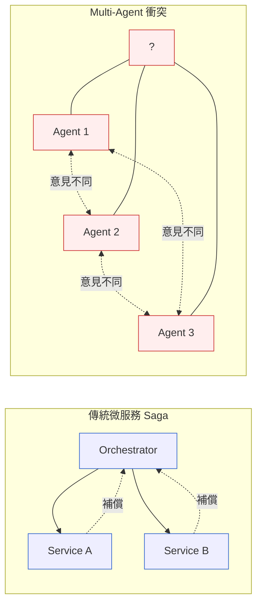
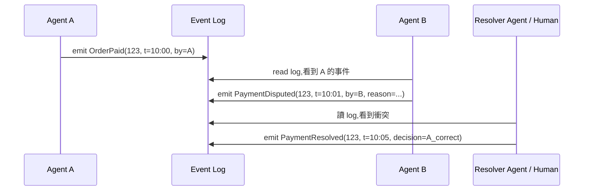
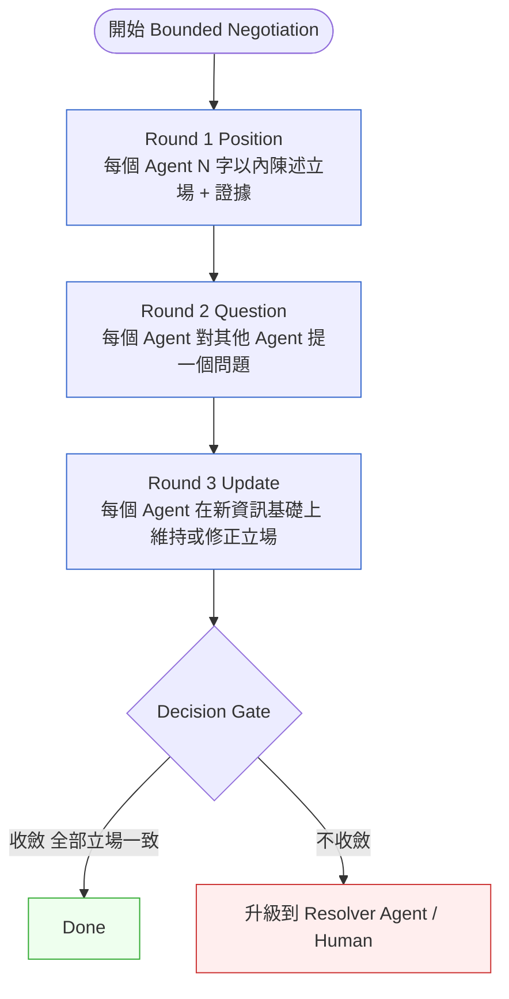

# Ch 41｜Multi-Agent 共識、狀態與衝突解決
## ⸺ Multi-Agent State Management & Consensus

> **前置閱讀**:[Ch 22 微服務](../part-04-architecture/ch-22-microservices.md)、[Ch 23 EDA / CQRS / ES](../part-04-architecture/ch-23-event-driven-cqrs-es.md)、[Ch 39](./ch-40-multi-agent.md)
> **下游章節**:[Ch 44 AI Eval](./ch-45-ai-eval-drift-redteam.md)
> **延伸補章**:[Ch 45 Agentic QA](./ch-46-agentic-qa.md)

---

## 41.1 冷觀察 ⸺ Ch 39 畫了拓樸,但沒談「他們不同意怎麼辦」

[Ch 39 Multi-Agent](./ch-40-multi-agent.md) 列出了 Multi-Agent 的五種模式(Augmented LLM、Prompt Chaining、Routing、Parallelization、Orchestrator-Workers、Evaluator-Optimizer)。[Ch 22 微服務](../part-04-architecture/ch-22-microservices.md) 與 [Ch 23 EDA](../part-04-architecture/ch-23-event-driven-cqrs-es.md) 談了傳統微服務的分散式交易(Saga、Outbox)。

**但兩者沒有交叉**。

問題是這樣的:**當兩個自主 Agent 在沒有中心化資料庫的前提下,需要對某件事達成共識(例如:這筆訂單的責任歸誰、這次資源排程怎麼分、這個會議結論是什麼),怎麼辦?**

這不是學術問題。它每天在以下場景發生:

- 採購 Agent 與庫存 Agent 對「一個 SKU 還剩幾件可用」有不同看法
- 兩個排程 Agent 同時試圖把同一個工程師排到兩個會議
- 多個分析 Agent 對同一份財報得出衝突的結論,主管 Agent 必須整合
- Code Review Agent 與 Security Agent 對同一段程式碼一個說 LGTM 一個說 Block

傳統 Saga 解決的是「跨服務交易的補償」,但它**默認最終誰的版本是對的**(通常是 orchestrator 的版本)。Agent 系統裡沒有這種「天然權威」。



## 41.2 真問題 ⸺ 三種共識需求,不要混為一談

第一步是**承認需要的不是「一種共識」**。把它分成三類:

| 共識類型 | 例子 | 傳統對應 |
|---|---|---|
| **資料共識**(誰的數值是對的) | 「庫存到底剩幾件」 | Replicated State Machine、Raft |
| **權威共識**(誰說了算) | 「這次申請該由 A 還是 B 簽核」 | RBAC + Workflow Engine |
| **意義共識**(這代表什麼) | 「這封 email 是 P0 還是 P2」 | (傳統沒對應,人類來判斷) |

[Ch 22](../part-04-architecture/ch-22-microservices.md) 的工具(Saga、Outbox)解決的是「資料共識」。Agent 系統最常需要的反而是**意義共識** ⸺ 這是傳統分散式系統幾乎沒處理過的問題。

## 41.3 決策框架 ⸺ Event Log、Bounded Negotiation、Distributed State Machine

### 41.3.1 解法 1:重建「中央但不單點」的共識層 — Event Log as Truth

最務實的解法,通常不是讓 Agent 自己達成共識,而是**設計一個受信任的共識層**。它不是一個 Agent,是一個**協議**。

把所有 Agent 的所有重要動作寫進一條 append-only event log(Kafka、EventStoreDB、自建),log 本身就是 source of truth。Agent 之間的「認知」由 log 決定。



這套等於把 Event Sourcing 升級為**多 Agent 的共享記憶與爭議仲裁機制**。每個 Agent 只能對 log 提出主張(propose),不能直接改變狀態。**這個模式現場用得最多**。它把問題從「分散式共識」轉化為「事件序列推論」,難度大幅下降。

### 41.3.2 解法 1 強化版:兩階段共識(2-Phase Agreement)

對於需要強一致性的場景(資金、庫存):

```
Phase 1 (Propose):
  Agent A: 「我打算扣 5 件庫存」→ Coordinator
  Coordinator → 廣播給其他相關 Agent
  其他 Agent: 「ACK / NACK + 理由」

Phase 2 (Commit):
  若全部 ACK → Coordinator 寫入 → 通知全體
  若有 NACK → 啟動衝突解決(見 D.3.3)
```

這在 Agent 世界跟資料庫的 2PC 在概念上一樣,但有兩個關鍵差異:

- **Phase 1 的 NACK 可以包含「為什麼不同意」的推理**,而不只是 yes/no
- **Phase 2 失敗的補償可以是 Agent 自己決定的**(例如「用另一個策略再嘗試」),不像資料庫只能 rollback

### 41.3.3 解法 2:衝突解決協議(Bounded Negotiation)

當 Agent 之間真的需要協商(沒有共識層,或共識層也搞不定的意義衝突),需要一個**明確的協商協議**。

直覺上會讓兩個 Agent「自由對話直到達成共識」⸺ **這是一個陷阱**:不收斂(無限對話舔尾巴)、被誤導(有缺陷的 Agent 說服另一個)、代幣爆炸(每輪 context 越來越長,成本指數爆炸)。

務實做法是**有結構的協商**。實戰好用的協議:



關鍵是:**有明確的退出條件,不能無限循環**。最大輪次:3 輪。超過就強制升級。

**仲裁者(Arbiter / Resolver)的設計**,當 Bounded Negotiation 不收斂時:

| Arbiter 類型 | 適用情境 |
|---|---|
| **更強模型** | 用 Claude Opus 仲裁 Sonnet 之間的爭議;用 GPT-5 仲裁 GPT-4o |
| **領域專家 Agent** | 採購衝突中引入「採購 SOP Agent」做仲裁,它有完整政策知識 |
| **人類** | 最後手段,但要設計成易接入(把所有 context 整理成一頁摘要,人類點 A/B 即可) |

### 41.3.4 解法 3:分散式狀態機(Distributed State Machine)

當 Agent 之間有複雜的多步協作(比 Saga 更複雜),需要顯式的**分散式狀態機**。

**為什麼狀態機重要?** 人類傾向把 Agent 行為描述成「自然語言流程」⸺ 這是調試與審計的災難。把它寫成狀態機,立刻獲得:**明確的狀態列舉**(一共有哪些可能狀態)/ **明確的轉換條件**(從 A 到 B 需要什麼)/ **可驗證**(可以證明不會卡死、不會回到非法狀態)/ **可審計**(每次轉換都有 trace)。

| 工具 | 適用 |
|---|---|
| **LangGraph** | LangChain 系列,以圖建模 Agent 流程。事實上的入門選擇 |
| **Temporal** | 不是 Agent 專用,但是「持久化工作流」的標竿,Agent 與傳統工作流混合的最佳載體 |
| **AWS Step Functions / Azure Durable Functions** | 雲廠對應品 |
| **自建 + Redis Streams** | 小團隊預算有限時的務實選擇 |

**一個關鍵的反模式:不要讓 LLM 「自由決定」狀態轉換**。有些教學會教:讓 LLM 看當前 context,「想想下一步要去哪」⸺ **請避開這種模式**。LLM 應該決定「在當前狀態下要採取什麼動作」,但「動作觸發後系統處於什麼狀態」必須由確定性的轉換函數決定:

```python
# 正確
state = "pending_review"
llm_action = llm.decide(state, context)  # → "approve" / "request_change"
new_state = transition_table[state][llm_action]  # 確定性

# 錯誤
llm_decision = llm.decide(state, context)  # → "ok 我覺得我們現在進入 finalized 狀態"
state = llm_decision  # 把狀態本身交給 LLM 決定
```

---

## 41.4 踩坑清單 ⸺ Multi-Agent 共識失敗速查

### 反模式 1:Agent 之間無限對話

直覺上讓兩個 Agent 自由聊到達成共識,結果不收斂、互相舔尾巴、代幣爆炸。

> ✅ **修正方向**:Bounded Negotiation 三輪上限 + 強制 Arbiter 升級。明確的退出條件比「期望 Agent 自己會收斂」可靠得多。

### 反模式 2:兩個 Agent 都堅持自己對

缺乏共享 source of truth,各自從不同上下文推理,結論衝突且都自信。

> ✅ **修正方向**:引入 Event Log as Truth。每個 Agent 只能對 log 提出主張(propose),不能直接改變狀態。爭議由 log 上的 Resolver event 仲裁,不在 Agent 對話中解決。

### 反模式 3:共識達成但結果是錯的(Sycophancy)

兩個同模型家族的 Agent 互相認同對方的好聽話,結論看起來一致但實際上錯的(尤其在意義共識場景)。

> ✅ **修正方向**:引入專業 Critic Agent;不同模型家族交叉(Claude 仲裁 GPT 的爭議,反之亦然);Critic 的 prompt 中刻意要求「找出 weakness」而非「評估好不好」。

### 反模式 4:把太瑣碎的事都寫進共識層

每一個 Agent 內部 micro-decision 都寫進 Event Log,結果 log 爆炸,真正重要的業務級事件被淹沒。

> ✅ **修正方向**:**只寫業務級事件**(Order Paid、Payment Disputed、Resolution Issued)到共識 log,低層細節走自己的 trace(OTel span)。共識 log 的 throughput 應遠低於應用層 trace。

---

## 41.5 交付清單

完成本章後,讀者應產出:

````markdown
# Multi-Agent Consensus Pack — {專案名稱}

## 1. 共識需求分類表
- [ ] 系統中需要哪幾類共識(資料 / 權威 / 意義)
- [ ] 每一類對應的解決方案

## 2. Event Log Schema
- [ ] Agent 主張(Propose)事件格式
- [ ] 爭議(Dispute)事件格式
- [ ] 解決(Resolve)事件格式
- [ ] Event Log 儲存方案(Kafka / EventStoreDB / 自建)

## 3. Negotiation Protocol
- [ ] 採用的協商協議規格(輪數、退出條件、Arbiter)
- [ ] Bounded Negotiation 範本(Position / Question / Update)
- [ ] Arbiter 類型選擇(更強模型 / 領域專家 / 人類)

## 4. Distributed State Machine 圖
- [ ] Multi-Agent 協作的所有狀態
- [ ] 所有合法轉換條件
- [ ] 確定性 transition table(LLM 不負責狀態本身)
- [ ] 工具選擇(LangGraph / Temporal / Step Functions / Redis Streams)

## 5. 失敗劇本(Runbook)
- [ ] Agent 無限對話 → 強制升級 SOP
- [ ] 共識長期不收斂 → 人類介入流程
- [ ] Event Log 爆炸 → 只寫業務級事件 + 清理 SOP
- [ ] Sycophancy 偵測 → 跨模型家族交叉驗證 SOP
````

放在 `docs/multi-agent-consensus/`,跟程式碼同 repo。

---

## 41.6 Recap

讀完本章,應該已經能做到:

- [ ] 區分三種共識需求(資料 / 權威 / 意義)並對應不同解法
- [ ] 用 Event Log as Truth 把分散式共識降階為事件序列推論
- [ ] 用 Bounded Negotiation 設計有退出條件的 Agent 協商
- [ ] 把 Multi-Agent 協作寫成顯式分散式狀態機(LLM 決定 action,不決定 state)
- [ ] 認得四個失敗模式(無限對話 / 缺共享 truth / Sycophancy 假共識 / log 爆炸)

如果先挑一項做,建議是 Event Log as Truth ⸺ 它是 Multi-Agent 系統最低成本的共識基礎,有了它,後面的 Negotiation 與 State Machine 都建立在比較穩的地基上。

---

## Cross-References

- **前置**:[Ch 22 微服務](../part-04-architecture/ch-22-microservices.md)、[Ch 23 EDA](../part-04-architecture/ch-23-event-driven-cqrs-es.md)、[Ch 39 Multi-Agent](./ch-40-multi-agent.md)
- **下游**:[Ch 44 AI Eval](./ch-45-ai-eval-drift-redteam.md)
- **延伸補章**:[Ch 45 Agentic QA](./ch-46-agentic-qa.md)

## 引用

本章無外部文獻引用。
