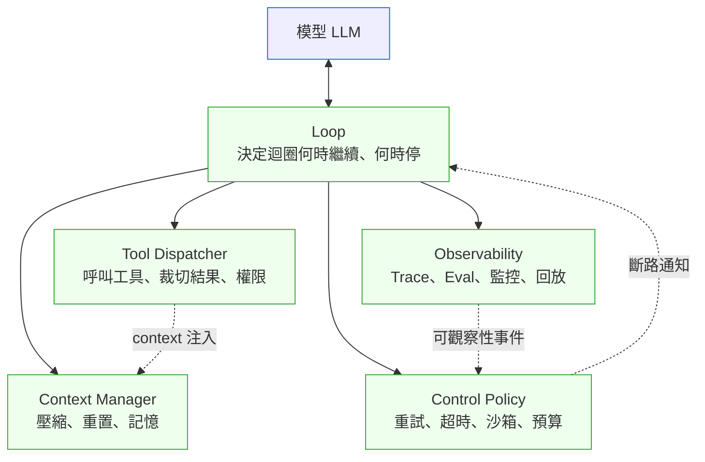
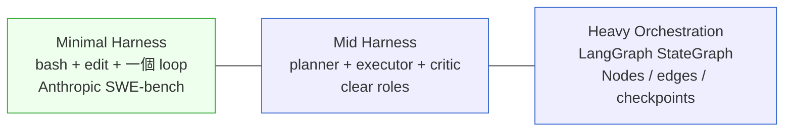
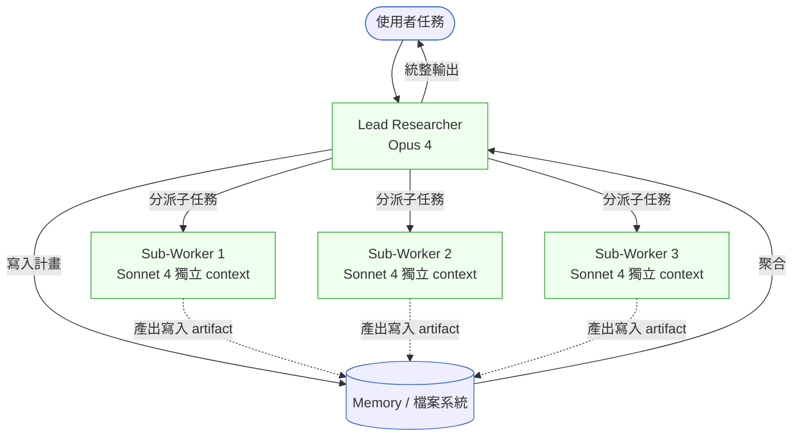
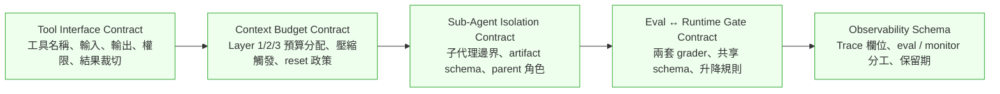

# Ch 43｜Agent Harness 工程
## ⸺ 從模型到可用代理的執行層設計

> **前置閱讀**：[Ch 39 RAG / Memory / Tool 設計](./ch-39-rag-memory-tool.md)、[Ch 40 Multi-Agent 系統設計](./ch-40-multi-agent.md)、[Ch 45 AI Eval / Drift / Red Team](./ch-45-ai-eval-drift-redteam.md)、[Ch 42 Agent 設定語言](./ch-42-agent-spec.md)
> **下游章節**：[Ch 48 Capstone](../part-08-synthesis/ch-48-capstone.md)
> **延伸補章**：[Ch 46 Agentic QA](./ch-46-agentic-qa.md)、[Ch 41 Multi-Agent 共識](./ch-41-multi-agent-consensus.md)

---

## 43.1 冷觀察 ⸺ 模型升一級，落地價值漲不到 4%

2026 年第一季，虛構北美 B2B 開發者工具平台 **Cresvale Engineering Cloud**（`CASE-SAS-014`）的 CTO 在一次月度報告上講了一段讓我記了很久的話。

Cresvale 內部養了一個四人小組做「自家 Codex」⸺ 一個能讀公司 monorepo、開 PR、接過 issue tracker 自動 triage 的編碼代理。他們選了 Anthropic Claude Sonnet 4.5 當底座，用 LangGraph 0.2 包了一個自家 harness，跑了五個月。團隊內部維護一份 280 題的「自家 SWE-bench-internal」，做為品質門檻。

那五個月裡，模型從 Sonnet 4.5 升到 Sonnet 4.6，再升到 Opus 4.7。每次模型升級，他們都會重跑那 280 題評測。資料相當好看：4.5 時 38.2%、4.6 時 47.1%、Opus 4.7 跑出 52.4%。週報投影片上是一條漂亮的爬升曲線。

但實際的 PR merge 率，五個月來在 39%–43% 之間徘徊，沒有跟著爬升。

CTO 在月會上問了那個讓會議室安靜十秒鐘的問題：

> 「我們的內部評測通過率漲了 14 個百分點，merge 率漲了 0%。如果我們再升一次模型，這個差距會變多少？」

沒有人答得出來。但 CTO 追問的方式值得注意——他問的不是「為什麼分數沒有轉換成 merge 率」，而是「如果我們再升一次，這個差距會變多少」。這個問法把問題的本質說出來了：這個 gap 是結構性的，還是暫時的？

於是團隊花了三週去拆這個 gap，不是為了找一個可以解釋的理由，而是為了弄清楚這個 gap 的成因屬於哪一類——因為不同類型的成因，要修的東西完全不同。

在說後面挖出什麼之前，先說清楚三週的調查是怎麼展開的——因為這套診斷邏輯，比最後挖出的問題本身更值得學。

面對「eval 漲 14%、merge 率不動」，Cresvale 的調查組把可能原因分成三類來排查：

1. **Eval Harness Mismatch（評測量錯了東西）**：280 題評測的 grader 只測「patch 能讓單元測試通過」，但 maintainer 看 PR 時量的是另一個向度——如果這個向度根本沒被評測覆蓋，分數漲多少都不會轉成 merge 率。
2. **Execution Harness Gap（執行層讓模型輸出品質打折）**：模型生成的程式碼其實是對的，但 harness 在 context 管理、工具結果處理上有問題，導致模型在跑生產任務時拿到的資訊比跑評測時差——評測高分無法複製到生產。
3. **Expectations Mismatch（模型輸出對了，但 maintainer 要的不是這個）**：模型按評測規格做出了正確的 patch，maintainer 也確認程式碼品質沒問題，但就是不 merge——這是對齊問題，跟 harness 無關。

調查組的第一步是把五個月的 rejected PR 和通過 eval grader 的樣本做對比，把 maintainer 留下的 review comments 分類。結論在第三天就出來了：**第三類（Expectations Mismatch）幾乎不存在**——maintainer 的拒絕理由都是具體的技術問題，不是「我覺得這個方向不對」。排除第三類後，問題收窄到一和二。

接著是比對評測題目與 maintainer 拒絕原因的交集。以下是兩邊最常出現的評斷維度：

| 維度 | 在 280 題評測中被量？ | 在 maintainer 拒絕 comment 裡出現頻率 |
|---|---|---|
| patch 能讓既有單元測試通過 | 是（100%） | 低（maintainer 預設測試會過） |
| 程式碼風格與既有 codebase 一致 | 否 | 高（37% 的被拒 PR 提到） |
| commit message 說清楚 why | 否 | 高（29%） |
| 影響半徑有被分析、高風險部分有標記 | 否 | 高（44%） |
| 「大家都知道不要碰」的隱性邊界沒被踩 | 否 | 中（21%） |
| 可重構部分有 follow-up 標記 | 否 | 中（18%） |

這個對比表讓第一類確診：**評測的 grader 量的東西，和 maintainer 真正在乎的東西，交集幾乎只有「測試通過」一條**。eval 漲 14% 是真的，但那 14% 量的是 maintainer 根本不看的維度。

確認第一類之後，調查組繼續往下挖第二類，發現生產 harness 上還有兩個獨立問題讓情況更糟：

**一件是 Tool 結果在炸 context window**。LangGraph 的 ToolNode 預設把 grep / search / file-read 的結果原封不動塞回 message 列表，一次跨庫 grep 可以拉回 60,000 token 的字串，跑兩三次 tool call 就把 200,000 token 預算燒掉超過一半。模型「失憶」、開始重複問同樣的問題、進入無效迴圈。這是第二類：eval 在沙箱裡跑小型 patch 不會觸發這個問題，但真實 monorepo 的 PR 任務會。

**另一件是觀測零位**。團隊只有 LangSmith 預設 trace，但沒有任何人盯這些 trace。那 280 題評測會留 trace 但沒人看；生產 PR 開出來會留 trace 但跟 PR review comment 沒接起來。merge rate 為什麼是 41%、為什麼不是 30% 也不是 60%、五個月有沒有任何一次趨勢變化——沒有任何儀表板看得到。這讓第一類和第二類都沒辦法被早期發現。

三週調查的結論是：**Cresvale 同時中了第一類和第二類，第三類不是問題**。換個說法：不是模型能力不足，而是「量的東西」和「生產跑的東西」都跟真正要的結果有 structural gap。

CTO 在那場月會結尾下了一段結論，被會議紀錄原樣記下來：

> 「我們花了五個月研究怎麼把更好的模型塞進 harness。現在看起來，我們真正應該研究的，是 harness 本身——而且要分兩件事修：評測在量什麼，以及生產跑起來的時候 context 在燒什麼。」

---

## 43.2 真問題 ⸺ Harness 是 SA 沒看到的那一層

Cresvale 的事不是孤例。把場景拉開來看，2025 年下半到 2026 年上半的業界文獻已經把這件事講得很白：

- **Anthropic** 在 SWE-bench Verified 上拿 49% 的那篇工程文章[^CIT-I01]，最直白的一段話是：「**give as much control as possible to the language model itself, and keep the scaffolding minimal**」⸺ 他們的 harness 只有 `bash` + `str_replace_editor` 兩個工具，沒有 planner、router、critic，從第一個 prompt 跑到模型自己宣布結束。同期他們又發布長期執行任務的 harness 設計文章[^CIT-I02]，承認「給定模型升一級（Opus 4.6 vs 4.5），所需的鷹架就減少」。
- **OpenAI** 2026 年 2 月公開的 *Harness Engineering* 報告[^CIT-I05]：3 名工程師（後來擴到 7 名）在五個月內以 Codex 寫出了 ~1,000,000 行程式碼、~1,500 個 PR，平均每位工程師每天 merge 3.5 個 PR。他們的結論被 InfoQ 標題化：「**harness 改進的回報，比模型改進的回報還高**」。
- **METR**（Model Evaluation & Threat Research）2026 年 3 月的研究筆記[^CIT-I04]：四位 SWE-bench Verified 取樣專案的 active maintainer 親手 review 296 個已經通過 eval grader 的 AI 生成 PR，**maintainer 的 merge 率比 grader 的 pass 率平均低 24.2 個百分點**，而且這個 gap 每年還以 9.6 個百分點的速度擴大。換成中文：**評測 harness 上的進步，沒有等比例傳遞到部署 harness**。

這三家獨立得出同一個結構性結論：**LLM 的可用性問題，從「模型能不能」轉到「跑模型的那一圈程式能不能」**。

### 43.2.1 Scaffolding 與 Harness 的分界

把 SA 看得到的東西攤開：

```mermaid
flowchart LR
    classDef cold fill:#eef,stroke:#36c
    classDef goal fill:#efe,stroke:#3a3
    classDef hot fill:#fee,stroke:#c33

    subgraph Pre["Scaffolding（第一個 prompt 之前）"]
      S1["CLAUDE.md / agent.md\n專案脈絡"]:::cold
      S2["System Prompt\n角色、規範、輸出"]:::cold
      S3["Tool Schema\nname / description / args"]:::cold
      S4["Skill / RAG corpus"]:::cold
    end

    subgraph Run["Harness（第一個 prompt 之後）"]
      R1["Loop\n模型→解析→工具→觀察"]:::goal
      R2["Tool Dispatcher\n呼叫 / 結果裁切 / MCP"]:::goal
      R3["Context Manager\n壓縮 / 重置 / Memory"]:::goal
      R4["Control Policy\n重試 / 超時 / 沙箱"]:::goal
      R5["Observability\nTrace / Eval / 監控"]:::goal
    end

    Pre --> Run --> Out["可用代理"]:::cold
```



一個粗略但實用的劃線：

- **Scaffolding** 是「在第一個 prompt 之前你先寫好的東西」⸺ Ch 42 整章在講這層，包括 CLAUDE.md、agent.md、tool 描述、skill。它是**靜態宣告**，可以放進 Git，可以版控，可以審查。
- **[Harness](../annex-f-glossary.md#agent-harness)** 是「第一個 prompt 之後，跑起來會發生的事」⸺ 模型回了什麼、要不要呼叫工具、結果怎麼裁切、要不要壓縮 context、要不要重試、要不要轉手給子代理、要不要把這次互動寫進 trace 與 eval。它是**動態執行**，只在 runtime 存在。

兩件事的工程責任本來就不同。Scaffolding 的問題是「規格寫得對不對」，Harness 的問題是「規格被執行得對不對」。**SRS 寫得再清楚，runtime 不照著跑，東西還是壞的**。

### 43.2.2 為什麼 Harness 是 SA 該接的事

過去三十年，SA 的工作圍繞兩個問題：「系統邊界在哪裡」與「資料／控制流經過哪些盒子」。Agent 系統把這兩個問題改寫了：

| 傳統系統 | Agent 系統 |
|---|---|
| 系統邊界 = 元件邊界 | 系統邊界 = **模型 + harness 一起構成的執行邊界** |
| 控制流 = 確定的呼叫圖 | 控制流 = **模型輸出驅動的非確定迴圈** |
| 介面契約 = API schema | 介面契約 = **tool schema + context 預算 + eval gate** |
| 例外處理 = try/catch | 例外處理 = **重試政策 + 子代理隔離 + 預算斷路** |

這不是工程師「順手做掉」的東西。它是規格層的決策。如果沒有 SA 把這層的規格寫下來，落到工程師手上就是「LangGraph 預設值、自己順手調」⸺ 然後就是 Cresvale 那五個月的故事。

---

## 43.3 決策框架 ⸺ Harness 五大組件、兩條光譜、SA 的交付物

把 Harness 拆細，現場可以用的劃法是五個組件、兩條光譜、一份交付清單。

### 43.3.1 Harness 五大組件與各自的失敗模式



這五個組件不是抽象分類，是把現場看過的故障拆出來歸類的結果。每個組件都有自己的失敗模式與成熟的對應模式。

#### Loop ⸺ 決定何時繼續、何時停

最小骨架：模型輸出 → 解析（要工具？要結束？）→ 執行工具 → 觀察 → 回到模型。Anthropic 的 SWE-bench harness 用的就是這一圈，加上一個「當模型自己宣布完成或超過 200K context 就停」的終止條件[^CIT-I01]。

**典型故障**：模型卡在自我對話的迴圈裡，對同一個問題反覆下同一個工具呼叫，直到 200K token 預算燒光。這在 ToolNode 把 stale 的 tool result 一直留在歷史時特別常見。

**對應模式**：**Context reset + structured handoff**。Anthropic 在長執行任務的 harness 設計文章[^CIT-I02]裡明確採用這個模式 ⸺ 與其壓縮歷史，不如在達到預算的某個分數時，讓模型把當前狀態結構化寫進 memory tool（或檔案），開新的 context window，把 memory 當作這個新窗口的 prompt。

#### Tool Dispatcher ⸺ 把工具呼叫轉成可控結果

Tool dispatcher 不是一個 `if tool == 'bash': run(args)`。它做四件事：對 tool schema 做嚴格驗證、把結果裁切到 context 能吃下的大小、把高權限工具放進沙箱、把工具結果結構化（避免把 60K 字 dump 進 message history）。

**典型故障**：跨庫 `grep` 拉回 60,000 token、`ls -R` 拉回 30,000 token、`curl` 拉回整份未裁切的 HTML。三次工具呼叫吃光大半 context。這正是 Cresvale 的故事第二層原因。

**對應模式**：**Context-editing API（`clear_tool_uses_20250919`）+ MCP**。Anthropic 的 context-editing 機制把舊的 `tool_result` block 替換成 placeholder，但保留 `tool_use` 紀錄 ⸺ 模型知道「我之前查過這個」但不會被舊內容塞滿[^CIT-I02]。MCP（Model Context Protocol）則把 tool 介面抽成跨 harness 可重用的元件，包含 streaming、進度回報、權限分級。

#### Context Manager ⸺ 在 200K 視窗裡塞下一個複雜任務

Context window 是 harness 最稀缺的資源，但它不是只有 prompt 與 history 兩塊。一個成熟的 context manager 把 context 看成多層：system prompt、scaffolding（agent.md + 長期 memory）、近期對話、近期 tool 結果、待寫入的 scratchpad。每一層有不同的保留策略。

**典型故障**：跨多日的長任務在第二天醒過來時，scratchpad 已經被截斷，計畫遺失。Anthropic 的 multi-agent research[^CIT-I03] 報告裡，主代理寫計畫進 memory 的根本理由就是這個：「**如果 context window 超過 200,000 tokens 它會被截斷**，所以重要的計畫不能只活在對話歷史裡」。

**對應模式**：**Memory Tool + 結構化 Scratchpad**。把計畫、關鍵決策、未完成項目寫入 memory（Anthropic 的 `memory_20250818`、OpenAI Codex 的 `AGENTS.md`-as-table-of-contents 模式[^CIT-I05]）。生產 harness 普遍採用「memory 是真實的權威，對話歷史只是工作區」的設計哲學。

#### Control Policy ⸺ 重試、超時、預算斷路

Agent 出錯時要不要重試？重試幾次？超時要怎麼設？單次任務預算上限是多少 token、多少美元？這些不是「跑起來再說」的事，是規格層決策。

**典型故障**：重試政策無上限。模型一次工具呼叫失敗 → harness 自動重試 → 失敗訊息進 history → 模型認為要換策略 → 再呼叫 → 再失敗 → 再重試 ⸺ 直到 token 預算燒光，留下一張一千美元的帳單，事情沒做成。

**對應模式**：**多層斷路器**。把 control policy 設計成 ⸺ 單次工具呼叫超時、單個任務 token 預算、單個任務美元預算、單個 session 跨任務預算 ⸺ 任一層觸發斷路就停下來，讓人介入。這對應傳統分散式系統的 Hystrix / circuit breaker 思想，只是斷路訊號從「下游 5xx 比例」改成「token 預算」「美元預算」「重試次數」。

#### Observability ⸺ Trace / Eval / 監控三件不同的事

這是 SA 最容易低估的一層。它不是把 LangSmith 接好就結束。Trace、Eval、Monitoring 是三件不同的事：

| 名稱 | 用途 | 觸發時機 | 工具代表 |
|---|---|---|---|
| **Trace** | 單次互動的完整紀錄（input、output、工具呼叫、cost） | 每次 agent 互動 | LangSmith、Langfuse、Helicone、Phoenix |
| **Eval** | 跑資料集驗證代理品質 | CI 階段、版本升級時 | Phoenix、Braintrust、自製 |
| **Monitoring** | 生產流量的延遲、成本、錯誤率、漂移 | 永遠 | Datadog、Honeycomb、自製 dashboard |

**典型故障**：把這三件事擠進同一個工具，結果三件事都做不好。Cresvale 把 LangSmith 的 trace 當作「我們有觀測了」，但 trace 沒人盯、eval 沒進 CI、monitoring 完全缺席 ⸺ 五個月就這樣過去。

**對應模式**：**OpenTelemetry GenAI semantic conventions 收斂**。把 trace span 的欄位收斂到 OTel 規範（`input` / `output` / `tool_calls[]` / `latency_ms` / `tokens` / `cost_usd` / `parent_span_id`），讓三件事可以用同一份 trace 餵不同的 sink。2025–2026 年的觀測平台戰局沒有壟斷者：**LangSmith** 在 LangChain 生態系內最方便、**Langfuse** 是 OSS 自架最熱（每月 SDK 安裝數超過 600 萬）、**Phoenix** 在 eval 嚴謹度上最強、**Helicone** 在零修改安裝上最快、**Datadog / Honeycomb** 在企業既有觀測棧上最融。SA 的責任不是選哪個工具，是寫清楚 **trace schema 與三類觀測的責任分工**。

### 43.3.2 第一條光譜：Minimal vs. Heavy Orchestration

Harness 設計的第一個取捨是「鷹架要多重」。兩端都有正當理由，誤判方向就會付出代價。



**[Minimal harness](../annex-f-glossary.md#minimal-harness)（Anthropic SWE-bench 風格）**：兩個工具、一個迴圈、一份精心設計的 tool description。Anthropic 的話直白：「**我們把大部分力氣花在工具的描述與規格上**」[^CIT-I01]。這條路相信模型本身的規劃能力，鷹架只負責不擋路。

**Heavy orchestration（LangGraph 風格）**：把代理拆成 StateGraph 上的 node 與 edge，每個 super-step 留 checkpoint，可以時光倒流（time-travel debug）、人在迴圈中（human-in-the-loop interrupt）、跨進程恢復。LangChain 的 `deepagents` 套件是這條路的代表，把 planner 子代理、虛擬檔案系統、middleware 全包進來。

**判斷光譜位置的三條準則**：

| 你的任務 | 該往哪一端走 |
|---|---|
| 短迴圈、結果可驗證、輸入結構穩定（程式碼修改、SQL 生成、報表查詢） | **Minimal** ⸺ 鷹架越輕、模型自由度越高，分數越好 |
| 長執行、需要跨進程恢復、需人工介入審批、合規要求每一步可重放 | **Heavy** ⸺ 失去鷹架就失去合規證據與可恢復性 |
| 工具呼叫多但每次結果小、模型表現穩定 | **Mid** ⸺ planner / executor / critic 三角分工 |

**普遍誤區**：團隊一上來就抓 LangGraph，把所有任務都拆成 StateGraph，結果短迴圈任務的鷹架反而擋住模型的判斷。Anthropic 在 *Harness design* 文章[^CIT-I02]裡記錄了一個對照組數字：同一個「重做老遊戲」的任務，純單代理跑了 20 分鐘、燒 9 美元、做出來的東西不能玩；補上 planner / generator / evaluator 三角分工的 harness 跑了 6 小時、燒 200 美元、做出來能上架。**鷹架的成本與報酬是匹配的，不會自動更好**。

### 43.3.3 第二條光譜：[Eval Harness 與 Inference Harness 的分離](../annex-f-glossary.md#eval-vs-inference-harness)原則

這是 METR[^CIT-I04]那篇研究筆記的核心訊息，也是 Cresvale 故事第一層原因的學術版本。

**Eval harness** 跑的事：給定固定資料集、自動 grader、測量 pass rate。它優化的是「在這個 grader 下能拿幾分」。
**Inference harness** 跑的事：在生產環境跑真實任務、和 maintainer / 客戶 / 法務互動、產出真正會被合併、會被付款、會被上線的東西。

兩件事如果共用同一套 harness 規格，必然會發生兩種偏移之一：

- **評測偏鬆**：eval harness 把 grader 設成「跑得起來且測試過」，但生產 harness 上 maintainer 還會在意風格、commit message、影響半徑、follow-up 紀錄 ⸺ pass 不等於 merge，merge 率永遠追不上分數。
- **評測偏嚴**：eval harness 加上模仿 maintainer 的 LLM-as-judge 嚴格 grader，但生產 harness 上沒有對應的 review-readiness gate ⸺ 模型在生產時又被推往「先上 PR 看 review 怎麼說」的捷徑。

**設計原則**：**eval harness 與 inference harness 共享 trace schema 與部分 control policy，但是兩個獨立規格**。SA 的交付物應分別寫：

| 項目 | Eval Harness 規格 | Inference Harness 規格 |
|---|---|---|
| 觸發時機 | CI、版本升級、Skill 改動 | 生產流量 |
| 資料集 | 固定、版控的 eval set | 生產流量 + 抽樣 replay |
| Grader | 機器可檢（unit test、JSON schema、LLM-as-judge） | 人類 review、客戶反饋、業務指標（merge 率 / 客訴率 / 退款率）|
| 通過條件 | 分數門檻 | 多維度 gate（業務 + 合規 + 觀測） |
| 失敗處理 | 阻擋上線 | 回滾、降級、限流、人工接手 |

只要這兩份規格不分開寫，METR 那 24.2 個百分點的 gap 就會在你的系統裡複現。

### 43.3.4 Multi-Agent Harness 模式

當任務本質要求多代理時（呼應Ch 41 的多代理共識章），harness 設計變成「在多個獨立 context 之間協調」。Anthropic 的 multi-agent research system[^CIT-I03] 給了一個現在已被廣泛複製的範式。

**核心模式：Lead-researcher + Sub-research workers**



幾個要素值得 SA 拿筆記：

1. **[Sub-agent isolation](../annex-f-glossary.md#sub-agent-isolation)（子代理隔離）**：每個 sub-worker 有自己的 context window、自己的工具、自己的軌跡。它們不知道對方在做什麼，只知道 lead 給的任務。這個隔離把「大量 tool result 塞滿 parent」的故障路徑切斷了 ⸺ 子代理的工具結果只活在它自己的 200K window 裡，永遠不會污染 parent。

2. **Parent compaction（主代理壓縮）**：Lead 不能變成 worker，否則 parent 的 context 會被自身工作淹沒。Lead 的職責是「分派、聚合、決策」三件事，工作的實做都丟給子代理。Anthropic 的設計理由直白：「**lead 把計畫寫進 memory，因為如果 context window 超過 200,000 tokens 它會被截斷**」[^CIT-I03]。

3. **Artifact system 而非 prose return**：子代理的產出寫入「檔案系統」（一個 K/V store 或實際的虛擬 FS），而不是用一段散文字回傳給 lead。Lead 收到的是「結果存在 `artifacts/sub-1/result.md`」，不是 50KB 的 prose。

4. **代價**：Anthropic 報告 lead-researcher（Opus 4）配 sub-agents（Sonnet 4）的設計，比單代理 Opus 4 高 90.2% 的內部研究評測分數，但**消耗的 token 數約 15 倍**。token 用量解釋了瀏覽評測上 80% 的表現變異。SA 在規格 multi-agent 時，必須把這個倍率寫進預算控制。

5. **何時不該走多代理**：Ch 41 與 Ch 40 都討論過 ⸺ 任務本質是序列依賴、上下文需要連續累積、結果需要極強一致性時，硬拆多代理會讓 token 倍增同時品質下降。Multi-agent 適合「可平行探索 + 結果可獨立驗證」的場景：研究、跨庫搜尋、多視角生成。

### 43.3.5 SA 的 Harness 規格交付物

把以上所有東西收回來，SA 在 Agent 系統的 harness 設計上，應該交付五份規格。它們對應五個組件，但表達語言是規格而非程式碼：



這五份契約不是工程師寫好給 SA 簽名的東西。它是 SA 寫好給工程師實作的東西 ⸺ 和過去寫 API 規格、寫 ERD 是同一層次的工作。

§43.5 的「可帶走 Artifact」會把這五份契約展開成可填寫的清單。

---

## 43.4 踩坑清單

### 43.4.1 七個常見反模式

**反模式一：把 Framework 當 Harness**

「我們用 LangGraph」「我們用 OpenAI Agents SDK」⸺ 這兩句話描述的是工具選擇，不是 harness 設計。Framework 是寫 harness 的材料，不是 harness 本身。沒有規格，框架的預設值就是你的 harness。

> **修正方向**：在挑 framework 之前，先把五大組件每一塊的規格決定下來（loop 終止條件、tool 結果裁切策略、context 預算、重試政策、trace schema）。framework 的角色是把規格實作出來，不是替你做決定。

---

**反模式二：把 Eval Harness 直接拿去當 Inference Harness**

「我們在內部評測上跑 92%，所以可以上線」⸺ 跳過了 inference harness 該量的事（業務指標、人類 review、合規 gate）。這是 METR 那 24.2 pp gap 的最直接成因。

> **修正方向**：把 eval harness 與 inference harness 寫成兩份獨立規格（即使共享 trace schema）。Eval 的通過不是上線的單一條件，inference 必須另外有一組業務 / 合規 / 觀測門檻。

---

**反模式三：Tool 結果原封不動進對話歷史**

ToolNode / AgentExecutor 預設把 tool 回傳塞回 message 列表，模型再把它讀回去。一次 grep 60K token，三次就燒掉一半 context。

> **修正方向**：所有工具呼叫加上**結果裁切契約**（最大長度、結構化欄位、檔案存檔路徑）。長結果存進 artifact / file / memory，message 歷史只保留「結果在這裡」的指針。Anthropic 的 `clear_tool_uses_*` context-editing 是現成的對應機制。

---

**反模式四：重試政策無上限**

「失敗就重試」是 ReAct loop 的預設行為，但沒有預算斷路就是無限燒錢。一次失敗的 LLM 任務在生產環境可以燒掉一千美元而沒做成事。

> **修正方向**：control policy 必須是**多層斷路**：單次工具超時、單任務 token 上限、單任務美元上限、單 session 跨任務上限。任一層觸發就停下、回報、讓人介入。生產 harness 的預算超支是嚴重事故，不是「下個版本注意」。

---

**反模式五：Observability 只有 Trace 沒有 Eval 與 Monitoring**

LangSmith 接起來、trace 開始進，就以為觀測完成。但沒有 eval 進 CI、沒有 monitoring 看延遲與成本、沒有人定期看 trace ⸺ 那些 trace 只是磁碟上的文字。

> **修正方向**：把觀測拆成三條獨立規格（trace / eval / monitor），各有觸發時機、各有負責人、各有閾值。OpenTelemetry GenAI semantic conventions 是統一 schema 的起點，三條規格共享 schema 但各自輸出。

---

**反模式六：Multi-Agent 用 Single-Agent 的 Harness**

「我們用 multi-agent」但 lead 與 sub-agent 共用同一個 context、同一個 message history，結果就是 parent 被工作淹沒、sub-agent 之間互相干擾。

> **修正方向**：multi-agent harness 的核心是 **isolation**。每個 sub-agent 有獨立 context、獨立工具、獨立 trace span（透過 `parent_span_id` 串回 parent）。Lead 只做分派、聚合、決策三件事，產出走 artifact system 而非 prose。預算與 token 倍率（Anthropic 報告約 15×）寫進控制契約。

---

**反模式七：Harness 規格散在工程師腦袋裡**

「我們的 harness 是 Tom 寫的，他知道」⸺ 過去 SRS、ADR、API spec 不會接受這種狀態，但 harness 規格在很多團隊就是這樣。

> **修正方向**：把 harness 規格寫成**獨立的設計文件**（與 agent.md、ADR 同層級），放進 Git，納入 PR review。下面的「可帶走 Artifact」就是這份文件的骨架。

---

### 43.4.2 時效性警告

**本章所有廠商機制與數字均以 2026 年第一季為基準。**

需要主動追蹤更新的點：

- Anthropic 的 context-editing API 與 memory tool 仍在 beta 階段（`clear_tool_uses_20250919` / `memory_20250818` 是日期版本號，會迭代）
- METR 的 24.2 pp gap 與 9.6 pp/yr 擴大趨勢來自 2026-03 的單一研究筆記，後續會被驗證或修正
- LangChain `deepagents` 仍在 0.x 階段
- OpenTelemetry GenAI semantic conventions 仍在 draft，欄位會調整

**SA 應對策略**：寫規格時關注**結構**（五大組件分工、兩條光譜決策、五份契約），不寫死特定 SDK 的方法名與版本號。SDK 改名是兩週的事，結構錯了是兩季的事。

---

## 43.5 交付清單 ⸺ 一頁式 Harness 規格五份契約清單

在設計或審查 Agent harness 時，SA 應能交付以下五份規格。每份都是可獨立 review、可進 Git 的文件。

````markdown
## Harness 規格五份契約
系統：______  SA：______  日期：______

### 契約 1：Tool Interface Contract（工具介面契約）
對每個被 agent 使用的工具：

| 欄位 | 內容 |
|---|---|
| 工具名稱 | |
| 用途（一句話） | |
| 輸入 schema（含必填 / 選填 / 預設） | |
| 輸出 schema（含成功 / 失敗 / 部分結果） | |
| 結果最大長度（token / bytes） | |
| 超出長度的裁切策略 | |
| 權限分級（讀 / 寫 / 高權限） | |
| 沙箱要求（是 / 否、邊界） | |
| 失敗時的 retry 預設（次數 / 退避） | |

### 契約 2：Context Budget Contract（脈絡預算契約）

| 項目 | 預算 |
|---|---|
| 單次任務最大 context window | _____ tokens |
| Layer 1 (system + agent.md) 預期佔用 | _____ tokens |
| Layer 2 (近期 message history) 預期佔用 | _____ tokens |
| Layer 3 (tool results) 預期佔用 | _____ tokens |
| 壓縮觸發點（達到預算 X% 觸發） | _____ % |
| 壓縮策略（summarize / reset + memory / truncate） | |
| Memory 寫入時機 | |
| Memory 讀取時機 | |

### 契約 3：Sub-Agent Isolation Contract（子代理隔離契約）

| 項目 | 規格 |
|---|---|
| 是否使用多代理（是 / 否） | |
| Lead agent 的職責（限制為分派 / 聚合 / 決策） | |
| Sub-agent 列表與各自任務領域 | |
| Sub-agent 是否獨立 context（必須是「是」） | |
| Sub-agent 產出走 artifact 而非 prose（必須是「是」） | |
| 預期 token 倍率（單代理基準的幾倍） | _____ × |
| 預算控制（單任務 token 上限、美元上限） | |
| Sub-agent 失敗時的隔離策略 | |

### 契約 4：Eval ↔ Runtime Gate Contract（評測 / 生產門檻契約）

| 項目 | Eval Harness | Inference Harness |
|---|---|---|
| 觸發時機 | | |
| 資料來源 | | |
| Grader（自動 / 人類 / LLM-as-judge） | | |
| 通過條件 | | |
| 失敗處理 | | |
| 共享的 trace schema 欄位 | | |

特別說明：
- [ ] Eval pass 不等於 inference 上線（必須有獨立 inference gate）
- [ ] 兩套 gate 的失敗處理路徑已分別設計
- [ ] METR-style gap（eval pass 但 maintainer 不 merge）的監測機制已建立

### 契約 5：Observability Schema（觀測 schema）

| 觀測類型 | 工具 | 觸發時機 | 負責人 | 保留期 |
|---|---|---|---|---|
| Trace | | 每次互動 | | |
| Eval | | CI / 升版 | | |
| Monitoring | | 永遠 | | |

Trace span 必填欄位（OTel GenAI semantic conventions 對齊）：
- [ ] `gen_ai.request.model` / `gen_ai.response.model`
- [ ] `gen_ai.usage.prompt_tokens` / `gen_ai.usage.completion_tokens`
- [ ] `gen_ai.cost.usd`
- [ ] `gen_ai.tool_calls[]` (name, arguments, result_size, latency_ms)
- [ ] `gen_ai.parent_span_id`（multi-agent 時必填）
- [ ] `gen_ai.eval_scores[]`（如有 eval grader 評分）
````

### 43.5.1 範例：Cresvale 第六個月該補的那五份契約

Cresvale Engineering Cloud（`CASE-SAS-014`）那 14 個百分點的內部評測漲幅之所以沒有換來 merge 率，根因是這五份契約一份都沒有獨立成檔。下面是 CTO 月會之後、SA 補做的版本——刪掉細部數字、保留契約的「形狀」：

````markdown
## Harness 規格五份契約 ⸺ Cresvale 自家 Codex（v0.6 → v0.7 補件）
系統：Cresvale Engineering Cloud Internal Codex   SA：Harness Lead   日期：2026-03-04

### 契約 1：Tool Interface Contract
<!-- 為什麼這欄：tool 結果裁切策略沒寫，agent 在跑大型 monorepo 時 context 直接撐爆；
     6 個月來這條沒寫，等於每次升模型都要重打一次預算。 -->
| 工具 | repo_search / pr_open / run_tests |
| 輸入 schema | 已定義（OpenAPI 3.1） |
| 輸出最大長度 | **未定義** ← 升 Opus 4.7 後才暴露 |
| 裁切策略 | **未定義** ← 目前各 agent 各自截斷 |
| 權限分級 | run_tests = 寫，其餘 = 讀 |
| 沙箱要求 | pr_open 必須走 fork，未強制 |

### 契約 2：Context Budget Contract
<!-- 為什麼這欄：280 題評測跑得漂亮但 merge 率不動，多半是真實 PR 的 context 早就溢出預算；
     沒這份契約，模型升級的紅利會被 context 浪費掉。 -->
| 單次任務最大 context | 200K tokens |
| Layer 1 (system + agent.md) | 預期 ≤ 5K，實測 9.4K |
| Layer 3 (tool results) | **無壓縮觸發點** |
| Memory 寫入時機 | **未定義** |

### 契約 3：Sub-Agent Isolation Contract
| 多代理 | 是（lead + 3 sub） |
| Sub-agent 獨立 context | **否** ← 共用 lead 的 context，token 倍率 ~3.8× |
| Sub-agent 產出形態 | prose（應改 artifact） |
| 預算控制 | 單任務 USD 上限未設 |

### 契約 4：Eval ↔ Runtime Gate Contract
<!-- 為什麼這欄：eval pass = inference 上線是這個專案最貴的等號；
     兩套 gate 不分開，merge 率永遠不會跟著 eval 漲。 -->
| Eval gate 通過條件 | 280 題 ≥ 50% |
| Inference gate 通過條件 | **未定義** ← 直接複用 eval pass |
| METR-style gap 監測 | 無

### 契約 5：Observability Schema
| Trace | LangSmith，部分欄位缺失（無 cost.usd / parent_span_id） |
| Eval | 內建 280 題，CI 觸發 |
| Monitoring | merge 率走另一個 dashboard，**未與 trace join** |
````

填完五份契約最大的價值不是「文件齊了」，而是把「升模型 ≠ 提升交付」這個 14% 的 gap **拆成五個可以分頭修的問題**。每一份契約寫得出來，就是一個 sprint 的 scope。

---

## 43.6 本章交付清單 Recap

讀完本章，你應該已經能做到：

- [ ] 解釋 Scaffolding 與 Harness 的分界（第一個 prompt 之前 vs 之後），以及為何兩件事在工程責任上不同
- [ ] 說明 Harness 五大組件（Loop / Tool Dispatcher / Context Manager / Control Policy / Observability）各自的失敗模式與對應模式
- [ ] 在 Minimal vs Heavy Orchestration 光譜上判斷你的任務該落在哪一端，並說明判斷依據
- [ ] 說明 Eval Harness 與 Inference Harness 為何必須是兩份獨立規格，以及 METR 的 24.2 pp gap 為何是結構性問題
- [ ] 設計 Multi-Agent Harness 時知道 sub-agent isolation、parent compaction、artifact-based return 三個必要約束
- [ ] 完成「Harness 規格五份契約清單」，把 harness 從「工程師腦袋裡的東西」變成「可審查的 SA 交付物」

如果先挑一項做，建議是 ⸺ **針對手上一個正在跑的 Agent 系統，把契約 4（Eval ↔ Runtime Gate）填一遍**，理由是它最快讓你看見「我們在量的事和我們真正在乎的事之間有沒有差距」⸺ 而你現在已經有把這個差距結構化、量出來、推回給工程師的工具。

---

## Cross-References

- **前置閱讀**：[Ch 39 RAG / Memory / Tool 設計](./ch-39-rag-memory-tool.md)、[Ch 40 Multi-Agent 系統設計](./ch-40-multi-agent.md)、[Ch 45 AI Eval / Drift / Red Team](./ch-45-ai-eval-drift-redteam.md)、[Ch 42 Agent 設定語言](./ch-42-agent-spec.md)
- **下游章節**：[Ch 48 Capstone](../part-08-synthesis/ch-48-capstone.md)
- **強連結**：[Ch 46 Agentic QA](./ch-46-agentic-qa.md)、[Ch 41 Multi-Agent 共識](./ch-41-multi-agent-consensus.md)

## 引用

[^CIT-I01]: Anthropic. "Raising the bar on SWE-bench Verified" / "Claude SWE-Bench Performance". 2024-10. https://www.anthropic.com/engineering/swe-bench-sonnet 詳見 `annex-g-citations.md#cit-i01`。
[^CIT-I02]: Anthropic. "Harness design for long-running application development" / "Effective harnesses for long-running agents". 2025–2026. https://www.anthropic.com/engineering/harness-design-long-running-apps 詳見 `annex-g-citations.md#cit-i02`。
[^CIT-I03]: Anthropic. "How we built our multi-agent research system". 2025. https://www.anthropic.com/engineering/multi-agent-research-system 詳見 `annex-g-citations.md#cit-i03`。
[^CIT-I04]: METR. "Many SWE-bench-Passing PRs Would Not Be Merged into Main." 2026-03-10. https://metr.org/notes/2026-03-10-many-swe-bench-passing-prs-would-not-be-merged-into-main/ 詳見 `annex-g-citations.md#cit-i04`。
[^CIT-I05]: OpenAI. "Harness Engineering" (Codex 三人組 1M LOC 案例). 2026-02. https://openai.com/index/harness-engineering/ 詳見 `annex-g-citations.md#cit-i05`。

<!-- PROPOSED-REFS
# QA 注意:
# 1. CASE-SAS-014 依賴於Ch 41 的 CASE-SAS-013（Caldwell Systems）先合併進
#    case-registry.yaml。合併順序:chH 的 CASE-SAS-013 → 本章的 CASE-SAS-014。
# 2. glossary anchor `harness-engineering-discipline` 用以避免與本章 slug
#    `harness-engineering` 在跨參考工具上的潛在衝突。

glossary:
  - anchor: harness-engineering-discipline
    name: Harness Engineering（Harness 工程）
    body: |
      設計、量測、迭代「跑模型的那一圈程式」的工程學科。Harness 指模型之外、
      包住模型的執行層 scaffolding:迴圈控制、工具呼叫、脈絡管理、控制政策、
      觀測。在 2025–2026 之交由 Anthropic、OpenAI、METR、LangChain 各自獨立
      確立為正式術語,與「改進模型」並列為 LLM 系統可用性的兩條獨立工程路徑。
  - anchor: agent-harness
    name: Agent Harness（代理執行鷹架）
    body: |
      包住 LLM 把它變成可用代理的 runtime scaffolding。包含五大組件：Loop、
      Tool Dispatcher、Context Manager、Control Policy、Observability。
      與 scaffolding（第一個 prompt 之前的靜態宣告，如 agent.md、CLAUDE.md）
      在時間維度上互補：scaffolding 是規格，harness 是執行。
  - anchor: minimal-harness
    name: Minimal Harness（最小鷹架）
    body: |
      Anthropic 在 SWE-bench Verified 上達成 49% 時所主張的設計哲學：給模型
      最大控制權，鷹架只給工具與迴圈，不給 planner / router / critic。對短迴圈、
      可驗證、輸入結構穩定的任務最有效。對應端點為 Heavy Orchestration。
  - anchor: eval-vs-inference-harness
    name: Eval Harness 與 Inference Harness 的分離原則
    body: |
      評測 harness（資料集 + grader）與生產 harness（真實任務 + 多維 gate）
      是兩個獨立規格。共享 trace schema 與部分 control policy，但不共用通過條件。
      METR 2026-03 報告顯示 maintainer merge 率比 grader pass 率平均低 24.2
      個百分點，且每年擴大 9.6 個百分點，是兩者規格未分離時的結構性偏差。
  - anchor: sub-agent-isolation
    name: Sub-Agent Isolation（子代理隔離）
    body: |
      Multi-agent harness 的核心約束：每個 sub-agent 有獨立 context window、
      獨立工具集、獨立 trace span，產出走 artifact system 而非 prose 回傳。
      避免 parent context 被子任務工作淹沒，並切斷 tool result 污染傳遞路徑。
      由 Anthropic multi-agent research system 確立為範式。
citations:
  - id: CIT-I01
    body: 'Anthropic. "Raising the bar on SWE-bench Verified" / "Claude SWE-Bench Performance". 2024-10. https://www.anthropic.com/engineering/swe-bench-sonnet'
  - id: CIT-I02
    body: 'Anthropic. "Harness design for long-running application development" / "Effective harnesses for long-running agents". 2025–2026. https://www.anthropic.com/engineering/harness-design-long-running-apps'
  - id: CIT-I03
    body: 'Anthropic. "How we built our multi-agent research system". 2025. https://www.anthropic.com/engineering/multi-agent-research-system'
  - id: CIT-I04
    body: 'METR. "Many SWE-bench-Passing PRs Would Not Be Merged into Main". 2026-03-10. https://metr.org/notes/2026-03-10-many-swe-bench-passing-prs-would-not-be-merged-into-main/'
  - id: CIT-I05
    body: 'OpenAI. "Harness Engineering" (Codex 1M LOC case). 2026-02. https://openai.com/index/harness-engineering/'
cases:
  - id: CASE-SAS-014
    title: "Cresvale Engineering Cloud — 模型升一級、merge 率漲 0% 事故"
    domain: saas
    chapters: [chI]
    summary: |
      虛構北美 B2B 開發者工具平台 Cresvale Engineering Cloud（4 人小組做自家
      Codex，Claude Sonnet 4.5 → 4.6 → Opus 4.7、LangGraph 0.2、自製 280 題
      內部評測）。五個月內模型升級三次，內部評測通過率從 38.2% 升到 52.4%，
      但 PR merge 率始終在 39%–43% 徘徊。事後三週調查發現 (1) eval harness
      與 inference harness 共用同一套 grader，maintainer 在乎的程式碼風格、
      影響半徑、commit message 從未被量；(2) Tool dispatcher 把跨庫 grep 的
      60K token 結果原封塞回 message 歷史，三次工具呼叫吞掉超過半個 context；
      (3) LangSmith trace 接了但沒人看，eval 沒進 CI，monitoring 完全缺席。
      用於展示「模型升級的 ROI 在某個點之後低於 harness 改進的 ROI」與
      「eval / inference harness 必須是兩份獨立規格」兩個結構性主題。
conventions_update:
  - file: book/conventions.md
    section: "1. 檔案命名"
    change: |
      補章字母範圍從 A–H 擴展至 A–I，以涵蓋本章。
      更新說明：「補章：對應篇下 ch{A-I}-{kebab-slug}.md」
-->
