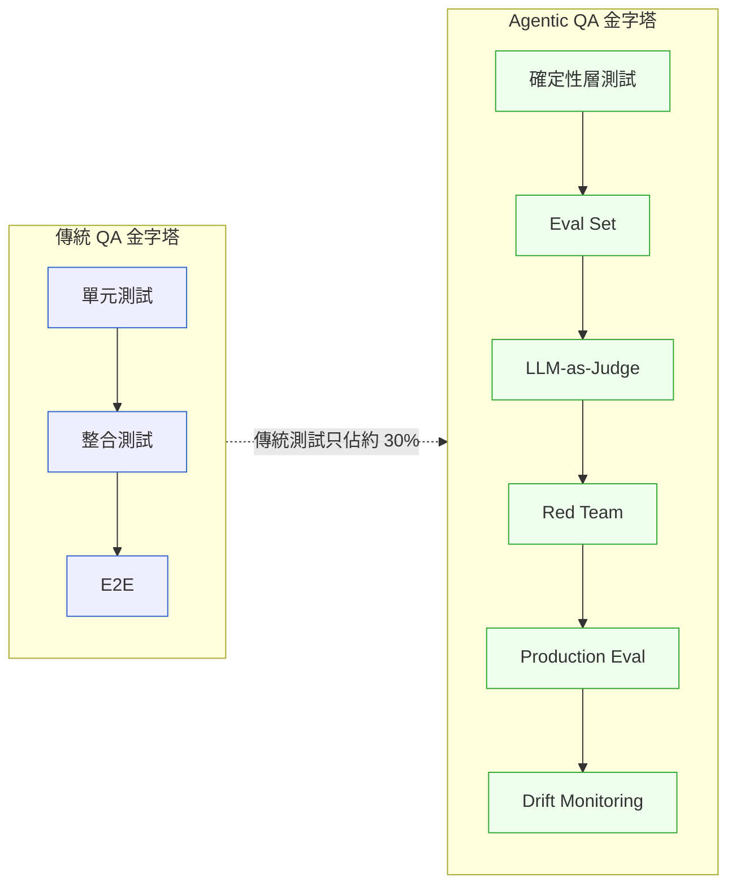
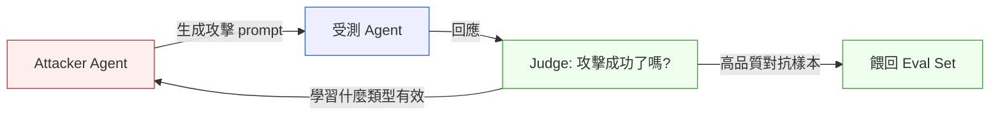

# 第 46 章｜Agentic QA ⸺ 非確定性系統的品質保證
## ⸺ Quality Assurance for Non-Deterministic Systems

> **前置閱讀**:[Ch 30 SRE / SLO / Chaos](../part-05-quality/ch-30-sre-slo-chaos.md)、[Ch 37 AI-Native](./ch-37-ai-native-architecture.md)、[Ch 45](./ch-45-ai-eval-drift-redteam.md)
> **延伸補章**:[Ch 28 Compliance](../part-05-quality/ch-28-compliance.md)、[Ch 41 Multi-Agent](./ch-41-multi-agent-consensus.md)

---

## 46.1 冷觀察 ⸺「LGTM」不能再是一個動詞

2025 年 Q4,虛構 B2B 法律科技公司 **ClauseGenie**(`CASE-SAS-015`)的 8 人工程團隊在凌晨兩點被一封客戶律師的電子郵件叫醒。

ClauseGenie 是一個多租戶 SaaS 合約審查平台,核心功能是「合約條款 AI 助手」:用戶上傳草稿合約,AI Agent 自動標記風險條款並建議替代措辭。技術棧是 FastAPI 0.115 + LangGraph 0.2.28 + Claude Sonnet 3.7,向量資料庫用 pgvector(PostgreSQL 17),部署在 AWS EKS 1.31。上線前,CI pipeline 共有 847 個測試,全數綠燈;PM 手測了 23 個真實合約場景,逐一確認無誤。

上線後第 14 天,TitanCorp(ClauseGenie 最大的企業客戶之一,每月處理約 400 份合約)的首席法務顧問在一份正式簽署的採購合約中發現了問題:AI 建議的免責條款版本比 TitanCorp 內部法務核准的版本舊了兩個修訂版,關鍵的「重大過失排除」措辭已經被悄悄替換成更寬泛的表述——而這份合約已送出給對方律師。那封凌晨兩點的信要求 ClauseGenie 說明:過去兩週,TitanCorp 總共有幾份合約被這個 Agent 處理過?

工程師 Rex 翻出監控儀表板,發現 CI 從未紅燈、P99 延遲正常維持在 1.2 秒以內、無任何 exception log。Drift 的跡象完全不在傳統監控的視野裡。當 Rex 把同一份合約丟回 staging 環境重跑,Agent 的回應是正確的。他把 staging 和 production 的 prompt 版本一一比對,沒有任何差異。

事後查明的根因:模型供應商在上線後第 9 天悄悄推了一次 claude-sonnet-3-7 的 patch 版本更新,同時 pgvector 索引裡的一份「條款範本庫更新文件」被法務助理靜默追加,兩個變化疊加後讓 Agent 在特定租戶的長對話情境下開始偏向舊版措辭。任何一個單一變化都不足以觸發問題,組合起來才會。

Rex 在事故覆盤會上說了一句話,事後被釘在工程 Slack 頻道的置頂訊息裡:

> 「CI 全綠代表系統沒有 bug;但它完全不代表 Agent 今天的行為跟昨天一樣。這是兩件事。」

LLM 系統打破了軟體 QA 最根本的隱含假設:**輸入相同 → 輸出相同**。同一個 prompt,溫度設成 0.7,跑 100 次會得到 100 個略有差異的輸出。對話歷史延長到第 15 輪,Agent 開始忽略系統提示。底層模型靜默更新一個 patch 版本,行為就可能飄移。

如果工程文化是「Code Review 看一眼說 LGTM、CI 跑綠就 merge」,這套對 Agent 系統根本不夠用。**Agent 系統需要的不是測試,是治理**。

對於用 6–7 人精銳編制取代傳統大型 R&D 部門的團隊(這是 2026 AI 賦能組織的典型結構),Agentic QA 不是錦上添花,**是確保系統不在凌晨三點崩潰把整個團隊叫起床的最後一道防線**。



## 46.2 真問題 ⸺ 把 QA 重新分類:確定性層 vs 非確定性層

混亂的根源是把所有測試都丟在一起。比較乾淨的解法是把 Agent 系統切成兩層:

### 46.2.1 確定性層(Deterministic Layer)

包括:工具(Tool)、Function Calling 契約、檢索器(Retriever)、外部 API 包裝、資料庫查詢、結構化輸出 schema 驗證。

**這一層用傳統 QA 測**。寫單元測試,寫契約測試,寫整合測試。Pact、Spectral、jsonschema、OpenAPI validation,該怎麼用就怎麼用。這部分跳過,後面所有問題都會被歸咎於「LLM 不準」,但實際上是工具回傳格式不穩。

### 46.2.2 非確定性層(Non-Deterministic Layer)

包括:LLM 回答品質、Agent 決策路徑、多步推理完整性、工具選擇合理性、最終輸出有用性。

**這一層用 Eval 測,不是 Test 測**。Eval 是統計性的,接受「100 次中 95 次正確就通過」的概念,而不是「綠燈紅燈」。

| 面向 | 傳統 Test | Agent Eval |
|---|---|---|
| 結果類型 | Pass / Fail | 0–100 分,或多維度向量 |
| 通過標準 | 100% 通過才能 merge | 例如「>= 90 分,且無單一維度 < 70 分」 |
| 失敗代價 | 單個案例就阻擋 | 整體分數下降才阻擋(Eval Regression) |
| 執行頻率 | 每次 push | Nightly 或每次 prompt / 模型變更 |
| 結果穩定性 | 完全可重現 | 統計穩定;n=5 取平均 |

## 46.3 決策框架 ⸺ Eval Set、LLM-as-Judge、Red Team、Drift 四件齊備

### 46.3.1 Eval Set 的建立與治理

Eval Set 是 Agentic QA 的核心資產。**它的價值跟產品的程式碼一樣高,有時候更高**(因為換一個基礎模型,程式碼可能要全改,但 Eval Set 仍然有效)。

| 來源 | 內容 | 規模 |
|---|---|---|
| **黃金樣本(Golden Set)** | 領域專家手寫,代表「希望系統如何回應」。每條記載輸入、期望輸出特徵、評分維度 | 50–200 條起步 |
| **生產樣本(Production Drawn)** | 從真實使用記錄中抽樣,過濾敏感資訊,人工標註 | 隨上線時間累積 |
| **對抗樣本(Adversarial)** | Red Team(人或 Agent)生成,專門找系統會失敗的邊界 | 每季新增 ≥ 50 條 |

Eval Set 必須:版本化(放進 git)、打標籤(category / difficulty / source)、定期審視(每季一次)、有 owner(不是 QA 一個人,是整個產品團隊共擔)。

### 46.3.2 LLM-as-a-Judge:用大象來秤大象

人工評分跟不上 Eval 規模。業界這兩年廣泛使用 **LLM-as-a-Judge** ⸺ 用一個更強的模型(或專門 prompt 過的同模型)來評分另一個模型的輸出。

**關鍵設計選擇**:

- **Pairwise vs Pointwise**:早期業界偏好 Pairwise(A 跟 B 哪個比較好),因為相對排序比絕對分數穩定。隨著模型變強,Pointwise(直接給分)也越來越可用,且更容易視覺化追蹤。
- **多維度比單一分數穩定**:不要問 Judge「這個回答好不好(0–10)」,問它「正確性、相關性、完整性、安全性各打幾分」。混合單一分數會把所有缺陷平均掉。
- **要求引用 + 解釋**:Judge 必須說明為什麼給這個分數。沒有解釋的分數都應該不採信。

**Judge 的常見偏誤**(這是最容易被忽略的):

| 偏誤 | 描述 | 解法 |
|---|---|---|
| **Position Bias** | Judge 系統性地偏向第一個 / 第二個答案 | 每次評估都隨機交換 A/B 順序,n 次取平均 |
| **Verbosity Bias** | Judge 偏好更長的答案 | 在 rubric 明確要求懲罰冗長 |
| **Self-preference** | Judge 偏好跟自己模型風格相似的答案 | 用不同模型家族交叉驗證(GPT 受測就用 Claude 當 Judge) |
| **Sycophancy** | Judge 容易被 prompt 中的暗示帶風向 | Judge prompt 中刻意不透露受測者身份與意圖 |

### 46.3.3 Red Teaming:把破壞當成例行公事

紅隊測試在資安領域行之有年。對 Agent 系統而言,紅隊有兩個目的:**找到讓 Agent 行為失控的 prompt**、**發現 Agent 工具誤用的路徑**。

| 層次 | 對抗目標 | 典型攻擊 |
|---|---|---|
| **Prompt 層** | LLM 本身 | Jailbreak、Prompt Injection、Roleplay 繞過 |
| **Agent 層** | 整個 Agent 行為 | Tool Misuse、Loop 攻擊、Context Bloat |
| **System 層** | 整套系統(Agent + 後端) | 資料外洩、權限提升、租戶汙染、資源耗盡 |

**自動化紅隊的雙 Agent 架構**:



把紅隊當成另一個 Agent 來訓練,讓它自己學會攻擊向量。每次被防住,就調整策略。這套循環跑一夜可以產生數千個高品質對抗樣本,直接餵回 Eval Set。

業界 2025–2026 比較成熟的工具:**PyRIT**(微軟)、**garak**(英國 AISI)、**Promptfoo Red Team**、**Lakera Red Teamer**。實務上會自寫一個薄層在這些之上,因為每個產品的攻擊面都不一樣。

### 46.3.4 Behavior Drift:沒人改 prompt,但行為變了

這是 Agent 系統最詭異的失敗模式。

**情境**:三個月前部署了一個運作良好的客服 Agent。沒人改 prompt、沒人改模型、沒人改工具。但客服主管反映最近 Agent 開始傲慢,還會主動提供錯誤的退款政策。

**為什麼會漂移?**
1. 底層模型版本悄悄更新(用 SaaS 模型 API 都吃過這個虧)
2. 檢索資料庫被人加了新文件,而且這份文件跟舊文件矛盾
3. 使用者的提問模式變了(熱門事件帶來新類型問題)
4. 工具回傳格式有微調(後端 API 加了一個欄位,看似無害,但讓 Agent 開始「探索」這個新欄位)

**Drift 的三類指標必須同時監看**:回答品質指標(LLM-as-a-Judge 平均分)/ 工具使用指標(每次對話呼叫工具的次數、失敗率、平均深度)/ 使用者反饋指標(thumbs-up / down 比、轉接人工率、會話長度分佈)。任何一類連續三天偏離基線 > 2σ,就應該觸發人工審查。**等到使用者投訴才發現,已經晚了**。

### 46.3.5 把 Agentic QA 整合進 CI/CD

| 階段 | 觸發 | 內容 | 阻擋條件 |
|---|---|---|---|
| Pre-commit | 本機 | Linter、Schema 驗證 | 任何錯誤 |
| PR Open | CI | 確定性測試 + Eval Mini(20 條) | 確定性 100%、Eval > 90% |
| Merge to main | CI | Eval Full(200+ 條) | Eval Regression > 3% 阻擋 |
| Pre-production | Manual | Red Team Suite | 任何 P0/P1 攻擊成功 |
| Canary(10% 流量) | 自動 | Online Eval | 線上分數 > 線下分數 -5% |
| Full rollout | 自動 | Drift Monitor | 三日連續 < 2σ |

---

## 46.4 踩坑清單

### 反模式 1:確定性層也用 LLM-as-Judge 量

工具 / 檢索器 / API 契約這些是確定性事件,卻拿 Judge 給分,結果是「真正的 bug 被統計平均掉」。

> ✅ **修正方向**:確定性層走傳統 Test(Pact / jsonschema / OpenAPI validation),非確定性層走 Eval。**兩條 pipeline,不混用**。

### 反模式 2:Eval Set 一寫就放著不更新

Eval Set 寫了 50 條黃金樣本,半年沒人動,生產樣本也沒抽進來。半年後 Eval 跑出 95% 但實際生產 60%。

> ✅ **修正方向**:Eval Set 像程式碼一樣治理(版本控制、季度審視、產品團隊共擔 owner)。每月至少抽一次生產樣本,過濾後標註入 set。

### 反模式 3:Judge 沒做 bias 控制

直接拿 Judge 給的分數信任,position bias / verbosity bias / self-preference / sycophancy 全部放大進指標。

> ✅ **修正方向**:Judge 必須跨模型家族交叉(GPT 受測 → Claude 當 Judge,反之亦然)、隨機交換 A/B 順序 n=5 取平均、rubric 明確懲罰冗長、不透露受測者身份。每季用「人工 Golden Set」校準 Judge 一次。

### 反模式 4:Red Team 一次性、Drift 不接 CI

上線前找紅隊跑了一次測試,通過後就放著。半年後生產出事才發現「漂移」。

> ✅ **修正方向**:Red Team 進 CI(每次 prompt / model 變更跑一次)、Drift Dashboard 接告警、三類指標(品質 / 工具 / 反饋)任一連續三天 > 2σ 自動建立 ticket。**Eval / Drift / Red Team 三軸並行,缺一就會出事**。

---

## 46.5 交付清單

完成本章後,讀者應產出:

````markdown
# Agentic QA Pack — {專案名稱}

## 1. Eval Set v1
- [ ] 50 條黃金樣本(覆蓋核心使用情境、邊界、敵對輸入)
- [ ] 版本控制位置(git path)
- [ ] 標籤體系(category / difficulty / source)
- [ ] 季度審視 owner

## 2. Judge Rubric
- [ ] 多維度評分標準(正確性 / 相關性 / 完整性 / 安全性)
- [ ] 懲罰冗長條款
- [ ] 要求引用 + 解釋
- [ ] Bias 控制:跨模型家族 / 隨機 A/B / 不透露身份

## 3. Red Team Playbook
- [ ] Prompt 層 10 條攻擊案例(Jailbreak / Prompt Injection / Roleplay)
- [ ] Agent 層 10 條(Tool Misuse / Loop / Context Bloat)
- [ ] System 層 10 條(資料外洩 / 權限提升 / 租戶污染)
- [ ] 自動化紅隊(雙 Agent)上線時程

## 4. Drift Dashboard
- [ ] 回答品質指標(LLM-as-Judge 平均分)
- [ ] 工具使用指標(呼叫次數 / 失敗率 / 平均深度)
- [ ] 使用者反饋指標(👍/👎、轉接人工率、會話長度)
- [ ] 三類指標 > 2σ 自動建立 ticket

## 5. CI/CD 整合
- [ ] PR Open: Eval Mini + 確定性
- [ ] Merge to main: Eval Full + Regression 3%
- [ ] Pre-production: Red Team Suite
- [ ] Canary 10% + Online Eval
- [ ] Full rollout + Drift Monitor

## 6. 失敗劇本(Runbook)
- [ ] Drift 觸發時的處理 SOP
- [ ] Red Team 攻擊成功時的回應流程
- [ ] Eval Regression > 3% 的 rollback 流程
````

放在 `docs/agentic-qa/`,跟程式碼同 repo,跟 README 同層。

### 46.5.1 範例:HavenAxis AMLNavigator 的 Eval Set 與 Drift Dashboard 補卡

如果 HavenAxis Bank(`CASE-FIN-010`)在 AMLNavigator 上線時就把這份 Pack 寫齊,六個月後 MAS 抽查那 19 筆漏報就會在第二週的 Drift 告警裡被攔截下來。下面是事故覆盤後團隊**應該**寫的版本:

````markdown
# Agentic QA Pack — AMLNavigator(STR 判斷助手)

## 1. Eval Set v1
<!-- 為什麼這欄:沒這 50 條黃金樣本,上線時宣稱的 92.3% 等於沒被任何外部標準量過;
     後面 Drift 比的也是空氣。 -->
- 黃金樣本 80 條(覆蓋 STR 觸發、PEP、跨境結構化、現金密集業)
- git path:`evals/aml-navigator/golden_v1/`(每條附 banker 標註與決策理由)
- 標籤:`category=str|kyc|sanction` × `difficulty=easy|hard|adversarial` × `source=banker|prod|red_team`
- 季度 owner:Risk Lead Mei + QA Lead Hsin(雙簽,不單押 QA)

## 2. Judge Rubric
- 維度評分:Correctness / Reasoning / Citation / Safety(各 0–5,單項 < 3 即整體不合格)
- 懲罰冗長:超過 300 字且未引用 STR 法條,Reasoning 自動 -2
- Bias 控制:Claude Sonnet 受測 → GPT-5.1 當 Judge,A/B 隨機 n=5 取平均

## 3. Red Team Playbook
<!-- 為什麼這欄:AMLNavigator 在上線後從沒被紅隊掃過,16 次 prompt injection 11 次穿透;
     寫進 CI 後同類攻擊在 PR 階段就會被擋。 -->
- Prompt 層:Roleplay 繞過(「你現在是 banker 私下幫忙評估」)10 條
- Agent 層:Tool Misuse(把 KYC lookup 當成搜尋引擎查不相關客戶)10 條
- System 層:跨租戶汙染、PEP 名單越權查詢 10 條

## 4. Drift Dashboard
<!-- 為什麼這欄:六個月 accuracy 從 92.3% 漂到 71.4% 沒人發現,就是因為這條沒接;
     接上後 FN rate 任一週連續三天 > 5% 就會自動建 ticket。 -->
- 品質:Judge 平均分 / 各維度 / FN rate(基準 < 3%)
- 工具:KYC lookup 失敗率 / 平均工具呼叫深度
- 反饋:banker 「不採納建議」比率 / 案件升級至 MLRO 比例
- 三類任一連續 3 日 > 2σ 自動 PagerDuty + 建 ticket 給 Risk Lead

## 5. CI/CD 整合
- PR Open:Eval Mini 20 條(覆蓋 STR / PEP)+ 確定性契約測試
- Merge to main:Eval Full 80 條,Regression > 3% 阻擋
- Pre-production:Red Team Suite,任一 P0/P1 攻擊成功阻擋
- Canary 5%(MAS 高合規環境保守):Online Eval 對照線下 -5% 內

## 6. 失敗劇本(Runbook)
- Drift 觸發 → Risk Lead 4hr 內人工抽查 20 筆 → 必要時切回確定性規則
- Red Team 穿透 → 24hr 內補 prompt + 加 eval 條目,不可只修 prompt
````
這頁本來就該在 2025 Q3 上線當天交,不是 2026 Q1 被 MAS 抽到才補。**Eval / Drift / Red Team 三軸並行不是奢侈品,是不被監理罰款的最低門票。**

---

## 46.6 Recap

讀完本章,應該已經能做到:

- [ ] 把系統切成確定性層 vs 非確定性層,各用各的 QA 工具
- [ ] 建立並治理 Eval Set(三類來源、版本控制、季度審視、產品共擔 owner)
- [ ] 跨模型家族 + 隨機 A/B + bias 控制下使用 LLM-as-Judge
- [ ] Red Team 三層次 + 自動化雙 Agent 紅隊 + Drift 三類指標 + CI/CD 整合
- [ ] Eval / Drift / Red Team 三軸並行,缺一不可

如果先挑一項做,建議是先寫 50 條黃金樣本的 Eval Set ⸺ 它是 Agentic QA 的最低公倍數,所有其他 QA 工具都建立在這上面。

---

## Cross-References

- **前置**:[Ch 30 SRE](../part-05-quality/ch-30-sre-slo-chaos.md)、[Ch 37 AI-Native](./ch-37-ai-native-architecture.md)、[Ch 45 AI Eval](./ch-45-ai-eval-drift-redteam.md)
- **延伸補章**:[Ch 28 Compliance](../part-05-quality/ch-28-compliance.md)、[Ch 41 Multi-Agent](./ch-41-multi-agent-consensus.md)

## 引用

本章無外部文獻引用。
