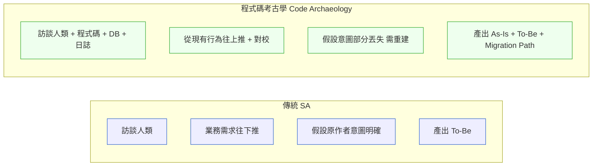
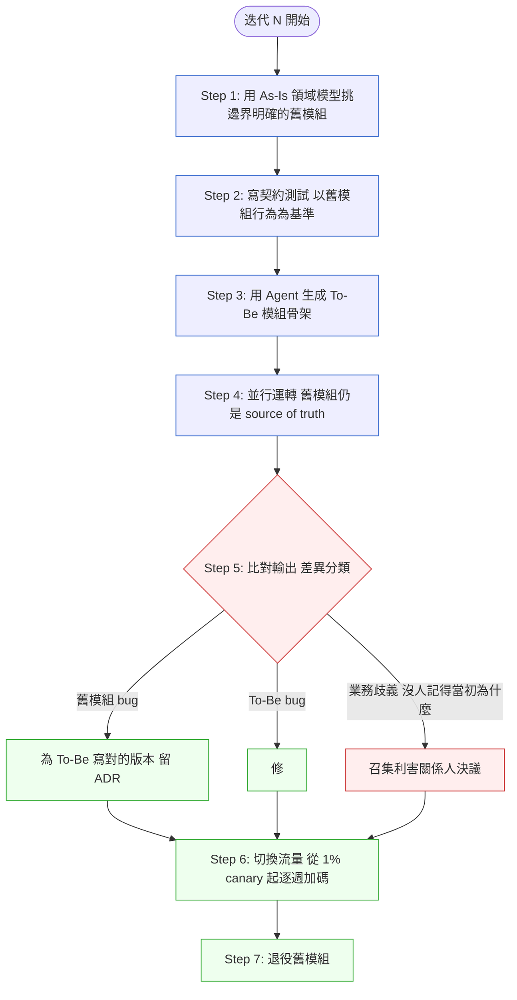

# 第 47 章｜遺留系統現代化與 AI 逆向工程
## ⸺ Brownfield Modernization with Agent-Assisted Reverse Engineering

> **前置閱讀**:[Ch 18 DDD](../part-04-architecture/ch-18-ddd-strategic-tactical.md)、[Ch 21 Modular Monolith](../part-04-architecture/ch-21-modular-monolith.md)、[Ch 38 CDE](./ch-38-context-driven-engineering.md)、[Ch 44 Coding Agent](./ch-44-coding-agent.md)
> **下游章節**:[Ch 48 Capstone](../part-08-synthesis/ch-48-capstone.md)
> **延伸補章**:[Ch 46 Agentic QA](./ch-46-agentic-qa.md)

---

## 47.1 冷觀察 ⸺ 主大綱默認在 Greenfield,但你大概率不在

2025 年 Q4，虛構銀行科技公司 **凌雲金融科技**（`CASE-FIN-011`）的架構重構專案走到第八個月，進入了沒有人預期的僵局。

凌雲的核心放款系統已跑了十二年。後端是 WebLogic 14.1 + Java EE 8，資料層是 Oracle 19c，業務規則幾乎全藏在 PL/SQL stored procedure 裡，其中單一套件 `pkg_loan_rate` 就有 4 萬行。十六人的重構小組在第零個月拍板採用 DDD + Event Sourcing：Bounded Context 圖畫完、Spring Boot 3.3 的骨架起好、Kafka 叢集也在 AWS 上跑起來了。照計畫，第八個月應該要進入並行測試。

然而，並行測試永遠沒有開始。

問題出在 COBOL 那側。凌雲早年有一批清算批次跑在 IBM z16 上，用 COBOL 寫就，總量約 40 萬行。這批程式直到重構啟動前都沒有人去碰，因為「它一直都在跑、從沒出事」。直到第七個月底，QA 工程師 Victor 在比對利息試算結果時，發現新服務算出的金額在某些分期情境下與主機相差最多 NT$184 元 ⸺ 不大，但在放款系統裡，這個數字每筆都要解釋清楚。

Victor 把差異往上追，追進了 COBOL 的 `CALC-EFFECTIVE-RATE` 段落。沒有人能讀懂它。當年的程式碼作者早在 2019 年離職，留下的唯一文件是一份掃描版 Word 檔，上面的業務說明停在 2014 年的版本。重構小組翻遍 Git history，發現這批 COBOL 從未被 commit 進版控，只存在主機磁帶備份裡。

架構師 Serena 在第八個月的 Steering Committee 上說了一句話，沉默了整個會議室：

> 「我們畫了八個月的 To-Be，但我們根本不知道 As-Is 在做什麼。」

這句話道出了 Greenfield 思維最致命的盲區：[Ch 18](../part-04-architecture/ch-18-ddd-strategic-tactical.md) 談 DDD 從 Bounded Context 開始畫，[Ch 20](../part-04-architecture/ch-20-c4-model-visualization.md) C4 從 System Context 圖開始畫，[Ch 23](../part-04-architecture/ch-23-event-driven-cqrs-es.md) Event Sourcing 假設能重新設計事件流。**這些都是 Greenfield 視角**。

[Ch 21](../part-04-architecture/ch-21-modular-monolith.md) 提到 Strangler Fig 模式 ⸺ 這是現代化的「目標形狀」,但不是「行動方案」。Strangler Fig 假設已經知道**舊系統做了什麼**。**現實是:不知道**。原作者離職了，文件不存在，使用者只知道「按這個鈕會觸發那個流程」。

這一章談的是:**在這種狀態下,如何用 AI Agent 逆向找回知識,然後設計現代化路徑**。



## 47.2 真問題 ⸺ 用 Agent 做逆向工程的四個層次

不要把 Agent 當成「貼進去問問題」的工具。它能做的事分四個層次,要分階段使用。

| Level | 名稱 | 內容 | 適用工具 | Agent 角色 |
|---|---|---|---|---|
| **L1** | Lexical(詞彙層) | 抽取所有類別、函式、表名、欄名;統計呼叫頻率、依賴關係;找出明顯死碼 | SonarQube、Understand、CodeQL | 價值不大 |
| **L2** | Structural(結構層) | 重建模組依賴圖、類別繼承樹、ER 圖;找出循環依賴、上帝物件、跨層耦合 | CodeQL + Agent 摘要 | Agent 把工具輸出翻譯成人話與圖示 |
| **L3** | Behavioral(行為層) | 給定入口追蹤執行路徑;從 stored procedure 提取業務規則;識別「看似相同但暗藏差異」程式碼;把日誌反推回程式碼路徑 | Claude Code、Cursor、Antigravity、Codex CLI | **Agent 真正開始發光的地方**,需要長上下文與工具呼叫 |
| **L4** | Domain(領域層) | 從程式碼推回 Ubiquitous Language;為每一個 Bounded Context 寫考古報告;對照訪談標記矛盾點(程式碼這樣寫、使用者描述不一樣 → 一定有故事) | Claude Code + 領域專家 | **必須人類主導,Agent 輔助**。Agent 可提案,人類必須驗證 |

## 47.3 決策框架 ⸺ IDE / Agent 工具取捨與三段式遷移

### 47.3.1 IDE / Agent 工具取捨(2026 現實)

[Ch 38 CDE](./ch-38-context-driven-engineering.md) 與 [Ch 44 Coding Agent](./ch-44-coding-agent.md) 提到了 Context-Driven Engineering 與工具,但沒針對「逆向工程」場景做選型。這裡補上:

| 工具 | 上下文視窗 | Brownfield 適合度 | 取捨 |
|---|---|---|---|
| **Google Antigravity**(Gemini 3.1 Pro) | 200 萬 token | ★★★★★ 大型 codebase 整體理解 | 可一口氣吃下整個中型 monorepo,但 production 穩定性仍差。**用它做分析,不用它做生產修改**。 |
| **Cursor**(Claude Sonnet 4.6 / GPT-5.1) | ~200K | ★★★★ 精準局部修改 | SOC 2 + GDPR 合規通過,適合在嚴肅環境做小範圍修改。Shadow workspace 是 Brownfield 救命特性。 |
| **Claude Code**(Claude Opus / Sonnet) | ~200K(可分段) | ★★★★★ 終端原生 + 80.8% SWE-Bench | 主力。Skills + Subagent 機制能把考古經驗模組化。 |
| **Aider**(多模型) | 隨模型 | ★★★ 輕量、git-native | 適合 git history 重建、commit-by-commit 重構。 |
| **GitHub Copilot Workspace** | 隨模型 | ★★★ 與 PR 流程整合好 | 適合「已知道要改什麼」的場景,Brownfield 探索性差。 |

**一個務實的工具組合**:實務上會用兩到三套疊加 ⸺ Antigravity / Gemini 3.1 Pro 跑一次「全景考古」,生成宏觀報告後就停(**不寫回任何檔案**);Claude Code 主力編碼,跑深度逆向工程,提取業務規則,寫進文件,Skills 設計成「逆向某個 stored procedure 並產出 PRD」這類;Cursor 進入修改階段做精準 refactor,Shadow workspace 確保不污染主分支。

### 47.3.2 從 As-Is 到 To-Be 的安全平滑遷移

這是最容易翻車的環節。一旦提取出 As-Is 領域模型,開始畫 To-Be,**80% 的失敗在這裡發生**:To-Be 畫得太理想、跟 As-Is 不接、導致遷移路徑根本走不通。

**三條黃金規則**:

| 規則 | 內容 |
|---|---|
| **規則一:To-Be 必須能用 As-Is 的語言被解釋** | 如果 To-Be 引入了 As-Is 完全沒有的概念(如新的 Bounded Context),必須能在現有業務語言中為它找到對應。否則使用者訓練成本會殺死整個專案。 |
| **規則二:任何 To-Be 模組必須有「並行運轉一個月」的計畫** | 新模組接管舊模組之前,讓兩者並行跑、輸出比對。Stripe、GitLab、Shopify 在大型遷移上都用這套。 |
| **規則三:Strangler Fig 必須有「中途停下來」的設計** | 做到一半發現方向錯了,要能停在中間狀態繼續運轉,而不是「全有或全無」。舊新模組之間必須維持雙向相容。 |

### 47.3.3 一個典型的遷移迭代



每一個迭代產出一份 ADR + 一份「考古報告」,慢慢累積整個系統的知識資產。

---

## 47.4 踩坑清單

### 反模式 1:相信 Agent 的初次摘要

給它一個 2 萬行的 service,它會自信地告訴你業務邏輯。但常常半對半錯。

> ✅ **修正方向**:重要環節人工驗證至少 3 次。Agent 摘要寫進「考古報告草稿」,不直接寫進 ADR。每條業務規則記載出處(檔名 + 行號)、推導理由、置信度(High / Medium / Low)。

### 反模式 2:相信 Agent「幻覺出來的 API」

Agent 有時會發明不存在的函式呼叫,看起來合理但實際 codebase 沒有這個 method。

> ✅ **修正方向**:寫程式碼前必須驗證真實存在(grep / IDE go-to-definition)。在 Agent 工作流中加一條「rule:任何 API 呼叫必須附上 file path + line number 的證據」,沒附證據的 API 視為幻覺。

### 反模式 3:讓 Agent 自己決定刪除程式碼

Agent 看了一段沒被呼叫的程式碼說「這是 dead code 可以刪」⸺ 但 Agent 看不到 cron job、爬蟲、外部整合等隱性觸發路徑。

> ✅ **修正方向**:死碼分析永遠假設「可能漏看了某條觸發路徑」。要刪,必須有人簽字。先 deprecation period(加 log 警告 + 監控 30 天無觸發)再刪。

### 反模式 4:忽略隱性權限與資料庫 trigger

舊系統的權限模型常常是隱含的(「這個欄位只有特定 role 看得到,但檢查邏輯散在 5 個地方」)、資料庫 trigger 與 stored procedure 一樣是業務規則藏身處,Agent 容易漏掉。

> ✅ **修正方向**:在考古 Skill 中加固定 checklist:(1) trigger 列表 + 每個 trigger 的觸發條件 + 副作用;(2) 散落在多處的權限檢查(grep `if user.role` 類);(3) 跨系統整合(cron / 爬蟲 / 共享 DB)需訪談 + 日誌分析。Agent 看不到的,人類補上。

---

## 47.5 交付清單 ⸺ 一頁式 Brownfield Modernization Pack

每當工程師第一次打開一個十年老系統,最危險的不是「不知道怎麼改」,而是「以為自己知道了」。這份 Brownfield Modernization Pack 是考古工作的收斂點——把 Agent 逆向工程的四層輸出、訪談矛盾、並行驗證結果全部匯入同一份文件,讓 Strangler Fig 的第一刀有據可查。

````markdown
# Brownfield Modernization Pack — {專案名稱}
> 版本:v0.1 | 撰寫日期:YYYY-MM-DD | 擁有人:{名字}

## 1. As-Is Bounded Context Map
- [ ] 從程式碼考古推回的領域模型
- [ ] 每個 Context 的 Ubiquitous Language Top 10
- [ ] 與訪談的矛盾點清單

## 2. Business Rules Catalog
- [ ] 每條規則:出處(檔名 + 行號)/ 推導理由 / 置信度(High/Medium/Low)
- [ ] 規則之間的依賴 / 互斥關係

## 3. Migration Dependency Graph
- [ ] 模組之間的拆解順序與依賴
- [ ] 並行運轉時的 source of truth 標註

## 4. Migration ADR Set
- [ ] 每一個重要決策有理由
- [ ] 每個 ADR 連結到對應「考古報告」

## 5. Parallel Run Comparison Report
- [ ] 舊新差異分類:舊 bug / To-Be bug / 業務歧義
- [ ] 處置紀錄與簽核

## 6. 工具組合配置
- [ ] L1/L2(SonarQube / CodeQL)
- [ ] L3(Claude Code Skills 設計)
- [ ] L4(人類主導 + Agent 提案的工作流)
````

放在 `docs/brownfield/`,與程式碼同 repo。

### 47.5.1 範例:WebLogic 利率計算 SP 第一張考古卡

`CASE-FIN-011` 那位離職資深工程師留下的 5,000 行 PL/SQL 裡,團隊挑了最常被客服質疑的 `pkg_loan_rate.calc_effective` 當第一個考古目標。下面是 L3/L4 跑完之後**應該**產出的那一頁,而不是「Claude 說大概是這樣」的對話 log:

````markdown
# Brownfield Modernization Pack — 個金放款計息核心(WebLogic 7y)
> 版本:v0.1 | 撰寫日期:2026-01-15 | 擁有人:Pricing 現代化小組

## 1. As-Is Bounded Context Map
<!-- 為什麼這欄:沒這張圖,Strangler Fig 第一刀往哪切都是賭;
     畫出來才看見「利率計算」其實藏在 Loan / Pricing / Compliance 三個 BC 中間。 -->
- 識別 4 個 As-Is BC:Loan Servicing / Pricing Engine / Compliance Hold / Customer
- Pricing Engine 的 Ubiquitous Language Top 10:base_rate / spread / floor / cap / promo_offset / hold_flag …
- 與訪談的矛盾:5 位資深 banker 說「促銷迭代過三套」,但 SP 只看得出兩套

## 2. Business Rules Catalog
<!-- 為什麼這欄:每條規則沒標出處與置信度,To-Be 重寫時會把暗藏的合規條款一起遺失;
     2008 OBU 拒貸條款就藏在 BR-017。 -->
| ID | 規則 | 出處 | 推導理由 | 置信度 |
|---|---|---|---|---|
| BR-007 | 寬限期內不複利 | `pkg_loan_rate.calc_effective` L142–168 | 與 banker 訪談一致 | High |
| BR-017 | OBU 客戶利率下限 = TWD prime + 0.75% | trigger `trg_obu_floor` + 2008 函釋 PDF | 訪談「沒人記得為什麼」+ Compliance NAS | Medium |
| BR-031 | 月底促銷自動延期 7 天 | SP L2310–2380(註解只寫「per Eddy」) | 推導 + 三個月日誌比對 | Low(待 banker 確認) |

## 3. Migration Dependency Graph
- 第一刀:Pricing Engine(讀多寫少、邊界清楚、有銀行對賬可比)
- 並行期 source of truth = 舊 SP(新 service 只讀後算,寫回仍走 SP 30 天)
- 不切:Compliance Hold(trigger 鏈過深,留到第三刀)

## 4. Migration ADR Set
- ADR-021:Pricing Engine 用 Spring Boot 3.3 + Drools 重寫,不沿用 SP 風格
- ADR-022:BR-017 OBU floor 維持為**規則**而非常數(2008 函釋仍在效)
- 每個 ADR 連結到 `docs/brownfield/archeology/pricing-engine.md` 對應段落

## 5. Parallel Run Comparison Report
<!-- 為什麼這欄:沒寫進這張表的差異,上線後就會被當成新系統 bug 而不是舊 SP 的歷史包袱;
     兩種歸因處理流程完全不同。 -->
- 並行 30 天,5,420 萬筆計息事件
- 差異 47 筆:舊 SP bug 31 筆(寬限期計算誤差,簽 ADR-023 採新版)/ To-Be bug 12 筆(已修)/ 業務歧義 4 筆(召集 Risk + 法遵決議)

## 6. 工具組合配置
- L1/L2:SonarQube + CodeQL 跑全 codebase 拓樸,輸出 dead code 候選(僅候選,不刪)
- L3:Claude Code Skill `archeology-plsql`(吃單一 SP → 產 BR catalog 草稿,強制附行號證據)
- L4:Antigravity 跑全景一次後鎖權限唯讀;領域決策由 banker + SA 主導,Agent 只提案
````
**第一張考古卡寫得出來,Strangler Fig 才有真正能下手的位置;** 寫不出來,通常代表這條 SP 還沒準備好被現代化。

---

## 47.6 Recap

讀完本章,應該已經能做到:

- [ ] 認得出主大綱章節哪些是 Greenfield 視角、在 Brownfield 必須補做考古
- [ ] 把 AI Agent 逆向工程分四層使用(L1 Lexical / L2 Structural / L3 Behavioral / L4 Domain)
- [ ] 用 Antigravity + Claude Code + Cursor 三套工具的組合策略
- [ ] 遵守 As-Is → To-Be 三條黃金規則(語言可解釋 / 並行運轉 / 中途可停)
- [ ] 在每個遷移迭代產出 ADR + 考古報告,累積系統知識資產

如果先挑一項做,建議是 L4 領域層的「考古報告」⸺ 它是把程式碼知識翻譯回業務語言的橋樑,有了它,後面所有的遷移決策才有共同語言。

---

## Cross-References

- **前置**:[Ch 18 DDD](../part-04-architecture/ch-18-ddd-strategic-tactical.md)、[Ch 21 Modular Monolith](../part-04-architecture/ch-21-modular-monolith.md)、[Ch 38 CDE](./ch-38-context-driven-engineering.md)、[Ch 44 Coding Agent](./ch-44-coding-agent.md)
- **下游**:[Ch 48 Capstone](../part-08-synthesis/ch-48-capstone.md)
- **延伸補章**:[Ch 46 Agentic QA](./ch-46-agentic-qa.md)

## 引用

本章無外部文獻引用。
