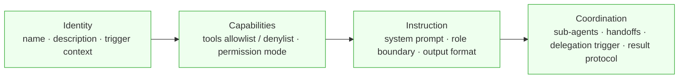
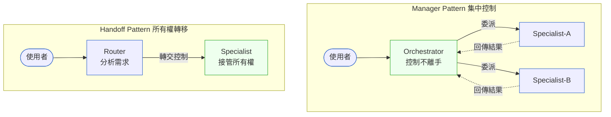

# 補章 H|Agent 設定語言 ⸺ SA 的新交付物
## ⸺ CLAUDE.md、agent.md、skill.md 與跨廠商通用設計框架

> **插入位置**：緊接 [補章 D Multi-Agent 共識](./chD-multi-agent.md) 之後，作為 Part VII 最後一個補章
> **前置閱讀**：[Ch 36 Multi-Agent 系統設計](./ch-36-multi-agent.md)、[Ch 37 AI Coding Agent](./ch-37-coding-agent.md)、[補章 D](./chD-multi-agent.md)
> **下游章節**：[Ch 39 Capstone](../part-08-synthesis/ch-39-capstone.md)
> **強連結補章**：[補章 B Agentic QA](./chB-agentic-qa.md)、[補章 D](./chD-multi-agent.md)

---

## H.1 冷觀察 ⸺ 你的 Agent 系統，SA 在哪裡？

2026 年初，一個 SA 主管找過來，說了一句讓我記了很久的話。

「我被拉進來做需求稽核，想確認幾個 Agent 的職責邊界和需求規格書對不對得起來。結果我翻了兩天的程式碼，找不到任何可以閱讀的東西。」

她服務的公司是做企業 ERP 整合的 **Caldwell Systems**（`CASE-SAS-013`）。CTO 找了三個工程師，兩週後交出一個「可以動的版本」：Python 寫的四個 Agent，每個 Agent 的 `instructions` 字串硬塞在程式碼裡，總長度約 4,000 字。沒有文件，沒有版本歷史。每次需求變更，工程師直接改字串再重新部署。

她花了兩天才拼湊出一份「Agent 行為現況表」。那份表格在下一次 sprint 之後就過期了。

**Caldwell Systems 的問題不是工程問題，是分析問題。**

當系統裡有多個 Agent 時，「這個 Agent 是什麼人、能做什麼事、如何和其他 Agent 溝通」，就是一份需要被設計、被文件化、被版控的規格。它和以前寫的 SRS、DFD、API 規格沒有本質差異——只是載體換了。

那個新載體，就是本章要討論的東西：**Agent 設定語言**（Agent Configuration Language）。

> 📌 [圖示建議 H-1] 三列對照：傳統 SA 交付物（SRS、DFD、ERD）→ AI 時代 SA 交付物（CLAUDE.md、agent.md、skill.md）→ 對應的「規格問題」（系統邊界 → Agent 邊界；資料流 → 工具呼叫流；模組介面 → Handoff 介面）

---

## H.2 真問題 ⸺ Agent 設定語言要解決什麼分析問題？

### H.2.1 四個分析問題，都需要文件化

面對一個 Multi-Agent 系統，SA 需要能夠回答四個問題：

**問題一：這個 Agent 是誰？（Identity）**
它叫什麼名字？它在什麼情境下被啟動？它代表哪個業務角色？沒有這層定義，兩個 Agent 可能同時試圖處理同一件事，或都認為那件事不是自己負責的。

**問題二：它被允許做什麼？（Capabilities）**
它可以呼叫哪些工具？哪些資料來源它有讀寫權限？哪些操作被明確禁止？這是 Agent 等級的最小授權原則（Principle of Least Privilege）。

**問題三：它應該怎麼行動？（Instruction）**
[系統提示](../annex-f-glossary.md#system-prompt)（System Prompt）本身就是規格。「你是帳務專員，處理退款申請時必須確認客戶身份後才能執行」這句話不只是提示工程，它是業務規則的陳述——和 SRS 裡的業務邏輯條文是同一層次的東西。

**問題四：它如何和其他 Agent 協作？（Coordination）**
哪些任務可以委派出去？委派給誰？委派之後，對話的控制權在哪裡？結果如何回傳？這是 Agent 等級的介面設計。

這四個問題的答案，就是 **Universal Agent Spec（通用 Agent 規格）** 的四要素：**Identity、Capabilities、Instruction、Coordination**。



### H.2.2 三家主要廠商，相同的四要素，不同的載體

截至 2026 年初，三家主要 LLM 廠商——Anthropic（Claude Code）、OpenAI（Agents SDK）、Google（ADK）——都在自己的生態系裡回答了這四個問題。格式不同，但語意結構高度收斂。

| 面向 | Anthropic (Claude Code) | OpenAI (Agents SDK) | Google (ADK) |
|---|---|---|---|
| **Agent 定義主要格式** | Markdown + YAML frontmatter | Python/TypeScript 程式碼 | YAML（`agent_config.yaml`）或 Python |
| **Identity 怎麼寫** | frontmatter 的 `name` + `description` | `Agent(name=, ...)` 參數 | YAML 的 `name:` + `description:` |
| **Capabilities 怎麼寫** | frontmatter 的 `tools:` allowlist | `tools=[]` 參數 | YAML 的 `tools:` list |
| **Instruction 怎麼寫** | Markdown body（整個 system prompt） | `instructions=` 字串或函數 | YAML 的 `instruction:` 多行字串 |
| **Coordination 怎麼寫** | `Agent` tool 委派；`.claude/agents/*.md` 引用 | `handoffs=[]` 或 `.as_tool()` | YAML 的 `sub_agents:` 路徑列表 |
| **有無獨立的「技能」概念** | 是（SKILL.md，agentskills.io 開放標準）| 部分（OpenAI Codex CLI 採用 SKILL.md）| 否（用 sub_agents 替代）|
| **有無全域專案記憶** | 是（CLAUDE.md，session 必載）| 否 | 否 |

以「財務分析師 Agent」為例，三家的最小定義並排如下：

```markdown
# Anthropic（.claude/agents/analyst.md）
---
name: financial-analyst
description: 分析財務報表、計算財務指標。
             當使用者提及財報分析、比率計算、估值模型時啟動。
tools: Read, Bash
model: opus
---
你是資深財務分析師，專精台灣上市公司財報分析。

## 行為規範
- 引用數字必須標注原始報表來源（頁碼或附注編號）
- 不提供具體投資建議，只提供分析觀點
- 發現資料異常時，主動標記並請使用者確認

## 輸出格式
每份分析必須包含：摘要（3 點）、關鍵指標表、風險提示。
```

```python
# OpenAI（Python，agents/analyst.py）
from agents import Agent

analyst = Agent(
    name="financial-analyst",
    instructions="""你是資深財務分析師，專精台灣上市公司財報分析。

行為規範：
- 引用數字必須標注原始報表來源
- 不提供具體投資建議
- 發現資料異常時主動標記

輸出格式：摘要（3點）、關鍵指標表、風險提示。""",
    tools=[read_financial_report, calculate_ratio],
    model="gpt-4o"
)
```

```yaml
# Google ADK（agents/analyst.yaml）
name: financial-analyst
model: gemini-2.0-flash
description: 分析財務報表、計算財務指標
instruction: |
  你是資深財務分析師，專精台灣上市公司財報分析。

  行為規範：
  - 引用數字必須標注原始報表來源
  - 不提供具體投資建議
  - 發現資料異常時主動標記

  輸出格式：摘要（3點）、關鍵指標表、風險提示。
tools:
  - name: mytools.read_financial_report
  - name: mytools.calculate_ratio
```

**三者的 SA 閱讀成本截然不同**：Anthropic 的 Markdown 格式最接近傳統規格文件，非技術背景的 SA 和 PM 不需要懂 Python 就能審查 Agent 定義；OpenAI 的格式需要讀程式碼；Google ADK 的 YAML 介於兩者之間。

> 📌 [圖示建議 H-2] 兩軸象限：橫軸為「SA 閱讀門檻」（低→高），縱軸為「IDE 型別安全支援」（低→高）。Anthropic Markdown 落在左上（門檻低但型別安全弱）、OpenAI Python 落在右上（門檻高但型別安全強）、Google ADK YAML 落在左中（門檻中等）。

---

## H.3 決策框架 ⸺ SA 如何設計 Agent 設定規格

### H.3.1 系統提示工程的三段式結構

三家廠商的官方最佳實踐都指向同一個系統提示結構。這個框架直接對應業務需求文件的三個關鍵問題，是 SA 本來就應該設計的東西——只是現在需要整合進 Agent 設定文件：

```
[角色定位（Role Statement）]
  ↑ 對應：Use Case 的 Actor 定義

你是 X，具備 Y 專業，服務 Z 場景。

[行為規範（Boundary Constraints）]
  ↑ 對應：業務規則（Business Rules），傳統上寫在 SRS 的 BR-XXX 條文

你應該 A、B、C。
你不應該 X、Y、Z。
邊界情況 P 時，執行 Q。

[輸出規格（Output Format）]
  ↑ 對應：介面規格（Interface Specification），傳統上寫在 API 規格的 response schema

輸出必須包含欄位一、欄位二。
格式使用 JSON / 繁體中文 / Markdown 表格。
```

過去這些決策散落在 SRS、PRD、口頭約定之間，現在它們需要被集中寫入 Agent 設定文件，才能被版控、被審查、被追蹤。

### H.3.2 最重要的架構選擇：[Manager Pattern](../annex-f-glossary.md#manager-pattern) vs. [Handoff Pattern](../annex-f-glossary.md#handoff-pattern)

當系統有多個 Agent 時，最關鍵的架構設計決策是協調模式。這個選擇和廠商無關——三家廠商都支援兩種模式，只是 API 形狀不同。



**模式一：Manager Pattern**

中央 Orchestrator 保持對話控制權，透過工具呼叫（tool call）委派子任務，等待結果回傳後自行整合，再回應使用者。

```python
# OpenAI 實作（as_tool 模式）
orchestrator = Agent(
    name="orchestrator",
    instructions="分析需求，委派給合適的專家，整合結果後回應。",
    tools=[
        billing_agent.as_tool("billing_expert", "帳務問題：退款、發票、帳單糾紛"),
        tech_agent.as_tool("tech_expert", "技術問題：Bug、API 使用、功能設定"),
    ]
)
```

```yaml
# Google ADK 實作（sub_agents 模式，root agent 自動扮演 Manager）[^CIT-H03]
name: orchestrator
model: gemini-2.0-flash
instruction: 分析需求，委派給合適的專家，整合結果後回應。
sub_agents:
  - config_path: agents/billing_agent.yaml
  - config_path: agents/tech_agent.yaml
```

```markdown
# Anthropic 實作（Markdown + Agent tool）
---
name: orchestrator
description: 客服協調者，委派帳務與技術問題後整合結果回應
tools: Agent
---
分析使用者需求，委派給合適的 sub-agent，整合結果後回應。
- 帳務問題（退款、發票、帳單糾紛）→ 委派給 billing-agent
- 技術問題（Bug、API 使用、功能設定）→ 委派給 tech-agent
```

**模式二：Handoff Pattern**

路由 Agent 分析需求後，把對話的完整控制權移交給專家 Agent。專家 Agent 直接與使用者互動，不再回頭。

```python
# OpenAI 實作（handoff 模式）
router = Agent(
    name="router",
    instructions="分析需求，路由給合適的專家。",
    handoffs=[billing_agent, tech_agent]   # 轉交後 router 退出
)
```

**選擇準則（SA 的設計決策點）：**

| 情境 | 選 Manager | 選 Handoff |
|---|---|---|
| 子任務結果需要整合後才能回應 | ✓ | |
| 需要跨多個專家彙集資訊 | ✓ | |
| 需要單一 Guardrails 控制點 | ✓ | |
| 專家需要「擁有」整個後續對話 | | ✓ |
| 路由本身是業務流程的一環 | | ✓ |
| Orchestrator 成為效能瓶頸 | | ✓ |

### H.3.3 [Progressive Disclosure](../annex-f-glossary.md#progressive-disclosure)：三層載入策略

Agent 系統面臨和傳統架構相同的「資訊在需要時才載入」問題，只是資源不是記憶體而是 [Context Window](../annex-f-glossary.md#context-window)。

SA 在設計 Agent 設定文件時，應區分三個資訊層：

| 層次 | 載入時機 | 預估 Token 成本 | 內容 |
|---|---|---|---|
| **Layer 1 — Metadata** | Session 啟動時，永遠存在 | 約 100 tokens / agent | `name` + `description` + 觸發條件 |
| **Layer 2 — Instructions** | 觸發時載入 | < 5,000 tokens | System prompt 主體、行為規範、輸出格式 |
| **Layer 3 — Resources** | 按需存取 | 無上限 | 參考文件、計算腳本、範本資料 |

這個策略在 Anthropic 的 SKILL.md（agentskills.io 開放標準）裡被明確化為目錄結構：

```
my-skill/
├── SKILL.md          ← Layer 2：主體指令（< 5000 tokens）
├── references/
│   └── REFERENCE.md  ← Layer 3：詳細技術參考（按需讀取）
└── scripts/
    └── process.py    ← Layer 3：可執行腳本（只傳執行結果）
```

設計 Agent 設定文件的資訊架構時，應明確標注哪些內容屬於哪一層，避免把所有資訊都塞進 Layer 2 導致 Context 爆炸。

### H.3.4 CLAUDE.md / 專案記憶：跨 Agent 的全域規格

Anthropic 生態系有一個其他廠商目前沒有對等機制的概念：**CLAUDE.md**，即「專案記憶文件」。

它在每次 Agent session 啟動時自動載入，扮演「全域規格書」的角色：所有 Agent 共同需要知道的上下文（技術棧、業務領域、工作慣例、SA/RD 協作規則）都寫在這裡，不需要在每個 Agent 的 system prompt 裡重複。

從 SA 觀點看，CLAUDE.md 是一份「跨 Agent 的共同假設清單」，對應傳統需求文件裡的「系統範圍（System Scope）」和「術語表（Glossary）」段落：

```markdown
# CLAUDE.md 建議內容結構（SA 視角）

## 系統定位（等同 SRS 的 System Overview）
本系統是一個企業客服 Multi-Agent 平台，服務 B2B 客戶，業務域為帳務管理。

## 技術棧（影響 Agent 可用工具集）
- 後端：Python 3.13 + FastAPI
- 資料庫：PostgreSQL 17（唯讀）+ Redis 7（狀態）
- LLM 廠商：Anthropic Claude Sonnet

## 業務術語（等同 Glossary）
- 「帳務異常」= 發票金額與系統紀錄差異 > 5%
- 「高優先客戶」= MRR > TWD 100,000 / month

## Agent 協作規則（等同 Multi-Agent Interface Spec）
- 所有 Agent 輸出必須附上 agent_name 和 confidence_score
- 敏感客戶資訊不得在 Agent 間的委派 payload 中以明文傳遞
```

OpenAI 和 Google ADK 沒有等效的自動載入機制；全域規格需要手動注入每個 Agent 的 `instructions` 或 YAML `instruction:` 欄位，容易造成版本漂移。

### H.3.5 SKILL.md 開放標準：跨平台的可重用能力

2025 年底，agentskills.io 發布了一個由 Anthropic 主導、26+ 平台採用（包含 OpenAI Codex CLI、GitHub Copilot、多個 IDE 工具）的 SKILL.md 開放標準[^CIT-H01]。

這個標準定義了「可重用的 Agent 能力單元」的最小規格：

````markdown
---
name: pdf-extraction
description: |
  從 PDF 萃取文字與表格，填寫表單，合併文件。
  當使用者提及 PDF、表單或文件萃取時使用。
license: Apache-2.0
compatibility: Python 3.10+
---

## 使用方式

使用 pdfplumber 萃取文字：

```python
import pdfplumber
with pdfplumber.open("document.pdf") as pdf:
    text = pdf.pages[0].extract_text()
```
````

SKILL.md 代表一個設計概念的具體化：**能力（Capability）和角色（Role）的分離**。一個 Agent 的角色定義在 agent.md 裡，它使用的具體能力定義在 SKILL.md 裡。同一個 SKILL 可以被多個 Agent 引用，類似傳統軟體架構裡的 Library 或 Shared Service：

```
agents/
  billing-agent.md    ← 角色（使用 skills: invoice-parser, refund-calculator）
  audit-agent.md      ← 角色（使用 skills: invoice-parser, anomaly-detector）

skills/
  invoice-parser/SKILL.md     ← 共用能力（兩個 Agent 都引用）
  refund-calculator/SKILL.md
  anomaly-detector/SKILL.md
```

---

## H.4 踩坑與交付清單

### H.4.1 五個常見反模式

**反模式一：把業務規則寫死在程式碼裡，而非設定文件**

Agent 的 `instructions` 字串散落在程式碼的多個位置，沒有版控，SA 無法審查。需求每次變更，工程師直接改字串再部署，沒有任何可追蹤的歷史——這就是 Caldwell Systems 的原始狀態。

> **修正方向**：所有業務規則、角色定義、行為規範提取到獨立的設定文件（Markdown、YAML 或等效結構），與程式碼分離，納入 Git 版控並走需求審查流程。

**反模式二：把 Instruction 當做程式碼的替代品**

System prompt 裡充斥邏輯判斷（「如果 A 則 B，如果 C 且 D 則 E，否則…」），超過三層巢套。Instruction 變成了一份難以閱讀、難以測試的隱式程式碼。

> **修正方向**：複雜邏輯放在工具（Tool / Function）裡，Instruction 只描述「何時呼叫這個工具、如何詮釋結果」。Instruction 應是業務語言，不是程式邏輯。

**反模式三：所有 Agent 都拿到全部工具的授權**

每個 Agent 的 `tools` 列表幾乎相同，包含所有可用工具。帳務 Agent 拿到了刪除記錄的工具，稽核 Agent 拿到了執行退款的工具。

> **修正方向**：嚴格依照最小授權原則（Principle of Least Privilege），工具授權列表與需求文件的「功能權限矩陣」對齊。敏感工具（執行退款、刪除資料）的授權單獨審查。

**反模式四：混用 Manager 和 Handoff 而沒有明確的邊界**

Orchestrator 有時自己回應使用者，有時 handoff 給專家，有時委派後再整合，行為不一致。測試人員無法預測同一個請求下次會走哪條路。

> **修正方向**：每個 Agent 的協調角色（Manager / Worker / Router）在設計階段明確化，標注在 agent.md 的 `description` 欄位。同一個 Agent 不應同時扮演 Router 和 Worker。

**反模式五：把全域規格重複貼進每個 Agent 的 Instruction**

每個 Agent 的 Instruction 開頭都有相同的業務術語表和技術棧說明，共三百字。各版本說法略有不同，版本漂移三個月後，沒有人確定哪份是最新的。

> **修正方向**：全域規格寫在 CLAUDE.md（Anthropic 生態系）或等效的集中載入機制裡。各 Agent 的 Instruction 只寫角色特定的行為規範。

### H.4.2 時效性警告與廠商機制差異

**本章所有廠商格式說明均以 2026 年初為基準。**

Agent 設定語言正在快速演進。已知的高變動風險點：

- agentskills.io 的 SKILL.md 開放標準尚在 v1.x 階段，欄位仍可能調整
- Google ADK 的 YAML 格式於 2025 年 8 月才推出，生產穩定性待觀察
- OpenAI Agents SDK 的 Handoff API 自 2025 年以來已有三次 breaking change[^CIT-H02]

**廠商機制差異（截至 2026 年初）**：Handoff Pattern（所有權轉移）目前只有 OpenAI Agents SDK 提供原生支援（`handoff()` 函數，含所有權轉移 callback、對話歷史過濾、結構化轉交資料）。Anthropic 和 Google ADK 的 Agent 委派均為「委派—回傳」模式，父 Agent 始終保持控制。若在 Anthropic / Google 技術棧上需要 Handoff 語意，需在 Orchestrator 層自行實作路由邏輯。

**SA 的應對策略**：關注四要素（Identity、Capabilities、Instruction、Coordination）的**語意設計**，而非特定廠商的**語法細節**。語意設計的壽命和需求文件一樣長；語法細節的壽命和 SDK 版本一樣短。

### H.4.3 SA 的 Agent 設計審查清單

在設計或審查一個 Multi-Agent 系統時，SA 應能對以下問題提供書面答案：

**Identity 層**
- [ ] 每個 Agent 有唯一的 `name` 和清晰的 `description`（說明何時啟動）
- [ ] Agent 的協調角色（Manager / Worker / Router）已在設計文件中明確標注
- [ ] Agent 的業務角色對應需求文件中的哪個 Actor 或 System Role

**Capabilities 層**
- [ ] 每個 Agent 的工具（Tool）清單已列出，並有對應的授權依據
- [ ] 沒有 Agent 持有超出其業務角色所需的工具授權
- [ ] 敏感工具（執行退款、刪除資料）的授權已獨立審查

**Instruction 層**
- [ ] System Prompt 已採用「角色定位 → 行為規範 → 輸出規格」三段式結構
- [ ] 業務規則條文可回溯至需求文件（SRS / PRD）的對應項目
- [ ] Instruction 中無超過三層邏輯巢套（複雜邏輯已移至 Tool）
- [ ] 全域規格（術語表、技術棧）已集中管理，未分散重複於各 Agent

**Coordination 層**
- [ ] 已明確選擇 Manager Pattern 或 Handoff Pattern，並記錄選擇理由
- [ ] 每個委派 / Handoff 的介面（觸發條件、輸入參數、輸出格式）已定義
- [ ] Agent 間傳遞的 Payload 格式已定義並受版本控制
- [ ] Orchestrator 的異常處理路徑（Agent 失敗、超時、拒絕服務）已設計

**Progressive Disclosure**
- [ ] 各 Agent 設定文件已區分 Layer 1 / Layer 2 / Layer 3
- [ ] Layer 2 的 token 預估值在可接受範圍內（< 5,000 tokens / agent）

---

## H.5 本章交付清單 Recap

讀完本章，你應該已經能做到：

- [ ] 用 Universal Agent Spec 四要素（Identity / Capabilities / Instruction / Coordination）框出任何 Agent 的規格邊界
- [ ] 在三家廠商（Anthropic / OpenAI / Google ADK）的格式中，看懂各欄位對應的語意，而不被語法差異干擾
- [ ] 根據業務情境選擇 Manager Pattern 或 Handoff Pattern，並寫下選擇理由
- [ ] 設計系統提示（System Prompt）的三段式結構（角色定位 → 行為規範 → 輸出規格）
- [ ] 對一個 Multi-Agent 系統做 SA 設計審查，完成 H.4.3 的交付清單

如果先挑一項做，建議是 ⸺ **用四要素框一個現有系統的某個 Agent**，理由是它立刻讓你看見哪個欄位是空的、哪個欄位沒有文件依據——那就是下一個設計工作的起點。

---

## Cross-References

- **插入位置**：[補章 D Multi-Agent 共識](./chD-multi-agent.md) 之後，Part VII 最後一個補章
- **前置閱讀**：[Ch 36 Multi-Agent 系統設計](./ch-36-multi-agent.md)、[Ch 37 AI Coding Agent](./ch-37-coding-agent.md)、[補章 D](./chD-multi-agent.md)
- **下游章節**：[Ch 39 Capstone](../part-08-synthesis/ch-39-capstone.md)
- **強連結**：[補章 B Agentic QA](./chB-agentic-qa.md)、[補章 D](./chD-multi-agent.md)

## 引用

[^CIT-H01]: agentskills.io. Agent Skills Open Standard Specification v1.x. 2025. 詳見 `annex-g-citations.md#cit-h01`。
[^CIT-H02]: OpenAI. Agents SDK Documentation: Agents, Handoffs, Multi-agent Orchestration. 2026. 詳見 `annex-g-citations.md#cit-h02`。
[^CIT-H03]: Google. Agent Development Kit (ADK) Documentation: Agent Config, Sequential/Parallel Agents. 2025. 詳見 `annex-g-citations.md#cit-h03`。

<!-- PROPOSED-REFS
glossary:
  - anchor: system-prompt
    name: System Prompt（系統提示）
    body: |
      傳遞給 LLM 的初始指令，定義 Agent 的角色、行為規範與輸出格式。
      在 Agent 設定文件中相當於業務規則的陳述，對應傳統 SRS 的業務邏輯條文。
  - anchor: context-window
    name: Context Window（上下文視窗）
    body: |
      LLM 在單次推理中能處理的最大 token 數量。Agent 設定文件設計的核心約束之一，
      Progressive Disclosure 漸進式載入策略的根本動機。
  - anchor: manager-pattern
    name: Manager Pattern（集中控制模式）
    body: |
      Multi-Agent 協調模式之一。中央 Orchestrator 保持對話控制權，透過工具呼叫委派
      子任務，等待結果回傳後自行整合再回應使用者。對應詞：Handoff Pattern。
  - anchor: handoff-pattern
    name: Handoff Pattern（所有權轉移模式）
    body: |
      Multi-Agent 協調模式之一。路由 Agent 分析需求後將對話完整控制權移交給專家
      Agent，專家 Agent 直接與使用者互動，不再回頭。對應詞：Manager Pattern。
  - anchor: progressive-disclosure
    name: Progressive Disclosure（漸進式載入）
    body: |
      Agent 設定文件的三層載入策略：Layer 1 Metadata 永遠在 context；
      Layer 2 Instructions 觸發時載入；Layer 3 Resources 按需存取。
      目的是最小化 Context Window 佔用。
citations:
  - id: CIT-H01
    body: "agentskills.io. Agent Skills Open Standard Specification v1.x. 2025."
  - id: CIT-H02
    body: "OpenAI. Agents SDK Documentation: Agents, Handoffs, Multi-agent Orchestration. 2026."
  - id: CIT-H03
    body: "Google. Agent Development Kit (ADK) Documentation: Agent Config, Sequential/Parallel/Loop Agents. 2025."
cases:
  - id: CASE-SAS-013
    title: "Caldwell Systems — ERP 整合平台 Agent 規格零文件事件"
    domain: saas
    chapters: [chH]
    summary: |
      虛構企業 ERP 整合公司 Caldwell Systems 把客戶服務系統升級為 Multi-Agent 架構，
      所有 Agent instructions 硬塞在 Python 字串中，無文件無版控。SA 主管三個月後
      進場稽核時花兩天才拼湊出 Agent 行為現況表，且在下一個 sprint 後即過期。
      用於展示「Agent 設定文件是 SA 的新交付物，與 SRS/DFD 同層次」。
conventions_update:
  - file: book/conventions.md
    section: "1. 檔案命名"
    change: |
      補章字母範圍從 A–F 擴展至 A–H，以涵蓋 Part IX 的 chG 與 Part VII 的 chH。
      更新說明：「補章：對應篇下 ch{A-H}-{kebab-slug}.md」
-->
