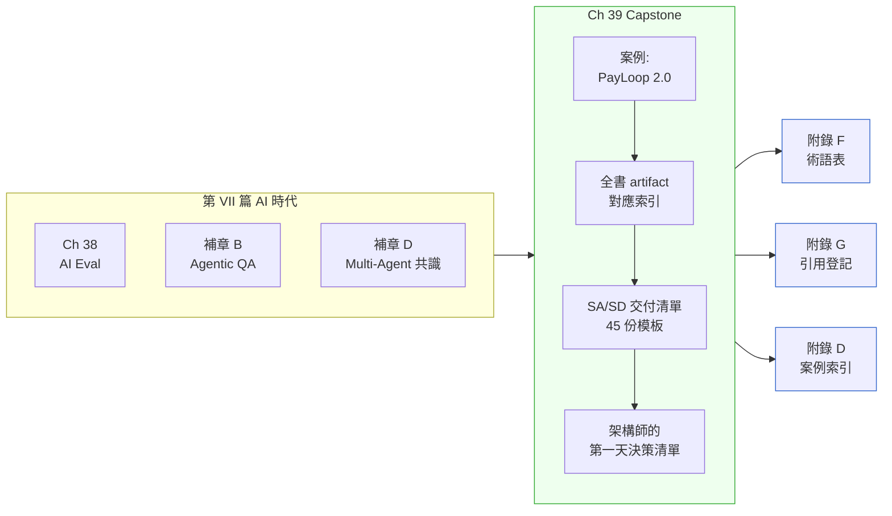

# 第 VIII 篇|綜合 Capstone

> **兩年後,同一個 CTO,被 MAS 問同一句話。這次她沒有沉默。**

---

第 VIII 篇只有一章:Ch 39。

這章不教新工具,不重複定義。它的工作是把前 38 章加六個補章的所有決策點,接到同一個案例裡,讓你看清楚它們在真實工程節奏中的**相對位置**。

PayLoop 在 Ch 1 是一個 18 天上線、180 天崩潰的新創,CTO 在事故覆盤會上問:「我們有什麼?除了一個會跑的東西之外,我們到底擁有什麼?」Ch 39 的 PayLoop 2.0,月流水從一百萬成長到 4,200 萬美元,當 MAS 再次問同一句話時,CTO 打開 IDE,把 `docs/` 的整棵樹投影到牆上。那棵樹上的每一個檔案,對應全書的一個 artifact。

Capstone 是**收束**,不是結局。你讀完之後應該能回答的問題是:如果我現在要為一個新系統或一個遺留系統,從頭開始做 SA/SD,我知道要做哪些事、按什麼順序、產出哪些文件。

---

## 篇內結構圖

---

## 這章做了什麼

Ch 39 按**時間軸**走了一遍 PayLoop 2.0 的生命週期:

1. **Sprint 0**:System Charter + 利害關係人 TELOP + Requirements Decision Log
2. **架構決策期**:Bounded Context + Event Storming + C4 四層文件
3. **分散式化**:Modular Monolith → Cell-Based 微服務,附帶 EDA 接線
4. **品質內建**:Security by Design + Compliance Pack + SLO 談判紀錄
5. **AI 整合**:Multi-Agent 風控 + AI System Card + Eval 框架
6. **MAS 覆盤**:45 份 artifact 的完整對應清單

每個節點引用對應章節,可以跳回去讀細節。

---

## 讀完這篇你應該能做的事

- 看到一個新系統需求,知道 SA/SD 的第一張要出的文件是什麼
- 看到一個遺留系統,知道從哪裡開始評估改造入口
- 和 MAS / 稽核 / 法務說清楚「你們的系統設計是否可被審計」
- 給 AI Coding Agent 一份足夠清楚的 CLAUDE.md,讓它不需要猜設計意圖

---

## 前後篇連結

- **前置**:全書 38 主章 + 補章 A–F(本章不重複理論,只接劇本)
- **下游**:[附錄 D 案例索引](../annex-d-case-index.md)、[附錄 F 術語表](../annex-f-glossary.md)、[附錄 G 引用登記](../annex-g-citations.md)
