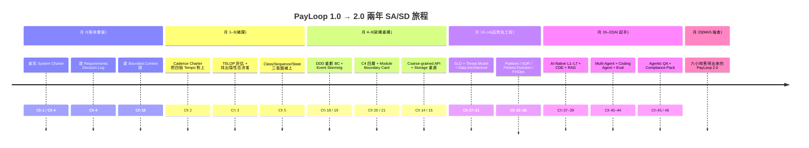
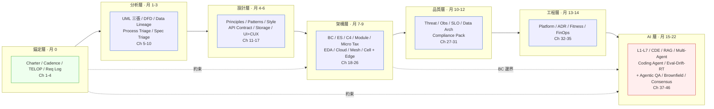

# 第 48 章|Capstone
## ⸺ 把 SA/SD 的劇本全部接上

> **前置閱讀**:全書 Ch 1–47(本章是收束章,不重講細節,只接劇本)
> **下游章節**:附錄 1 全書術語 / 附錄 2 全書案例 / 附錄 3 全書引用 / 附錄 4 一頁式 artifact 速查 / 附錄 5 全書 ADR 範例庫
> **延伸補章**:[Ch 26 雲原生選擇](../part-04-architecture/ch-26-edge-ot-it.md)、[Ch 46 Agentic QA](../part-07-ai-era/ch-46-agentic-qa.md)、[Ch 47 遺留系統 AI 現代化](../part-07-ai-era/ch-47-legacy-ai.md)、[Ch 41 Multi-Agent Consensus](../part-07-ai-era/ch-41-multi-agent-consensus.md)、[Ch 28 Compliance by Design](../part-05-quality/ch-28-compliance.md)、[Ch 17 CUX 對話式體驗](../part-03-design/ch-17-cux.md)、[Ch 54 工程直覺保護手冊](../part-09-human-engineer/ch-54-engineering-intuition.md)、[Ch 42 Agent 設定語言](../part-07-ai-era/ch-42-agent-spec.md)、[Ch 43 Agent Harness 工程](../part-07-ai-era/ch-43-harness-engineering.md)

---

## 48.1 冷觀察 ⸺ 兩年後,同一個 CTO,被問同一句話

我在 2027 年第一季再次看到 PayLoop 的名字。

[Ch 1](../part-01-foundations/ch-01-why-sa-sd.md) 那家虛構新創,在第一場事故(`CASE-FIN-001`)之後,沒有解散,也沒有被收購。三名工程師擴成 22 人,跨境匯款業務從新加坡-越南一條走廊,加到香港、菲律賓、日本與印尼,月流水從一百萬美元成長到 4,200 萬美元(`CASE-FIN-012`,以下稱 PayLoop 2.0)。技術棧也跟著業務需求一起演進。第一步是穩定性地基:後端從 Vercel 函數改成 Spring Boot 3.3 + PostgreSQL 17,理由只有一個 ⸺ MAS 稽核要求「可解釋的單一 source of truth」,而 Supabase 的多租戶架構讓稽核路徑難以追蹤。第二步是合規邊界:部署換到自管 Kubernetes 1.31 cell-based 架構,每個地理 cell(新加坡、香港、菲律賓)各自獨立,讓 MAS「資料不得出境」的要求從法律條文變成拓樸結構。第三步是新能力:AI 那條線換上 Claude Opus 4.7(1M context)+ LangGraph 0.2 跑多 Agent 風控,因為合規審查涉及跨月份、跨幣別、跨走廊的交易歷史關聯,必須在一個 context window 裡同時看到。pgvector 跟著 PostgreSQL 17 一起進來,負責 AML 規則的語意相似度檢索。Kafka 3.7 是最後加入的一塊,用於 Bounded Context 之間的 domain event,把六個業務邊界解耦。Next.js 15 留著,但退回只負責 banker 工作站的前端 ⸺ 它的活動半徑縮小了,反而變得更穩。

兩年後的某一個下午,新加坡金管局(MAS)再次來敲門。這次不是事故覆盤,是例行的 thematic review,但問題依然挑釁:

> 「兩年前你們有過一次 8,400 美元差額對不上的事故。MAS 想確認,如果今天再來一次,你們六小時內能不能回答『這筆交易在你們系統裡走了哪幾步、寫了哪張表、誰是 source of truth』?」

這次 CTO 沒有沉默。她打開 IDE,在 monorepo 的根目錄敲下 `tree docs/`,投影到牆上的不是 PRD、不是 80 頁 SRS,而是這樣一棵樹:

```
docs/
├── charter.md                 # System Charter v3.2(Ch 1)
├── cadence.md                 # Cadence Charter(Ch 2)
├── stakeholders/telop.md      # 利害關係人 TELOP(Ch 3)
├── requirements/log.md        # Requirements Decision Log(Ch 4)
├── architecture/
│   ├── c4/                    # C4 四層 .dsl(Ch 20)
│   ├── adr/                   # 84 份 ADR(Ch 33)
│   └── fitness/               # 23 條 Fitness Function(Ch 34)
├── domain/
│   ├── bounded-contexts.md    # DDD BC 圖(Ch 18)
│   └── event-storming.md      # ES 結論(Ch 19)
├── api/
│   └── contracts/             # OpenAPI 3.1 + AsyncAPI 2.6(Ch 14)
├── data/
│   ├── lineage.md             # transaction_id 同名異義表(Ch 8)
│   └── storage-decisions.md   # Workload Profile(Ch 15)
├── agents/
│   ├── claude.md              # 給 Claude Code 看的 root(Ch 38)
│   ├── system-card.md         # Agent System Card(Ch 39)
│   ├── multi-agent-card.md    # Multi-Agent System Card(Ch 40)
│   ├── quality-card.md        # AI Quality Card(Ch 44)
│   ├── agent-spec.md          # Agent Spec Card(Ch 42)
│   └── harness-config.md      # Harness Engineering Card(Ch 43)
└── compliance/
    └── design-pack.md         # Compliance by Design Pack(Ch 28)
```

她沒有講話,只把游標停在 `data/lineage.md`,Ctrl+F 輸入「reconciliation」,跳出三筆 ADR 連結、一張 sequence diagram、四個 source-of-truth 標記。整個過程花了不到三分鐘。MAS 的稽核人員看了一眼,問:「這個目錄是兩年慢慢長出來的,還是一次補的?」

CTO 回了一句話,我把它原樣記下來:

> 「**它是跟著 commit 一起長的。每一次架構變動,我們都先改這裡,再改 code。當初我們只擁有一個會跑的東西;現在我們擁有它的形狀。**」

把這兩年的時間軸壓成一張圖,大概長這樣:



兩年前的 PayLoop 之所以崩潰,不是因為他們沒做 SA/SD,而是因為他們**做的 SA/SD 沒留下「可被傳遞的理解」**。兩年後的 PayLoop 2.0 之所以能站住,不是因為他們做了「最佳實踐」,而是因為他們把這本書 Ch 1–47 每一章交付的那張 Card,都老老實實寫成了現場的 artifact。

接下來這一章,要做的不是再講前 47 章的內容,而是把這 22 個月走過的劇本接成同一張地圖 ⸺ 證明一件事:**這本書不是 47 章獨立內容,是同一張系統設計地圖的不同 zoom level**。

---

## 48.2 真問題 ⸺ 全書其實只在講六件事

PayLoop 2.0 在 22 個月的事後覆盤中,做了一件事:把他們實際做出的每一個決策,對應回「是哪個問題逼出這個決策」。覆盤主持人把 84 份 ADR 的「Context」欄位抄出來,貼滿兩面牆,然後問:「這些問題,有沒有共同的模式?」

結論是有。把全書 Ch 1–47 每一章交付的那張 Card 攤開、把每一章開頭的「真問題」段落攤開,PayLoop 團隊歸納出全書反覆在講的其實只有六件事。這不是作者事後整理出來的分類,而是 22 個月的決策痕跡倒推回去的結論:每一個曾經讓他們困住的問題,最後都落回這六件事其中一件。

這六件事是同一張地圖的六個「定錨點」⸺ 任何一個 SA/SD 問題,最後都會落回其中一個。把它拆開來看會比較清楚:

| 全書定錨點 | 一句話 | 對應章節 | 對應 artifact |
|---|---|---|---|
| **① SA/SD = 製造可被傳遞的理解** | 不是儀式、不是文件,而是讓三年後的人(和 AI)能接手 | Ch 1 / 4 / 10 / 33 / 34 / Ch 47 | System Charter、Requirements Decision Log、ADR、CLAUDE.md |
| **② System Charter 是入口** | 比 PRD 更早、比 ADR 更總,是專案的「定錨」 | Ch 1 / 2 / 3 / 11 | Charter、Cadence Charter、TELOP |
| **③ Cadence 讓四個 Tempo 對上** | Business / Product / Engineering / Compliance 不是同一個鼓點 | Ch 2 / 27 / 30 / 28 | Cadence Charter、SLO Catalog、FinOps Card |
| **④ Bounded Context 是抗變動的核心** | 從 DDD 到 Modular Monolith 到 Cell-based,都在處理同一件事:邊界 | Ch 18 / 19 / 20 / 21 / 24 | BC Card、ES Outcome、C4、Module Boundary Card |
| **⑤ AI 時代的 SA/SD = 脈絡工程** | LLM 沒失憶,是脈絡沒持久化;CLAUDE.md / Skill / RAG / Memory / Harness 都在補這件事 | Ch 37 / 38 / 39 / 40 / 41 / 42 / 43 / 44 / 45 | CDE Setup、Agent System Card、AI Quality Card、Agent Spec Card、Harness Engineering Card |
| **⑥ Workload-Aware 是治理基礎** | 從儲存到雲端到 LLM 成本,先看 workload profile 再選工具 | Ch 13 / 15 / 23 / 35 / 37 | Storage Card、Architecture Style Card、Workload Cost & Carbon |

這六個定錨點並非平行,也不是同一件事的六個分身。它們各自負責不同的決策責任:① 是哲學前提,回答「我們為什麼要做 SA/SD」;②③ 是專案啟動的雙引擎,Charter 定錨問題與邊界、Cadence 讓四個節奏不互相打架;④ 是技術層的核心,從 DDD 到 Modular Monolith 到 Cell-based,本質上都在處理邊界這件事;⑤ 是 2026 年新增的補丁,AI 系統要可靠,必須把脈絡工程做到和 code 同等嚴謹;⑥ 是貫穿所有層的判準,選工具之前先看 workload,不要反過來。

換句話說,讀者讀完這本書之後,**如果只能記住六句話**,就是這六句。其餘 47 章是這六個定錨點在不同場景與 zoom level 的展開:Ch 5 的 UML 是「製造可被傳遞的理解」在「給同期工程師看」這個 zoom 的具體工具;Ch 39 的 RAG 是同一件事在「給 LLM 看」這個 zoom 的工具,兩者工具不同,但服務的都是定錨點①。Ch 14 的 API Contract 和 Ch 21 的 Module Boundary Card,服務的則是定錨點④。不是所有章都從屬於①⸺ 把 Ch 15 的 Workload Profile 說成「製造可被傳遞的理解的展開」就失準了,它服務的是定錨點⑥。六個定錨點各有守備範圍。

PayLoop 2.0 之所以能在 22 個月內把劇本接起來,就是因為他們在事故覆盤時(月 0)沒有問「我們缺哪份文件」,而是問「我們在這六件事上各自在哪一格」。表格填完之後,47 章對他們來說就不是 47 章,是一張一張可以按需取用的卡。

---

## 48.3 決策框架 ⸺ PayLoop 2.0 的 22 個月,逐章對應

這一節是全書最長的一節,也是最後一次的「白板示範」。把 PayLoop 2.0 的 22 個月切成五個階段,每個階段對應 1–N 章,並列出當時實際產出的 artifact ⸺ 讓讀者能對著自己的專案說:「我在第幾個月、缺哪張 Card。」

### 48.3.1 月 0–1:重新定錨(對應 Ch 1 / 2 / 3 / 4)

事故覆盤後第一週,PayLoop 沒有去寫 PRD、沒有去重寫 code。CTO 把白板擦乾淨,寫上四個字:**Charter 重寫**。

這個階段交付了四份 artifact:

| Artifact | 章節溯源 | 內容(節錄) |
|---|---|---|
| **System Charter v3.0** | Ch 1 | 一頁。Problem:「跨境匯款 banker 在事故 6 小時內無法回答 source of truth。」Constraints:MAS / 央行 / 卡組織三條紅線。Out of Scope:不做 retail-facing 錢包。 |
| **Cadence Charter** | Ch 2 | 把四個 Tempo 對齊:Business(月)/ Product(雙週)/ Engineering(週)/ Compliance(季)。每個 Tempo 的決策點與升級條件寫死。 |
| **TELOP 利害關係人圖** | Ch 3 | 找出三個隱性否決者:**MAS 合規官、Visa/Mastercard 卡組織風控、新加坡央行外匯司**。三人從未出現在 PRD,但一句話可以讓上線推遲六個月。 |
| **Requirements Decision Log** | Ch 4 | 30 場 banker / compliance / ops 訪談,輸出 47 條需求,每條附三欄:What / Why / Decision-Owner。 |

這四份東西加起來不到 12 頁。它們真正的價值不在頁數,在於每一份都把「有人這樣說」變成「決策被寫定」。舉一個具體的例子:Requirements Decision Log 第 12 條,banker 訪談原話是「如果出了事,要能知道發生過什麼」。SA 沒有把它收進「功能需求:查詢介面」就結案,而是往下問:是哪個層次的「知道」?誰負責說它知道了?追問兩輪後,這條被改寫成:「所有 transaction 狀態變更必須 append-only 持久化,且 timestamp 不可由應用層覆蓋,Decision Owner:MAS 合規官。」這一條後來成了 §48.3.2 Data Lineage Card 的第一條設計約束,也是 §48.3.3 Storage 決策中「audit log 走 S3 + Iceberg」的直接來源。

這就是 [Ch 1.2](../part-01-foundations/ch-01-why-sa-sd.md) 反覆強調的:**把模糊業務問題,轉換成可被傳遞的決定與限制**。沒有這層,後面所有架構動作都沒有可以對齊的座標。

### 48.3.2 月 1–3:把上一版的「會跑的東西」拆解(對應 Ch 5 / 6 / 7 / 8 / 9 / 10)

這個階段的目標不是設計新系統,是先**看懂舊系統**。PayLoop 1.0 那 70% AI 寫的 code 還在跑,真實流量也還在進來,所以 SA 團隊必須在「不停機 / 不 break 任何 banker 工作流」的前提下,把舊系統的形狀逆向出來。

不畫 14 張 UML 圖,只畫三張([Ch 5](../part-01-foundations/ch-05-uml-overview.md) 反覆強調的劑量)。推理過程很直接:「不停機 / 不 break 流」的約束代表無法進行大規模重構,因此必須先**逆向理解**舊系統的形狀,才知道從哪裡切入。逆向理解只需要三個關鍵視角——靜態結構(誰擁有什麼資料)、動態流程(一筆交易如何流動)、狀態機(Transaction 的生命周期有哪些邊界)——這三個視角加起來足以識別邊界與問題點,再多的圖只會增加逆向成本而不增加識別精度:

- **Class Diagram**:只畫核心領域物件(Transaction、Wallet、Counterparty、ComplianceCase),共 14 個 class。
- **Sequence Diagram**:只畫「跨境匯款一筆走到底」這條黃金路徑,共 11 個 step。
- **State Diagram**:只畫 Transaction 的 8 個狀態(initiated / screened / settled / disputed ...),把 PayLoop 1.0 那次 8,400 美元差額對應到「screened ↔ settled」這條邊。

DFD 與 OOA([Ch 6 / 7](../part-02-analysis/ch-06-dfd-structured-analysis.md))在這個階段做了**資料拓樸圖**(Use Case Atom),清楚標註:每個 use case 只能改 1–2 個 entity,跨 entity 的操作必須走 saga 而不是 transaction。

[Ch 8](../part-02-analysis/ch-08-data-modeling-normalization.md) 那課關於 `Patient_id`「同名異義」的教訓,在 PayLoop 2.0 對應的就是 `transaction_id`。事故覆盤揭露:PayLoop 1.0 裡至少有三張表叫 `transaction_id`,但意思不一樣 ⸺ payment 表的 `transaction_id` 是內部 UUID;ledger 表的 `transaction_id` 是合作銀行給的編號;reconciliation 表的 `transaction_id` 是兩者拼接後的 hash。當初 8,400 美元差額對不上,根因之一就是這個。新版立刻引入 Data Lineage Card:

> **transaction_id 同名異義表(Data Lineage Card 節錄)**
>
> | 出現位置 | 真實語意 | 重新命名 |
> |---|---|---|
> | `payment.transaction_id` | 內部 UUIDv7 | `payment_internal_id` |
> | `ledger.transaction_id` | 合作銀行編號 | `bank_external_ref` |
> | `reconciliation.transaction_id` | 對帳鍵 | `reconciliation_key` |

[Ch 9](../part-02-analysis/ch-09-process-modeling.md) 的「BPMN / 狀態機 / 決策表三層分工」直接套用:BPMN 描繪業務人員看到的端到端流程;狀態機描繪 Transaction 的內部生命周期;決策表描繪 AML 規則(共 38 條)。三層各自負責不同抽象層,不互相壓縮。

[Ch 10](../part-02-analysis/ch-10-spec-documents.md) 的「PRD / SRS / MVP 壓縮三層歧義」也在這個月底交付:不是寫一份 80 頁 SRS,而是三份各 6–10 頁的 Spec Triage One-Pager,每份對應不同讀者(business / engineering / compliance)。

### 48.3.3 月 4–9:架構級重構(對應 Ch 11–24,本書最長的一段)

這六個月是真正的工程主戰場。PayLoop 2.0 的架構重構按四個工程層依序推進,每一層都有對應的 Card:

**架構原則層**([Ch 11 / 12 / 13](../part-03-design/ch-11-architecture-principles.md)):先確立改動邊界的規則。  
**API 與合約層**([Ch 14](../part-03-design/ch-14-api-design.md)):統一跨系統介面的語言與治理。  
**資料儲存層**([Ch 15](../part-03-design/ch-15-data-storage.md)):依 workload 選工具,而不是反過來。  
**邊界與拓樸層**([Ch 18–24](../part-04-architecture/ch-18-ddd-strategic-tactical.md)):DDD / Event Storming / C4 / Modular Monolith / EDA / Cell-based,全部都是「邊界在哪裡、誰擁有它」這件事的不同 zoom level。

先做原則層不是巧合:原則層定義的是「每次做改動時的決策規則」,後續三層的所有決策都要遵守這套規則。如果跳過原則層直接定 API,後面每改一個 endpoint 都可能引發連鎖重設計——因為沒有共同的「改動半徑判定標準」,每個人對「這個改動夠不夠大、要不要寫 ADR」的判斷都不一樣。原則先定,其餘三層才有座標可以對齊。

#### 架構原則層([Ch 11 / 12 / 13](../part-03-design/ch-11-architecture-principles.md))

- **SOLID 改動半徑**:每個變更前先問「這次改動的半徑跨幾個 module」,跨越 2 個就要寫 ADR。
- **GoF 命名統一**:Strategy / Adapter / Repository 在 codebase 統一命名(`*Strategy`, `*Adapter`, `*Repository`),禁止 `*Helper`、`*Util` 這類無資訊命名。
- **Hexagonal 抗邊界變動**:核心 domain 與外部 adapter(MAS API、Visa API、Stripe Connect API)之間放 port,讓三家銀行 API 換廠商時,domain code 不動。

對應的 Coupling Audit Card 與 Pattern Adoption Card 寫進 `docs/architecture/`,每季一次審計。

#### API 設計([Ch 14](../part-03-design/ch-14-api-design.md))

PayLoop 1.0 同時有 REST、GraphQL、gRPC 三套協定散落各處,banker 工作站靠 REST,合作銀行靠 SOAP(歷史包袱),內部風控靠 gRPC。重構策略:**保留三套協定,但統一 API Contract Card**。每個 endpoint 都有一張卡,寫:Coarse-grained Intent(這個 API 在業務上做的事,用一句話)、SLA、idempotency key 規則、retry 策略。

關鍵決策是 Coarse-grained API:不再有 `POST /transactions/{id}/screen`、`POST /transactions/{id}/settle`、`POST /transactions/{id}/notify` 這三個細粒度,而是 `POST /transactions/{id}/advance`,讓內部狀態機決定下一步。這個改動把 banker 端的呼叫次數降了 60%。

#### 資料儲存([Ch 15](../part-03-design/ch-15-data-storage.md))

[Ch 15](../part-03-design/ch-15-data-storage.md) 的 Workload Profile 在這個月做了一份完整的:

| Workload 類型 | 量級 | 訪問模式 | 選擇 |
|---|---|---|---|
| Transaction OLTP | 4,200 萬美元 / 月、~80 萬筆 | 寫多讀少、強一致 | PostgreSQL 17 主庫 |
| Reconciliation | 每日 80 萬筆對帳 | 批次讀、分析 | PostgreSQL 17 read replica + Citus 分片 |
| AML Rule Vector Search | 38 條規則 + 客戶歷史 embedding | 相似度檢索 | pgvector 0.8(同一個 PG 17 實例) |
| Banker Session State | ~200 並發 | 短 TTL、低延遲 | Redis 7.4 |
| Audit Log | 寫入即不可變 | append-only、合規 7 年 | S3 + Iceberg(via Ch 28) |

關鍵決策是「**不引入 MongoDB / Cassandra**」⸺ Workload Profile 表明所有需求 PG 17 + pgvector + Citus 都能處理,引入 NoSQL 只會增加運維成本。這條 ADR 編號 `ADR-0023`,後面 §48.5 會展示完整內容。

#### UI/UX([Ch 16](../part-03-design/ch-16-uiux-system-view.md) + Ch 17)

banker 工作站的錯誤訊息在 PayLoop 1.0 是「Transaction failed.」這種等於沒講的話。重構引入 [Ch 16](../part-03-design/ch-16-uiux-system-view.md) 的 **DACR 錯誤訊息框架**(Diagnose / Action / Context / Recovery),把每個錯誤改寫成四欄。同時為將要上線的 AI banker 助手預備 [Ch 17](../part-03-design/ch-17-cux.md) 的 **CUX(Conversational UX)Card**,定義 AI 何時主動發言、何時等待、何時 handoff 給真人。

#### DDD / Event Storming / C4([Ch 18 / 19 / 20](../part-04-architecture/ch-18-ddd-strategic-tactical.md))

這是整個重構的脊椎。PayLoop 1.0 沒有明確的 Bounded Context,所有業務概念混在一個 namespace 裡。月 4–6 跑了三場 Event Storming workshop,各 4 小時,輸出:

- **6 個 Bounded Context**:Onboarding、Compliance、Transaction、Settlement、Reconciliation、Reporting。
- **每個 BC 一張 Bounded Context Card**(`docs/domain/bc-*.md`),定義:Ubiquitous Language(該 BC 內的詞彙表)、上游 / 下游 BC、Anti-Corruption Layer 的位置。
- **Event Storming Outcome Card**:38 個 domain event、12 個 command、6 個 policy,輸出成一張 PDF 釘在會議室牆上。

[Ch 20](../part-04-architecture/ch-20-c4-model-visualization.md) 的 C4 四層在月 7 用 Structurizr DSL 寫出來,放 `docs/architecture/c4/*.dsl`。CI 加入一條 Fitness Function:每次 PR 自動 parse C4 .dsl 與真實 Maven 依賴,如果發現「C4 圖上沒寫的依賴在 code 裡」就阻擋 merge ⸺ 這就是 [Ch 1.4 反模式 3](../part-01-foundations/ch-01-why-sa-sd.md) 講的 C4 圖過期問題的根治法。

#### Modular Monolith / 微服務 / EDA / Mesh / Cell([Ch 21 / 22 / 23 / 24](../part-04-architecture/ch-21-modular-monolith.md))

最關鍵的拓樸決策是:**走 Modular Monolith,不走微服務**。理由就是 [Ch 1.2.1](../part-01-foundations/ch-01-why-sa-sd.md) 的「防早期分解」⸺ 6 個 BC 中,只有 Compliance 因為合規隔離需求(MAS 要求合規資料留在新加坡境內)拆出獨立 service。其餘 5 個 BC 在同一個 Spring Boot 3.3 模組化單體內,各自獨立 maven module、獨立 schema、獨立 owner。

這條決策對應 Module Boundary Card([Ch 21](../part-04-architecture/ch-21-modular-monolith.md)) 與 Microservice Tax Card([Ch 22](../part-04-architecture/ch-22-microservices.md))。Microservice Tax Card 列出「如果現在拆成 6 個 service 要付的稅」:6 個 K8s deployment、6 條 CI pipeline、6 份 observability stack、跨 service transaction 改成 saga 的 4 週改動成本 ⸺ 加總後團隊的反應是「不值得」。

EDA / CQRS / ES([Ch 23](../part-04-architecture/ch-23-event-driven-cqrs-es.md))**三件不套餐**:只引入 EDA(Kafka 3.7 處理 BC 之間的 domain event),CQRS 與 ES 暫時不做。這裡需要釐清一個常見的混淆:Event Sourcing(ES)並不「等於」append-only audit log,拒絕 ES 不代表不需要事件持久化。PayLoop 2.0 確實有 append-only audit log(S3 + Iceberg),但 ES 在這之上還要求:每一個業務狀態都必須由事件序列重新推算,任何時間點都可以 replay 到那個時間點的狀態,並且 event schema 要做版本管理以支援跨版本 replay。PayLoop 2.0 的取捨是:PostgreSQL CRUD 管理 transaction 的 live 狀態、S3 append-only log 滿足合規的稽核要求,這兩件事組合起來比全套 ES 更容易操作。拒絕 ES 的真正原因是**運維負擔**:event schema 版本管理、大規模 replay 測試、temporal query 工具鏈,在 22 人團隊裡平均分攤成本太高。具體試算過程是:event schema 版本管理(含 Avro schema registry 維護、跨版本相容性測試)估計月均需~2 人月;建立能支援大規模跨版本 replay 的 CI/CD 管線估計需~3 週一次性投入,後續每次 schema 異動都要重跑驗證。對 22 人團隊而言,平均分攤後約~0.5 人月/月的持續成本——但這個成本換來的能力是「可以在任意時間點重播業務邏輯」,而 PayLoop 現階段的合規要求只需要 audit trail 存在,不需要 replay。ROI 為負,因此拒絕。代價是犧牲了事件驅動重播業務邏輯的能力,但 PayLoop 在現階段不需要這個能力。這個「只挑一件」的決策,對應 EDA Layer Card。

K8s / Mesh / Cell([Ch 24](../part-04-architecture/ch-24-cloud-native-kubernetes.md) / [Ch 25](../part-04-architecture/ch-25-service-mesh.md) + [Ch 26](../part-04-architecture/ch-26-edge-ot-it.md))在月 8 引入。Cell-based 的關鍵切割是「按地理 + 合規邊界」:新加坡 cell、香港 cell、菲律賓 cell 各自獨立,符合 MAS 的資料境內要求。Mesh 用 Istio 1.22 處理 cell 之間的流量(主要是 Reporting 跨 cell 聚合)。Edge 處理 banker 工作站本地端的合規預檢(避免每次按鈕都飛到 cloud)。

對應交付:Cloud-Native Choice Card、Traffic Governance Card、OT/IT Edge Design Pack(Ch 26)。

### 48.3.4 月 10–14:四層品質與工程實踐(對應 Ch 27–35)

#### Security / Observability / SRE / Data([Ch 27 / 29 / 30 / 31](../part-05-quality/ch-27-security-by-design.md))

四層品質一次補齊,各自一張 Card:

| 層 | Card | 關鍵決策 |
|---|---|---|
| **Security** | Threat Model Card | STRIDE 跑全部 6 個 BC,輸出 24 個 threat,12 個進 mitigation backlog |
| **Observability** | Observability Plane Card | OpenTelemetry 1.x、三平面分離(metrics / traces / logs)、Tempo + Loki + Mimir |
| **SRE** | SLO Catalog + EB Card | 18 條 SLO,每條對應一個 Error Budget,burn rate alert 兩段(2% / 10%) |
| **Data** | Data Architecture Decision Card | Bronze / Silver / Gold 三層 lakehouse,合規資料另走 vault path |

合規這一條走 [Ch 28 Compliance by Design](../part-05-quality/ch-28-compliance.md) 的 **Compliance Design Pack**:把 MAS / FATF / EU AI Act Annex III 的條文逐條對應到系統元件,輸出 Compliance Trace Matrix。月 12 MAS 來做小範圍 pre-audit,這份 matrix 直接拿去用,過。

#### Platform / ADR / Fitness / FinOps([Ch 32 / 33 / 34 / 35](../part-06-engineering/ch-32-platform-engineering-idp.md))

- **Platform Product Card**:把 internal platform 視為產品。Backstage(Spotify)做開發者入口,提供 4 個 Golden Path(new-service / new-data-pipeline / new-fitness-function / new-adr)。
- **ADR Template + Index Card**:84 份 ADR,索引在 `docs/architecture/adr/INDEX.md`,自動依關鍵字搜尋。每份 ADR < 500 字。
- **Fitness Function Card**:23 條 Fitness Function 跑 nightly CI,涵蓋從架構合規(C4 圖一致)到性能(P95 latency)到合規(audit log 完整性)。
- **Workload Cost & Carbon Card**:每月跑一次 cost-per-transaction 分析,目前 USD 0.012 / 筆;碳排放走 GreenSoftware patterns 跟著一起報告。

### 48.3.5 月 15–22:AI 起手(對應 Ch 37–46)

到這個階段,前面 14 個月的 SA/SD 基礎做穩了,PayLoop 才開始把 AI 放進系統。**順序很重要** ⸺ 把 AI 放在沒做好 SA/SD 的系統上,等於把第二個 PayLoop 1.0 蓋在第一個之上。

#### AI-Native L1–L7([Ch 37](../part-07-ai-era/ch-37-ai-native-architecture.md))

引入 AI-Native 七層架構:L1 Foundation Model(Claude Opus 4.7)、L2 Inference Gateway、L3 Memory、L4 Tool、L5 Orchestration、L6 Observability、L7 Governance。對應 AI-Native System Vision Card。

#### CDE 脈絡工程([Ch 38](../part-07-ai-era/ch-38-context-driven-engineering.md))

CLAUDE.md root 寫在 monorepo 根目錄,SKILL.md 散落在每個 BC 之下。Skill 的設計原則是「每個 Skill 對應一條業務能力,且必須註冊到至少一份 ADR」⸺ 這是 [Ch 33 / 34](../part-06-engineering/ch-33-adr-architecture-knowledge.md) 強調的「Skill 與 ADR 連動」,避免 Skill 漂移。

對應交付:CDE Setup Card + SKILL.md(每個 BC 一份)。

#### RAG / Memory / Tool([Ch 39](../part-07-ai-era/ch-39-rag-memory-tool.md))

合規 AI 助手 ComplianceCopilot 在月 17 上線。RAG 接 38 條 AML 規則 + 過去 90 天 transaction 摘要;Memory 分三層(short-term session、long-term per-banker preference、shared institutional knowledge);Tool 遵循 Least Privilege 與 dry-run + HITL,寫操作預設不自動執行。

對應交付:Agent System Card。

#### Multi-Agent / Coding Agent / Eval([Ch 40](../part-07-ai-era/ch-40-multi-agent.md) / [Ch 44](../part-07-ai-era/ch-44-coding-agent.md) / [Ch 45](../part-07-ai-era/ch-45-ai-eval-drift-redteam.md) + [Ch 46](../part-07-ai-era/ch-46-agentic-qa.md))

風控做成 Multi-Agent(LangGraph 0.2):Screener Agent 負責規則匹配、Investigator Agent 負責拉相關歷史交易、Reporter Agent 負責出 STR 草稿。三個 Agent 透過 [Ch 41 Multi-Agent Consensus](../part-07-ai-era/ch-41-multi-agent-consensus.md) 的 consensus pattern 達成共識,任一 Agent 不同意時走 HITL。對應 Multi-Agent System Card。

Coding Agent([Ch 44](../part-07-ai-era/ch-44-coding-agent.md))在 22 人團隊中作為 pair programmer,但寫死兩條規則:(1)所有 commit 必須由人類 approve;(2)涉及 ADR 變動的 PR 必須先寫 / 改 ADR 再改 code。對應 Agent-Friendly Codebase Card。

[Ch 45](../part-07-ai-era/ch-45-ai-eval-drift-redteam.md) 的 Eval / Drift / Red Team **三軸並行**全做。Eval set 480 題、Drift PSI 接 PagerDuty、Red Team CI 攻擊集 240 題。對應 AI Quality Card,並走 [Ch 46 Agentic QA](../part-07-ai-era/ch-46-agentic-qa.md) 的雙 Agent 對抗評估補強 Judge 校準。

### 48.3.6 全書 artifact ↔ 章節對應索引(可帶走)

下表是這 22 個月實際產出的全書級 artifact 索引,讀者可以對照自己的專案逐項檢核。**這張表本身就是一份 capstone 交付物**:

| # | Artifact | 章節 | PayLoop 2.0 路徑 |
|---|---|---|---|
| 1 | System Charter | Ch 1 | `docs/charter.md` |
| 2 | Cadence Charter | Ch 2 | `docs/cadence.md` |
| 3 | Project Initiation Brief | Ch 2 | `docs/cadence.md#brief` |
| 4 | TELOP 利害關係人圖 | Ch 3 | `docs/stakeholders/telop.md` |
| 5 | Requirements Decision Log | Ch 4 | `docs/requirements/log.md` |
| 6 | Diagram Decision Card | Ch 5 | `docs/diagrams/decision.md` |
| 7 | Use Case Atom | Ch 6 / 7 | `docs/usecase/atoms.md` |
| 8 | Data Lineage Card | Ch 8 | `docs/data/lineage.md` |
| 9 | Schema Decision Card | Ch 8 | `docs/data/schema.md` |
| 10 | Process Model Triage Card | Ch 9 | `docs/process/triage.md` |
| 11 | Spec Triage One-Pager | Ch 10 | `docs/spec/triage-{audience}.md` |
| 12 | Coupling Audit Card | Ch 11 | `docs/architecture/coupling.md` |
| 13 | Pattern Adoption Card | Ch 12 | `docs/architecture/patterns.md` |
| 14 | Architecture Style Selection Card | Ch 13 | `docs/architecture/style.md` |
| 15 | API Contract Card | Ch 14 | `docs/api/contracts/*.md` |
| 16 | Storage Selection Card | Ch 15 | `docs/data/storage-decisions.md` |
| 17 | Interaction State Card | Ch 16 | `docs/ui/state.md` |
| 18 | Bounded Context Card | Ch 18 | `docs/domain/bc-*.md` |
| 19 | Event Storming Outcome Card | Ch 19 | `docs/domain/event-storming.md` |
| 20 | C4 Diagram Card | Ch 20 | `docs/architecture/c4/*.dsl` |
| 21 | Module Boundary Card | Ch 21 | `docs/architecture/modules.md` |
| 22 | Microservice Tax Card | Ch 22 | `docs/architecture/microservice-tax.md` |
| 23 | EDA Layer Card | Ch 23 | `docs/architecture/eda.md` |
| 24 | Cloud-Native Choice Card | Ch 24 | `docs/cloud/choice.md` |
| 25 | Traffic Governance Card | Ch 25 | `docs/cloud/traffic.md` |
| 26 | Threat Model Card | Ch 27 | `docs/security/threat-model.md` |
| 27 | Observability Plane Card | Ch 29 | `docs/ops/observability.md` |
| 28 | SLO Catalog + EB Card | Ch 30 | `docs/ops/slo.md` |
| 29 | Data Architecture Decision Card | Ch 31 | `docs/data/architecture.md` |
| 30 | Platform Product Card | Ch 32 | `docs/platform/product.md` |
| 31 | ADR Template + Index Card | Ch 33 | `docs/architecture/adr/INDEX.md` |
| 32 | Fitness Function Card | Ch 34 | `docs/architecture/fitness/*.yaml` |
| 33 | Workload Cost & Carbon Card | Ch 35 | `docs/finops/cost-carbon.md` |
| 34 | AI-Native System Vision Card | Ch 37 | `docs/agents/vision.md` |
| 35 | CDE Setup Card + SKILL.md | Ch 38 | `CLAUDE.md` + `**/SKILL.md` |
| 36 | Agent System Card | Ch 39 | `docs/agents/system-card.md` |
| 37 | Multi-Agent System Card | Ch 39 | `docs/agents/multi-agent-card.md` |
| 38 | Agent-Friendly Codebase Card | Ch 43 | `docs/agents/codebase-card.md` |
| 39 | AI Quality Card | Ch 44 | `docs/agents/quality-card.md` |
| 40 | OT/IT Edge Design Pack | Ch 26 | `docs/edge/design-pack.md` |
| 41 | Agentic QA Pack | Ch 45 | `docs/agents/qa-pack.md` |
| 42 | Brownfield Modernization Pack | Ch 46 | `docs/legacy/modernization.md` |
| 43 | Multi-Agent Consensus Pack | Ch 40 | `docs/agents/consensus-pack.md` |
| 44 | Compliance Design Pack | Ch 28 | `docs/compliance/design-pack.md` |
| 45 | CUX Design Pack | Ch 17 | `docs/ui/cux-pack.md` |
| 46 | Engineering Intuition Card | Ch 54 | `docs/human/intuition-card.md` |
| 47 | Agent Spec Card | Ch 41 | `docs/agents/agent-spec.md` |
| 48 | Harness Engineering Card | Ch 42 | `docs/agents/harness-config.md` |

48 份 artifact,每份一頁,加總約 65–85 頁 ⸺ **這就是 PayLoop 2.0 在 MAS 抽查當天投影到牆上的那棵 `docs/` 樹**。

把 48 份 artifact 跟對應章節畫成一張結構圖,可以更清楚看到「同一張地圖的不同 zoom level」這句話的形狀:



這張圖的關鍵不是六個盒子的順序,是**那三條虛線**:Charter 一直在約束底層架構與 AI 層、BC 邊界一直延伸到 AI Agent 的職責劃分。少了這三條虛線,48 份 artifact 就會退化成 48 份各自獨立的文件 ⸺ 這就是 §48.4 反模式 1 要避免的事。

### 48.3.7 全書整合的 ADR 範例

這 22 個月最有教育意義的一份 ADR 是 `ADR-0023`,它一份文件把多章決策連動。這份 ADR 也是讀者可以直接套用的「全書整合範例」:

```markdown
# ADR-0023: 不引入 MongoDB,用 PostgreSQL 17 + pgvector + Citus 處理全部 workload

Status: Accepted (2026-09-12) | Owners: SA + DBA + Platform Lead
Linked: System Charter v3.2 §2 (Constraints),
        Storage Selection Card (Ch 15),
        Architecture Style Selection Card (Ch 13),
        Module Boundary Card (Ch 21),
        Workload Cost & Carbon Card (Ch 35),
        Compliance Design Pack §4.2 (Ch 28)

## Context
Workload Profile (Ch 15) 顯示我們需要支援:OLTP、批次對帳、向量檢索、
session state、append-only audit。團隊內有人提議引入 MongoDB(文件型)
與 Cassandra(寬列)以「現代化資料層」。

## Decision
不引入 MongoDB / Cassandra。全部 workload 走:
- PostgreSQL 17 主庫 + read replica(OLTP / 對帳)
- pgvector 0.8 共用同一個 PG 17 實例(向量檢索)
- Citus 12 水平分片(對帳批次)
- Redis 7.4(session state,獨立)
- S3 + Iceberg(audit log,獨立)

## Consequences
+ 運維面:1 個 RDBMS 比 3 個 RDBMS 少 60% 運維成本(對應 Ch 35 FinOps)
+ 合規面:單一 source of truth 對 MAS audit trail 友善(對應Ch 28)
+ 邊界面:Module Boundary Card 限定每個 BC 一個 schema,單庫多 schema
  即可滿足(對應 Ch 21)
- 規模面:若未來月流水 > USD 5 億且 OLTP 寫入 > 5,000 TPS,需重評估
  (觸發條件寫入 Fitness Function FF-0014,對應 Ch 34)

## Reversal Cost
若 12 個月內反悔,改 schema + 資料遷移工時 ~6 週(可逆)。
若 36 個月後反悔,因 Citus 分片與 partition 已成熟,不可逆。

## Trigger to Re-evaluate
1. 月寫入 TPS > 5,000(FF-0014 自動觸發)
2. pgvector 在 1 億+ embedding 規模 P95 latency > 500ms
3. PG 17 LTS 終止支援(預計 2032)
```

這份 ADR 一頁,連動了 6 章(Ch 13 / 15 / 21 / 28 / 34 / 35)。**這就是「同一張地圖的不同 zoom level」的具體含義**:單一決策不是孤立的,它必須說得出來自己跟哪些章節的觀念連動,以及在什麼條件下應該被推翻。

---

## 48.4 踩坑清單 ⸺ 全書級反模式

PayLoop 2.0 的 22 個月不只是成功故事。覆盤時也記下了四個曾經差點重蹈覆轍的全書級反模式,每一個都串多章。

### 反模式 1:把書當清單,而不是當地圖

SA/SD 最常被誤用成一份清單:✓ Charter 寫了、✓ ADR 寫了 84 份、✓ 48 張 Card 都交了。但清單打完勾,不等於設計完成。一個月後你會發現:Charter 裡寫的 constraint 沒有進任何一份 ADR 的 Context;ADR-0023 的 Consequences 有一條「若 TPS > 5,000 需重評估」,但沒有任何 Fitness Function 在監控這個觸發條件;Storage Card 選了 PostgreSQL,但沒有人知道這個決策跟 BC 邊界的關係。結果是有 artifact、沒有理解 ⸺ 這個問題不是工具問題,是理解問題。

SA/SD 的核心是**系統設計**,不是**歸檔系統**。每一份 artifact 必須能回答「這個決策為什麼存在」,而答案通常要追溯到 Charter 裡的某個 constraint,或者前一份 ADR 的某個 Consequence。PayLoop 2.0 的 22 個月說明:當每一份 Card 都能追溯到問題的來源,48 份 artifact 才會形成一張可以查找的地圖,而不是一個只能翻頁的資料夾。

> ✅ **修正方向**:每份 Card 強制標註「上游(我從哪來)」與「下游(我影響誰)」兩欄,跟 git commit 一樣建立 DAG。本章 §48.3.7 那份 ADR-0023 就是示範:它在 Linked 區塊明確列出 6 章(Ch 13 / 15 / 21 / 28 / 34 / 35)的連動,在 Trigger to Re-evaluate 裡把觸發條件接到 Fitness Function FF-0014。「上游 / 下游」標註是強制這個思維的機制,而不是格式要求 ⸺ 真正的目的是讓寫 Card 的人在動筆前先問:這個決策是被哪個問題逼出來的?它又會約束哪些下游的決策?把全書當「彼此引用的圖」而不是「依序讀完的書」,這也是 [Ch 1.2](../part-01-foundations/ch-01-why-sa-sd.md) 一開始強調的「製造可被傳遞的理解」最具體的形狀。

### 反模式 2:只做 Greenfield,不做 Brownfield(承接Ch 46)

PayLoop 1.0 → 2.0 是 brownfield,不是 greenfield。團隊在月 0 的覆盤會議上,有過一段沉默:「既然 1.0 的 70% code 是 AI 生的,我們直接砍掉重寫,能不能更快?」這個問題很合理,PM 把它認真試算過。團隊評估了三種人力配置,結論都指向同一個方向:

| 配置 | 新版進度(月 6) | 舊版狀況 |
|---|---|---|
| 15 人新版 + 7 人舊版 | 新版月進度約 30%,核心走廊可上 | 7 人維護 4,200 萬流水,合規漏洞開始積累 |
| 11 人新版 + 11 人舊版 | 新版月進度約 20%,僅新加坡-越南可上 | 11 人勉強撐住,但無力接新走廊監理要求 |
| 8 人新版 + 14 人舊版 | 新版月進度約 10%,完全停滯 | 舊版穩住,但新版形同凍結 |

三種配置的共同困境是:22 人不夠同時跑兩條完整的工程線。15:7 的配置讓新版進度看起來最快,但 7 人維護生產系統的人力缺口在月 3–4 就會以 bug 和客訴的方式爆發;11:11 兩線都吃力、沒有一條能做好;8:14 則讓新版完全喪失動力。這個試算最後讓團隊選擇了 Strangler Fig,而不是 greenfield 重寫。

> ✅ **修正方向**:走 [Ch 47](../part-07-ai-era/ch-47-legacy-ai.md) 的 Brownfield Modernization Pack。先做 **Strangler Fig** ⸺ 新功能寫在新模組,舊功能逐步從舊系統剝離,中間 6–9 個月雙線並存。AI 幫忙的地方不是「寫新程式」,是「讀舊 code 寫 ADR、補測試、生 type stubs」。PayLoop 2.0 month 4–9 的架構重構,就是 Strangler Fig 在跑。

### 反模式 3:只做 Eval,不做 Drift / Red Team(承接Ch 45)

[Ch 45](../part-07-ai-era/ch-45-ai-eval-drift-redteam.md) 的 AMLNavigator 教訓在 PayLoop 2.0 內部被當作經典案例反覆複述。但實際做的時候,還是有人想偷懶,理由是「我們先做 Eval,Drift / Red Team 等 Q4 再做」。這個拖延一旦發生,通常第三季就會吃到事故,因為輸入分布飄移與 prompt injection 攻擊不會等你做好準備才來。

> ✅ **修正方向**:Eval / Drift / Red Team **三軸並行,同月上線**。任何一軸晚兩個月做,等於三軸都白做。具體做法去 [Ch 46 Agentic QA](../part-07-ai-era/ch-46-agentic-qa.md):用雙 Agent 對抗評估自動產生 Drift 警報、用自動 Red Team Agent 持續產生新攻擊向量。PayLoop 2.0 ComplianceCopilot 上線當月,三軸都接好 PagerDuty。

### 反模式 4:Skill 沒接 ADR(承接 Ch 33 / 34)

[Ch 38](../part-07-ai-era/ch-38-context-driven-engineering.md) 的 SKILL.md 設計初期容易出現一種偏差:工程師寫 Skill 是為了「讓 Claude 寫 code 更順」,而不是「讓決策被持久化」。結果是 Skill 變成個人偏好的集合,半年後跟 ADR 互相打架,Claude 拿到衝突的脈絡時會幻覺,人類開 PR 時會踩雷。

> ✅ **修正方向**:每份 SKILL.md 必須在 frontmatter 列出 `linked_adrs: [ADR-0023, ADR-0041]`,且每次 Skill 改動都要在 commit message 引用 ADR 編號。CI 加一條 Fitness Function:Skill 引用的 ADR 不存在或已 deprecated 時阻擋 merge。這就是 [Ch 33](../part-06-engineering/ch-33-adr-architecture-knowledge.md) 與 [Ch 38](../part-07-ai-era/ch-38-context-driven-engineering.md) 的連動 ⸺ Skill 是 ADR 在 AI 協作層的可執行延伸,不是另起爐灶。

---

## 48.5 交付清單 ⸺ 全書 SA/SD 整合 Pack

讀完這 47 章,你可以帶走的不是 47 份心得,而是**一整個整合 Pack**。它的形狀就是 PayLoop 2.0 那棵 `docs/` 樹,規模 48 份 artifact,加總 65–85 頁。

以下空白模板可直接複製到新專案 `docs/` 根目錄，作為全書整合 Pack 的索引頁，讓任何接手者一眼看到所有 artifact 的位置與狀態。

````markdown
# {專案名稱} SA/SD 整合 Pack 索引
> 版本:v0.1 | 撰寫日期:YYYY-MM-DD | 擁有人:{名字}

**系統**: {系統名稱}  
**負責 SA**: {姓名}  
**最後更新**: {YYYY-MM-DD}  
**規模模式**: S / M / L（擇一）

## Part I–II 分析層
- [ ] Charter: `docs/charter.md` — 狀態: {draft|approved}
- [ ] Cadence Card: `docs/cadence.md`
- [ ] Req Log: `docs/req-log.md`
- [ ] UML 三張: `docs/diagrams/`
- [ ] Data Lineage: `docs/data-lineage.md`

## Part III–IV 設計 / 架構層
- [ ] API Contract: `docs/api-contract.md`
- [ ] Storage Card: `docs/storage-card.md`
- [ ] BC Card: `docs/bc-card.md`
- [ ] C4 Model: `docs/c4/`
- [ ] Module Card: `docs/module-card.md`

## Part V–VI 品質 / 工程層
- [ ] Threat Model: `docs/threat-model.md`
- [ ] SLO Card: `docs/slo-card.md`
- [ ] ADR Index: `docs/adr/README.md`
- [ ] Fitness Function Card: `docs/fitness-card.md`
- [ ] FinOps Card: `docs/finops-card.md`

## Part VII AI 層
- [ ] CLAUDE.md: `CLAUDE.md`
- [ ] System Card: `docs/system-card.md`
- [ ] AI Quality Card: `docs/ai-quality-card.md`
- [ ] Agentic QA Pack: `docs/agentic-qa/`
- [ ] Multi-Agent Card: `docs/multi-agent-card.md`

## 整合健康度
- Artifact 完成率: {N}/48
- 最後全書 Review: {YYYY-MM-DD}
- 下次 Review 排程: {YYYY-MM-DD}
````

放在 `docs/sa-sd-pack-index.md`，跟程式碼同 repo。

### 48.5.1 範例：PayLoop 2.0 全書整合地圖

PayLoop 2.0 走完 22 個月後，`docs/sa-sd-pack-index.md` 的實際內容如下。這份索引是 MAS 稽核員第一眼看到的東西，也是新工程師 onboarding 第一天打開的檔案：

````markdown
# PayLoop 2.0 SA/SD 整合 Pack 索引
> 版本:v1.0 | 撰寫日期:2026-03-14 | 擁有人:Kai Chen

<!-- 為什麼這欄:規模模式決定後續所有 artifact 的深度要求，L 代表要過 MAS FEAT 與 EU AI Act，審計員看到這行就知道要拿完整 Pack -->
**系統**: PayLoop 2.0 — Cross-Border Payment & ComplianceCopilot  
**負責 SA**: Kai Chen（Lead SA）/ Yuki Tanaka（AI SA）  
**最後更新**: 2026-03-14  
**規模模式**: L（MAS 監理 + EU AI Act Annex III 高風險）

<!-- 為什麼這欄:Charter 狀態與版本號是稽核員最先確認的合規錨點，approved 加上版本號才算完整 -->
## Part I–II 分析層
- [x] Charter: `docs/charter.md` — 狀態: approved（v3.2，月 0 定稿 v3.0，月 12 MAS pre-audit 後更新至 v3.2）
- [x] Cadence Card: `docs/cadence.md` — 四 Tempo 對齊，Business/Product/Engineering/Compliance
- [x] Req Log: `docs/req-log.md` — 214 筆需求，MOSCOW 標記完整
- [x] UML 三張: `docs/diagrams/` — Class / Sequence / State，Mermaid 格式
- [x] Data Lineage: `docs/lineage/` — pan_token / fx_rate / risk_score 三條主線

## Part III–IV 設計 / 架構層
- [x] API Contract: `docs/api-contract.md` — OpenAPI 3.1，/v2/payments 主路徑 + ComplianceCopilot webhook
- [x] Storage Card: `docs/storage-card.md` — PostgreSQL（交易）+ Redis（Session）+ S3（稽核 Log）
- [x] BC Card: `docs/bc-card.md` — 6 個 BC：Onboarding / Compliance / Transaction / Settlement / Reconciliation / Reporting
- [x] C4 Model: `docs/c4/` — L1 系統圖 + L2 Container 圖 + L3 ComplianceCopilot 元件圖
- [x] Module Card: `docs/module-card.md` — Modular Monolith 切割，6 個 Module，Anti-Corruption Layer × 3

## Part V–VI 品質 / 工程層
- [x] Threat Model: `docs/threat-model.md` — STRIDE，prompt injection 列高風險，ADR-0031 對應
- [x] SLO Card: `docs/slo-card.md` — p99 < 800 ms，可用性 99.95%，PagerDuty 接好
- [x] ADR Index: `docs/adr/README.md` — 84 條 ADR，ADR-0023（不引入 MongoDB，全部 workload 走 PostgreSQL 17 + pgvector + Citus）為儲存基礎決策
- [x] Fitness Function Card: `docs/fitness-card.md` — CI 7 條 FF，BC 邊界 + 回應時間 + Skill-ADR 連動
- [x] FinOps Card: `docs/finops-card.md` — LLM token 預算每月 $2,400，月超出 10% 自動告警

## Part VII AI 層
- [x] CLAUDE.md: `CLAUDE.md` — v1.8，PayLoop domain 知識 + ComplianceCopilot Skill 索引
- [x] System Card: `docs/system-card.md` — EU AI Act Annex III 高風險聲明，MAS FEAT 對應
- [x] AI Quality Card: `docs/ai-quality-card.md` — Eval / Drift / Red Team 三軸，上線首月並行
- [x] Agentic QA Pack: `docs/agentic-qa/` — 雙 Agent 對抗 Eval + 自動 Red Team，接 PagerDuty
- [x] Multi-Agent Card: `docs/multi-agent-card.md` — Orchestrator + ComplianceCopilot + FX Agent 三角

## 整合健康度
- Artifact 完成率: 48/48（月 22 收尾）
- 最後全書 Review: 2026-03-01（MAS 稽核前兩週）
- 下次 Review 排程: 2026-09-01（半年 Review，對應 EU AI Act 第二階段生效）
````



```mermaid
flowchart LR
    subgraph P1 [Part I 起手 · Ch 1-3]
      C1[Charter]:::goal
      C2[Cadence]:::goal
      C3[TELOP]:::goal
    end
    subgraph P2 [Part II 分析 · Ch 4-10]
      A1["Req Log / UML / DFD"]:::cold
      A2["Data Lineage / Process / Spec"]:::cold
    end
    subgraph P3 [Part III 設計 · Ch 11-17]
      D1["Principles / Patterns / Style"]:::cold
      D2["API / Storage / UI/UX + CUX"]:::cold
    end
    subgraph P4 [Part IV 架構 · Ch 18-26]
      AR1["DDD / ES / C4"]:::cold
      AR2["Modular Mono / Micro / EDA / Cloud / Edge"]:::cold
    end
    subgraph P5 [Part V 品質 · Ch 27-31]
      Q1["Security / Obs / SRE / Data"]:::cold
      Q2[Compliance Pack]:::cold
    end
    subgraph P6 [Part VI 工程 · Ch 32-35]
      E1["Platform / ADR / Fitness / FinOps"]:::cold
    end
    subgraph P7 [Part VII AI · Ch 37-46]
      AI1["L1-L7 / CDE / RAG"]:::hot
      AI2["Multi-Agent / Coding / Eval"]:::hot
      AI3["Agentic QA / Brownfield / Consensus"]:::hot
    end
    subgraph P8 [Part VIII Capstone · Ch 48]
      CS[同一張地圖]:::goal
    end

    P1 --> P2 --> P3 --> P4 --> P5 --> P6 --> P7 --> P8
    P1 -. Charter 約束所有層 .-> P8
    P4 -. BC 是技術層核心 .-> P8
    P7 -. CDE 是 2026 補丁 .-> P8

    classDef hot fill:#fee,stroke:#c33
    classDef cold fill:#eef,stroke:#36c
    classDef goal fill:#efe,stroke:#3a3
```

這張圖的關鍵不是「八個 Part」,是**那三條虛線**:Charter 一直在約束最底層的 capstone、BC 是中段的脊椎、CDE 是 2026 才補的最後一塊。PayLoop 2.0 走了 22 個月、48 份 artifact,每一張 Card 一頁,寫不滿就是寫得不對——這個標準從 Ch 1 講到這裡,沒變過。

### 48.5.2 AI 時代與 SA/SD 整合表(可貼上會議室白板)

| SA/SD 經典工具 | 1990 年代角色 | 2026 年新角色 | 整合 artifact |
|---|---|---|---|
| **SRS** | 上線前驗收文件 | spec.md(給人 + 給 AI) | Spec Triage One-Pager(Ch 10) |
| **UML / ERD** | 全套 14 圖 | 三張(Class / Sequence / State) | Diagram Decision Card(Ch 5) |
| **PRD** | 80 頁規格 | 一頁 Charter + 訪談 log | Charter + Req Log(Ch 1 / 4) |
| **DDD BC** | 學術概念 | Modular Monolith 切割線 | BC Card + Module Card(Ch 18 / 20) |
| **Code Review** | 人對人 | 人 + AI + Fitness Function | ADR + FF Card(Ch 33 / 34) |
| **Test** | unit / integration / e2e | + Eval / Drift / Red Team | AI Quality Card(Ch 44) |
| **Documentation** | Word / Confluence | git-tracked Markdown + CLAUDE.md | CDE Setup Card(Ch 38) |

### 48.5.3 全書交付物速查表

| 啟動階段 | 必交付(無論 S/M/L) | M 模式加做 | L 模式加做 |
|---|---|---|---|
| 月 0 | Charter + Cadence + TELOP | + Req Log | + Compliance Pack |
| 月 1–3 | UML 三張 + Data Lineage | + Process Triage + Spec Triage | + Threat Model 初版 |
| 月 4–9 | API Contract + Storage Card | + BC Card + C4 + Module Card | + Microservice Tax + EDA + Cloud Choice |
| 月 10–14 | SLO + Observability | + ADR Index + Fitness | + FinOps + 全套品質四 Card |
| 月 15+ | CLAUDE.md + System Card | + Multi-Agent Card + AI Quality | + Agentic QA Pack + Consensus Pack |

S 模式適合「丟掉重寫不會痛」的內部工具;L 模式留給「弄錯會被監理罰款 / 上新聞」的場景;**預設值是 M**。這跟 [Ch 1.3.1](../part-01-foundations/ch-01-why-sa-sd.md) 的三維 Triage 表一致 ⸺ 全書從 Ch 1 到 Ch 47,預設值始終沒變。

---

## 48.6 Recap ⸺ 全書六大核心觀念與一封給讀者的短信

讀完這 47 章,如果只能帶走六句話,就是這六句:

1. **SA/SD = 製造可被傳遞的理解**。不是儀式、不是文件,是讓三年後的人(和 AI)能接手。([Ch 1](../part-01-foundations/ch-01-why-sa-sd.md))
2. **System Charter 是入口**。一頁、寫不滿就是寫得不對、會逼出取捨。([Ch 1](../part-01-foundations/ch-01-why-sa-sd.md))
3. **Cadence 讓四個 Tempo 對上**。Business / Product / Engineering / Compliance 不是同一個鼓點,寫死它們各自的決策點。([Ch 2](../part-01-foundations/ch-02-sdlc-evolution.md))
4. **Bounded Context 是抗變動的核心**。從 DDD 到 Modular Monolith 到 Cell-based,本質上都在處理同一件事:邊界。([Ch 18 / 20 / 24](../part-04-architecture/ch-18-ddd-strategic-tactical.md))
5. **AI 時代的 SA/SD = 脈絡工程**。LLM 沒失憶,是脈絡沒持久化。CLAUDE.md / Skill / RAG / Memory / Multi-Agent / Eval-Drift-RedTeam / Harness 都在處理這件事。([Ch 37–45](../part-07-ai-era/ch-37-ai-native-architecture.md) + [Ch 42](../part-07-ai-era/ch-42-agent-spec.md) / [Ch 43](../part-07-ai-era/ch-43-harness-engineering.md))
6. **Workload-Aware 是治理基礎**。從儲存到雲端到 LLM 成本,先看 workload profile 再選工具,不要反過來。([Ch 13 / 15 / 35](../part-03-design/ch-13-architecture-styles.md))

把這六句話釘在會議室白板上,任何一個 SA/SD 的爭論最後都會回到其中一句。

---

### 一封給讀者的短信

寫到這裡,這本書 47 章的旅程要收束了。

我看著 PayLoop 從 18 天上線、180 天崩潰,走到 22 個月後在 MAS 稽核員面前打開 `docs/` 那棵樹。中間沒有奇蹟,沒有銀彈,只有一張一張被認真寫出來的 Card。每一張 Card 一頁,寫不滿就是寫得不對 ⸺ 這句話從 Ch 1 講到 Ch 47,沒變過。

如果你是剛接手新專案的工程師,請從 Charter 開始,一頁。如果你是接到 brownfield 任務的架構師,請從Ch 47 開始,Strangler Fig。如果你是把 AI 放進系統的 PM / RD,請從 Ch 45 + Ch 37 開始,三軸並行。如果你是要寫 Agent 設定規格的 SA/RD,請從Ch 42 的 SKILL.md 語言開始。如果你是要讓 Agent 穩定跑在生產環境的平台工程師,請從Ch 43 的 Harness Engineering 五元件開始。如果你擔心自己的工程直覺在 AI 輔助下逐漸退化,請從Ch 54 的「不可外包的五種判斷」開始。其餘 47 章是地圖,等你需要某個 zoom level 的時候再回來查。

Karpathy 在 2024 講 Software 3.0 [^CIT-390] 時,把「prompt 是新的程式語言、context 是新的記憶體、Agent 是新的執行單元」這個三段式講得很乾淨;Anthropic 2024–2026 的 Building Effective Agents [^CIT-391] 系列把 workflow 與 agent 的差別講得很實。這兩條線的共同結論是:**AI 系統的能力上限,取決於我們能餵給它多乾淨的脈絡**。而 SA/SD 做的事,從 1990 年代的 Eric Evans DDD [^CIT-392] 到 2026 年的 CLAUDE.md,本質上都是製造這個脈絡。

工具會換,Cursor 換 Claude Code 換下一個還沒命名的東西;模型會換,Sonnet 換 Opus 換 Haiku 4 換 Opus 5;雲會換,K8s 換 cell-based 換下一個還沒命名的拓樸。但「**製造可被傳遞的理解**」這件事不會換。它從 1968 年 NATO Software Engineering 會議開始,到你手上現在這個 commit,一直是同一件事。

這本書留給你的最後一個 artifact,不是一頁 Card,是一個位置:**請你也成為下一位老師傅**。把你接下來踩的坑寫成 ADR、把你做出的取捨寫成 Charter、把你訓出的 Skill 接到 ADR、把你教 AI 寫 code 的方式寫成 SKILL.md。下一個讀這本書的工程師,以及下一個接手你 repo 的 Claude / Cursor 後繼者,都會謝謝你。

我們有什麼?除了一個會跑的東西之外,我們現在擁有它的形狀。

把那個形狀傳下去。

---

## Cross-References

- **本書起點**:[Ch 1 為什麼系統分析與系統設計](../part-01-foundations/ch-01-why-sa-sd.md) ⸺ 同一個 PayLoop,18 天上線、180 天崩潰
- **節奏對齊**:[Ch 2 SDLC 與方法學演進](../part-01-foundations/ch-02-sdlc-evolution.md)
- **資料同名異義**:[Ch 8 資料模型](../part-02-analysis/ch-08-data-modeling-normalization.md)
- **Bounded Context 三章組**:[Ch 18 DDD](../part-04-architecture/ch-18-ddd-strategic-tactical.md) / [Ch 19 Event Storming](../part-04-architecture/ch-19-event-storming-modeling.md) / [Ch 20 C4](../part-04-architecture/ch-20-c4-model-visualization.md)
- **Modular Monolith 路線**:[Ch 21](../part-04-architecture/ch-21-modular-monolith.md) / [Ch 22 微服務稅](../part-04-architecture/ch-22-microservices.md)
- **AI 系統工程紀律**:[Ch 37–45](../part-07-ai-era/ch-37-ai-native-architecture.md) + [Ch 46 Agentic QA](../part-07-ai-era/ch-46-agentic-qa.md)
- **Brownfield 路徑**:[Ch 47 遺留系統 AI 現代化](../part-07-ai-era/ch-47-legacy-ai.md)
- **合規對齊**:[Ch 28 Compliance by Design](../part-05-quality/ch-28-compliance.md)
- **CUX 預備**:[Ch 17 對話式體驗](../part-03-design/ch-17-cux.md)
- **工程直覺保護**:[Ch 54 工程直覺保護手冊](../part-09-human-engineer/ch-54-engineering-intuition.md)
- **Agent 設定語言**:[Ch 42 Agent 設定語言](../part-07-ai-era/ch-42-agent-spec.md)
- **Agent Harness 工程**:[Ch 43 Agent Harness 工程](../part-07-ai-era/ch-43-harness-engineering.md)

## 引用

[^CIT-390]: Andrej Karpathy, "Software 3.0 / Software Is Changing (Again)", AI Engineer Summit / Sequoia 2024–2025。「prompt is the new programming language; context is the new memory; agents are the new execution unit」三段式的源頭。
[^CIT-391]: Anthropic, "Building Effective Agents" (2024) + "Effective Context Engineering for Agents" (2025–2026)。anthropic.com/research。Workflow 與 Agent 的區分、context engineering 的工程紀律。
[^CIT-392]: Eric Evans, *Domain-Driven Design: Tackling Complexity in the Heart of Software* (Addison-Wesley, 2003)。Bounded Context、Ubiquitous Language、Anti-Corruption Layer 的奠基。本書 Ch 18 / 20 / 39 三章共同的概念源頭。
[^CIT-393]: Sam Newman, *Monolith to Microservices* (O'Reilly, 2019) + GOTO 2020 / 2024 重訪。Strangler Fig 在 brownfield 的應用,對應 Ch 22 / Ch 46 / 本章 §48.4。
[^CIT-394]: ThoughtWorks Technology Radar Vol. 30 (2024)。Modular Monolith → Adopt;Microservices Envy → Hold。對應 Ch 1 / 20 / 21 / 本章 §48.3.3。
[^CIT-395]: Michael Nygard, "Documenting Architecture Decisions" (2011)。ADR 概念奠基。本章 §48.3.7 的 ADR-0023 範例直接套用 Nygard template。
[^CIT-396]: Neal Ford, Rebecca Parsons, Patrick Kua, *Building Evolutionary Architectures* (O'Reilly, 2nd ed. 2023)。Fitness Function 的奠基。對應 Ch 34 / 本章 §48.3.4。
[^CIT-397]: CNCF 2026 Q1 Microservices Regression Report。對應 Ch 1 / 本章 §48.3.3 微服務反思的數據來源。
[^CIT-398]: Shopify Engineering Blog, "How we scale our modular monolith to 30TB/min" (2025)。對應 Ch 1 / 20 / 本章 §48.3.3。
[^CIT-399]: EU AI Act, Annex III "High-Risk AI Systems" (2024 通過,2026 起分階段生效)。對應 Ch 44 / Ch 28 / 本章 §48.3.4 的高風險分類。

---
