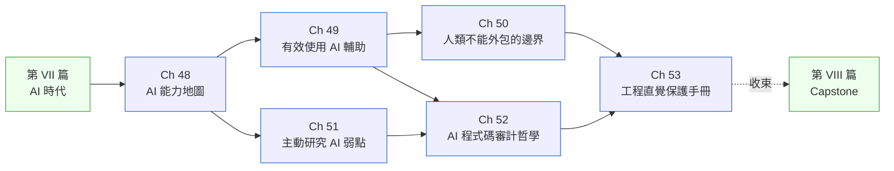

# 第 IX 篇|人類工程師的定位

> **AI 寫程式之後，人類的角色不是消失，而是改變。這篇五章加一個補章，說清楚改變成什麼樣子。**

---

NovaDeck 的 Leon，在 AI 工具全線中斷的那個下午，花了六小時找一個他兩年前三十分鐘就能解決的 bug。他的薪水沒有降，他的職稱沒有改，但他的工程直覺在兩年的 AI 加速裡悄悄退化了。

這不是 AI 的問題，也不是 Leon 的問題。是沒有人告訴他：**使用 AI 輔助和保持工程判斷能力，這兩件事需要分開設計，不會自然共存**。

第 IX 篇就是那份沒有人給他的設計圖。

---

## 篇內章節依存圖

---

## 各章核心問句

| 章 | 標題簡稱 | 這章回答的真正問題 |
|---|---|---|
| Ch 48 | AI 能力地圖 | 哪些任務 AI 可靠、哪些不可靠——這個答案是動態的嗎? |
| Ch 49 | 有效使用 AI 輔助 | 為什麼同一個工具，有些人用三個月就退回基線，有些人持續有效? |
| Ch 50 | 人類不能外包的邊界 | 哪五種判斷，「AI 沒說有問題」不能當成「沒有問題」? |
| Ch 51 | 主動研究 AI 弱點 | AI 的弱點是動態的——怎麼持續追蹤它? |
| Ch 52 | AI 程式碼審計哲學 | 傳統 Code Review 和 AI Code Review 的差距在哪裡? |
| Ch 53 | 工程直覺保護 | 在 AI 加速下，怎麼確保自己兩年後還能獨立 debug? |

---

## 不同讀者的建議入口

- **剛開始用 AI 工具的工程師**：Ch 48 → Ch 49 → Ch 53。三章讀完，你能設計自己的 AI 使用框架，而不是跟著感覺走。
- **Tech Lead / 架構師**：Ch 50 + Ch 52 是你的主線。前者告訴你哪些判斷不能外包，後者告訴你怎麼 review AI 寫的程式碼。
- **工程主管**：Ch 51 的季度 Red Team 流程，直接可以作為團隊季度評估的一部分。Ch 53 的團隊健康指標，是你觀察團隊 AI 依賴程度的工具。
- **對 AI 工具持懷疑態度的工程師**：Ch 48 先讀——它不是說「不要用 AI」，是說「怎麼評估什麼時候用、怎麼用」。

---

## 和其他篇章的關係

這篇是第 I 篇和第 VII 篇的對話：

- **第 I 篇**（認知基礎）問：SA/SD 是什麼，人類工程師的工作是什麼
- **第 VII 篇**（AI 時代）問：怎麼設計 AI 系統
- **第 IX 篇**（人類定位）問：在 AI 系統裡工作的人類，應該如何工作

這三個問題形成一個閉環。

---

## 前後篇連結

- **前置**：[第 VII 篇 AI 時代](../part-07-ai-era/00-overview.md)（設計 AI 系統 → 在 AI 系統裡工作）
- **這篇解鎖**：[第 VIII 篇 Capstone](../part-08-synthesis/00-overview.md) — Capstone 的 PayLoop 2.0 案例，是把這篇所有原則接上真實工程場景的最終驗證
