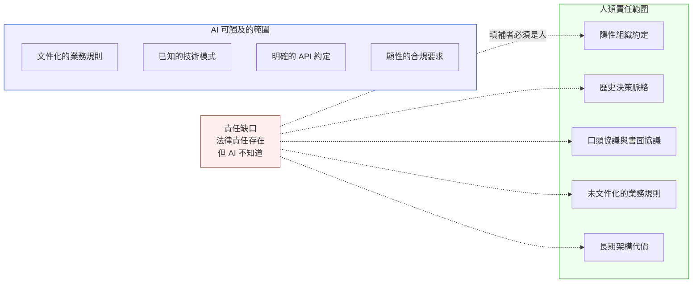

# 第 42 章|人類不能外包的邊界
## ⸺ 系統深度理解與判斷保留

> **前置閱讀**：[Ch 41 有效使用 AI 輔助](./ch-41-effective-ai-assistance.md)、[Ch 17 DDD 戰略設計](../part-04-architecture/ch-17-ddd-strategic-tactical.md)
> **下游章節**：[Ch 43 主動研究 AI 弱點](./ch-43-ai-weakness-research.md)
> **延伸補章**：[補章 E Compliance by Design](../part-05-quality/chE-compliance.md)、[補章 G 工程直覺保護手冊](./chG-engineering-intuition.md)

---

## 42.1 冷觀察 ⸺ AI 建議的欄位合併，繞過了一份 2019 年的書面協議

2026 年第二季，虛構區域醫院 EMR（Electronic Medical Record）系統 **PineRidge Medical Center**（`CASE-HCR-008`）的工程團隊正在做一個效能優化專案。

PineRidge 的 EMR 系統已經跑了八年。核心資料庫是 PostgreSQL 14，用量指標的查詢越來越慢——特別是一張叫 `medication_order_details` 的表，平均查詢時間在最近半年從 120ms 爬到 890ms。Tech Lead 把表結構和慢查詢 log 貼進 Claude Opus 4.7，請它提供優化建議。

AI 分析了三分鐘，給出一份詳細的優化方案：

> 「建議將 `medication_order_details` 和 `dispense_records` 進行部分欄位合併，減少 JOIN 操作。具體而言，可以將 `dispense_records.dispense_timestamp` 和 `dispense_records.dispenser_id` 反正規化（denormalize）到 `medication_order_details` 中，這樣常見的「醫囑 + 調劑紀錄」查詢可以避免一次 JOIN，預估查詢時間可降低 60–70%。」

技術上，這是一個合理的建議。Tech Lead 拿給 DBA 看，DBA 說「可以試」。工程師實作，staging 驗證，查詢時間降到 95ms。PR 通過，上線。

三個月後，醫院的資訊長（CIO）收到一封信。寄件人是台灣衛生福利部。

信的大意是：醫院的 EMR 系統在一次稽核取樣中，發現 `dispenser_id`（調劑藥師的員工識別碼）和 `medication_order_details` 出現在同一張表，違反了 2019 年醫院與主管機關簽訂的「處方與調劑分離稽核協議」。

工程師拿出當時的協議文件看了五分鐘。協議的第 7.3 條明確寫著：

> 「開立處方的資料欄位與調劑執行的資料欄位，不得儲存於同一資料表，以確保稽核時可獨立驗證兩個作業的操作紀錄。」

這份協議是 2019 年醫院為了通過當時的新版醫療機構管理辦法所簽的。簽約時做決定的主任委員已在 2022 年退休，當時的法遵長轉調到另一家醫院，這份協議的數位掃描檔案在 NAS 的一個叫 `compliance/2019/` 的資料夾裡，從來沒有進過任何 ADR、CLAUDE.md、或任何工程師可能看到的文件。

CIO 在緊急會議上說了一句話，被原樣記下來：

> 「AI 不知道有這份協議，因為我們自己也忘了有這份協議。但我們簽了，就有責任。」

---

## 42.2 真問題 ⸺ AI 的知識邊界等於你的文件邊界，但你的責任邊界不等於你的文件邊界

PineRidge 案例揭示的問題，不是 AI 做了壞建議。AI 做的建議在技術層面完全合理。問題是：**AI 的知識等於它能取用的 Context，但人類的責任範圍遠大於任何 Context 能涵蓋的範圍**。

那份 2019 年的協議是真實存在的約束。它不在 codebase，不在 ADR，不在任何工程師的腦袋裡。但它仍然有法律效力。AI 不知道它，所以 AI 的建議繞過了它——但繞過它的法律後果，是由醫院和工程師承擔，不是由 AI 承擔。

這個結構性問題在五個判斷類別上最常出現：



AI 只能工作在左側的範圍，但責任歸屬覆蓋右側的全部。

---

## 42.3 決策框架 ⸺ 五個不能外包給 AI 的判斷類別

不是所有事都不能問 AI。而是有五個類別的判斷，人類必須主動承擔，不能以「AI 沒提到」作為不知道的理由。

### 類別一：業務語義的最終裁定

同一個詞在不同系統、不同部門、不同時期可能有不同意義。`dispenser_id` 在 ERP 系統代表「執行操作的人」，在合規框架裡代表「需要獨立稽核的作業主體」——這個語義差距，只有熟悉業務歷史的人才能發現。

**判斷標準**：當一個術語在你的系統裡有「業務語義」而非只有「技術語義」，最終定義必須由能承擔業務後果的人確認，不能僅依靠 AI 解讀。

### 類別二：跨越組織記憶的歷史決策

每個系統都有一批「為什麼這樣設計」的答案，活在退休員工的腦袋裡、或者三年前的 Slack 對話裡。當 AI 建議修改一個沒有解釋的設計決策，工程師必須主動追問：「這樣設計當初有沒有特別的理由？」

**判斷標準**：凡是「看起來很奇怪但確實存在」的設計，在接受 AI 修改建議之前，先查清楚為什麼它會是這樣。

### 類別三：法律與合規責任的確認

AI 可以識別已知的法規條文，但它無法知道：你的組織和哪些監管機構簽了什麼協議、歷史合規審計留下了什麼限制、或者「業界普遍做法」在你的特定牌照範圍下是否被允許。

**判斷標準**：任何涉及資料儲存結構、個人資料處理、或稽核紀錄的設計變更，必須過法遵（或法律顧問）的確認，不能以「AI 說沒問題」替代。

### 類別四：長期架構代價的判斷

AI 沒有時間軸。它不知道「這個設計在十八個月後，當訂單量成長十倍的時候，會造成什麼問題」。架構的長期代價，需要工程師根據真實業務成長曲線進行判斷，AI 提供的只是基於通用模式的估算。

**判斷標準**：凡是架構層的設計決策，AI 的輸出只是「選項」，不是「建議採納的選項」。最終選擇必須基於對你的系統特定成長路徑的理解。

### 類別五：事故現場的根因定位

事故發生時，AI 可以幫助整理資訊、生成可能原因清單，但它沒有對你的系統的感知。「這個錯誤最可能的原因」這個判斷，需要的是對系統在過去幾個月裡每次重大變更的記憶，以及對當前系統狀態的直接觀測——這些都不能完整地放進一個 AI 的 Context。

**判斷標準**：事故根因分析，AI 是「情報蒐集助手」，不是「診斷者」。診斷的最終結論必須由真實接觸系統的工程師做出。

---

### 42.3.1 委派邊界的動態維護

委派邊界不是一次設定就固定的。系統越來越複雜、AI 能力持續演進、業務環境改變——邊界需要定期重新評估。

一個實用的做法：在每個 Sprint 結束時，花十分鐘問：「這個 Sprint 裡，有沒有哪個 AI 的建議，事後回頭看讓我有點不安？」如果有，那就是委派邊界需要收縮的訊號。

---

## 42.4 踩坑清單與交付清單

### 常見反模式

**反模式 1：委派漂移（Delegation Creep）**

一開始只讓 AI 寫 boilerplate，慢慢地開始讓它做架構建議，後來開始讓它審安全設計，最後發現合規決策也交給它了。每一步個別看起來合理，但累積起來讓人類的判斷主動性越來越低。

> **修正方向**：定期（每季）明確列出「我們允許 AI 主導決策的範圍」和「必須由人主導的範圍」，把這個清單寫進 CLAUDE.md 的「禁止」區塊。

---

**反模式 2：用 AI 的沉默代替盡責**

「AI 沒說這樣有問題」不是「這樣沒有問題」。這兩個命題不等價。AI 不說，可能是因為它不知道，也可能是因為它的訓練資料裡這種情況沒有被標記為問題。

> **修正方向**：把「AI 沒提到的問題」視為「需要更主動去找的問題」，而不是「可以排除的問題」。

---

**反模式 3：把「AI 說可以」當成合規依據**

在面對監管機構或法律爭議時，「我們詢問了 AI，AI 說這樣符合規定」不是任何司法管轄區認可的辯護理由。

> **修正方向**：合規確認需要具名的人類責任主體（法遵、法律顧問、或具備相關資質的工程師），AI 的輸出只能作為準備文件的輔助，不能作為確認本身。

---

**反模式 4：深度系統理解的退化**

當工程師長期讓 AI 代替自己理解系統，會發生一種漸進的退化：對系統的直覺變弱，需要問 AI 才能回答「這個系統為什麼這樣設計」。這讓五個判斷類別都變得更難做正確。

> **修正方向**：見[補章 G 工程直覺保護手冊](./chG-engineering-intuition.md)。深度理解是維持判斷能力的前提。

---

### 交付清單

**可帶走 Artifact：人類判斷邊界確認清單**

在開始一個功能開發或架構變更之前，逐一確認：

```
## 人類判斷邊界確認清單
功能 / 變更：______  日期：______  負責人：______

### 業務語義確認
☐ 這個變更涉及的核心業務術語，語義已由業務負責人確認
☐ 相關術語的定義已記錄在 CLAUDE.md 或 ADR

### 歷史決策確認
☐ 受此變更影響的舊有設計，已查清楚原始設計理由
☐ 若原始理由不明，已向資深成員（或文件）詢問確認

### 合規責任確認
☐ 變更不涉及個人資料、稽核欄位、或受監管的資料結構
☐ 若涉及，已取得法遵或法律顧問的書面確認

### 長期代價確認
☐ 已評估此設計在業務量 3x 和 10x 時的行為
☐ 已確認此變更不會增加未來無法承受的技術債

### AI 輸出的限制確認
☐ AI 提供的建議，已以獨立的業務標準驗收
☐ 若 AI 的建議觸及以上任何類別，已由人類最終確認
```

---

> **讀完這章你應該能做的事**：在下一次收到 AI 的設計建議時，能在五分鐘內判斷這個建議是否觸及五個不能外包的判斷類別，並決定下一步的確認行動。
