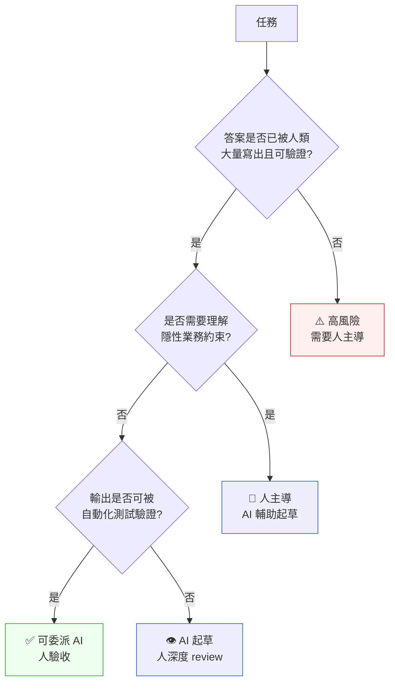

# 第 49 章|AI 能力地圖
## ⸺ 知道你在用什麼

> **前置閱讀**：[Ch 37 AI-Native 架構](../part-07-ai-era/ch-37-ai-native-architecture.md)、[Ch 45 AI Eval / Drift / Red Team](../part-07-ai-era/ch-45-ai-eval-drift-redteam.md)
> **下游章節**：[Ch 50 有效使用 AI 輔助](./ch-50-effective-ai-assistance.md)、[Ch 52 主動研究 AI 弱點](./ch-52-ai-weakness-research.md)
> **延伸補章**：[Ch 54 工程直覺保護手冊](./ch-54-engineering-intuition.md)

---

## 49.1 冷觀察 ⸺ schema 很漂亮,資料消失了

2026 年初，虛構多租戶 SaaS 平台 **VaultStack**（`CASE-SAS-010`）的工程團隊決定用 AI 設計一個新的訂閱計費模組。

VaultStack 做的是給中型企業用的**存取控制與稽核日誌平台**——IT 管理員用它設定「誰能看哪些系統、操作紀錄保留幾年、異常存取即時告警」。18 個客戶全是金融或製造業的法遵部門，月經常性收入（MRR, Monthly Recurring Revenue）約 USD 140 萬。計費模組要支援三種方案（Starter / Growth / Enterprise），每種有不同的功能開關（例如 Enterprise 才能開 SIEM 整合）、用量上限（每日日誌筆數上限）、與升降方案（Plan Change）紀錄。

Tech Lead 把需求描述貼進 Claude Opus 4.7。送出的 prompt 是：

```
你好，幫我設計一個 PostgreSQL 17 的訂閱計費 schema。
背景：SaaS 平台，多租戶，三種方案 Starter / Growth / Enterprise。
需求：
- 紀錄每個租戶的當前訂閱方案
- 支援方案升降的歷程紀錄
- 帳單週期（月付 / 年付）
- 用量計費欄位（每日日誌筆數）
請輸出 CREATE TABLE SQL，加上簡短說明。
```

注意這個 prompt 沒有提到：升降方案事件發生後，誰負責更新「當前生效方案」？`plan_changes` 和 `subscriptions` 之間的同步責任由誰承擔？這個問題在 prompt 裡是空白的。

AI 在四十秒內給出了一份乾淨的 schema：

```sql
-- AI 生成的計費 schema（精簡版）
CREATE TABLE subscriptions (
  id          UUID PRIMARY KEY DEFAULT gen_random_uuid(),
  tenant_id   UUID NOT NULL,
  plan_id     UUID NOT NULL,
  status      TEXT NOT NULL,  -- active / cancelled / paused
  starts_at   TIMESTAMPTZ NOT NULL,
  ends_at     TIMESTAMPTZ,
  created_at  TIMESTAMPTZ DEFAULT now()
);

CREATE TABLE plan_changes (
  id              UUID PRIMARY KEY DEFAULT gen_random_uuid(),
  subscription_id UUID REFERENCES subscriptions(id),
  from_plan_id    UUID NOT NULL,
  to_plan_id      UUID NOT NULL,
  changed_at      TIMESTAMPTZ DEFAULT now(),
  reason          TEXT
);
```

Tech Lead 看了三分鐘。3NF、外鍵合理、欄位命名清楚。PR 通過 review，上線。

三週後，客服收到一家客戶的投訴：「我上個月從 Growth 升到 Enterprise，帳單為什麼還是 Growth 的價格？」工程師去查 `plan_changes`，發現紀錄存在，`changed_at` 時間正確，`to_plan_id` 也對。問題是 `subscriptions.plan_id` 沒有被更新。

原來，整個系統升降方案的業務邏輯假設「`plan_changes` 只是稽核紀錄，真正生效的方案以 `subscriptions.plan_id` 為準」——但這個假設從來沒有人明確告訴 AI。AI 生成的 schema 邏輯自洽，但它把「升降方案事件」和「當前生效方案」視為兩個獨立的事實，而業務邏輯要求的是「升降方案事件必須觸發當前方案更新」。這個語義耦合沒有在任何文件、任何 spec 裡被寫出來——它活在三年前那個設計討論的 Slack 對話裡，那個對話從來沒有進過 codebase。

CTO 在覆盤會上說了一句話，被原樣記下來：

> 「AI 給的 schema 是對的，但它回答的不是我們真正的問題。我們問的是技術問題，但背後是業務語義問題。」

---

## 49.2 真問題 ⸺ AI 是補全引擎，不是理解引擎

把這件事拆開來看，問題不在 AI 設計的 schema 有技術缺陷。問題在於：**AI 補全了模式（pattern），但沒有理解意圖（intent）**。

大型語言模型（LLM, Large Language Model）的工作機制是 token 預測：給定一段上下文，計算下一個 token 的機率分布，選出機率最高的輸出。這個機制非常擅長「給出看起來像正確答案的答案」，因為它在大量人類寫的正確答案上訓練過。當你問它設計 schema，它見過幾百萬個 schema，知道「計費系統的 schema 通常長這樣」，所以輸出的結果在形式上是對的。

但「形式上正確」和「語義上正確」是不同的事。

| 維度 | AI 擅長 | AI 不擅長 |
|---|---|---|
| **形式正確性** | 語法、3NF、欄位命名、外鍵 | ✅ 高度可靠 |
| **模式補全** | 常見 schema 結構、慣用的 API 設計 | ✅ 高度可靠 |
| **業務語義** | 明確寫出來的業務規則 | ⚠️ 依賴 context 完整性 |
| **隱性約束** | 沒有被文件化的決策、口頭約定、歷史沿革 | ❌ 無法觸及 |
| **長期代價判斷** | 「這個設計三年後會有什麼問題」 | ❌ 訓練資料沒有時間軸 |
| **跨系統語義對齊** | 多個系統的同名欄位有不同意義 | ❌ 需要人工釐清邊界 |
| **安全邊界** | 已知攻擊模式的防禦 | ⚠️ 訓練截止日前的攻擊 |
| **合規細節** | 法規的字面要求 | ⚠️ 法規與系統設計的語義橋接 |

換句話說，AI 最可靠的工作範圍，是「答案已經被人類寫出來過、或者可以從已知模式推導出來」的任務。它最危險的工作範圍，是「答案在某個沒有被文件化的決策裡」的任務——因為 AI 不知道它不知道這件事，它仍然會給出一個看起來完整的答案。

---

## 49.3 決策框架 ⸺ AI 任務可靠性地圖

評估一個任務是否適合委給 AI，可以從三個維度入手：



**可靠性分級表（工程任務版）**

| 任務類型 | AI 可靠性 | 建議委派模式 | 驗收方式 |
|---|---|---|---|
| 樣板程式碼生成（CRUD、DTO） | 🟢 高 | 完全委派 | 自動化測試 |
| 已知設計模式實作 | 🟢 高 | 完全委派 | Code review |
| 技術文件撰寫（API doc、README） | 🟢 高 | 委派初稿 | 人工校對 |
| 測試案例生成（happy path） | 🟡 中 | 委派起草 | 人補邊界條件 |
| 錯誤處理邏輯 | 🟡 中 | 委派起草 | 人重點 review |
| Schema / 資料模型設計 | 🟡 中（若確實執行假設清單可達 🟢）| 人主導 + AI 輔助 | 業務語義驗證 + 假設清單逐項確認（見 §49.5）|
| 架構選型決策 | 🟠 低 | AI 提供選項 | 人決策 |
| 安全設計 | 🟠 低 | AI 識別已知模式 | 人做 Threat Model |
| 業務規則實作 | 🟠 低 | 人主導 | AI 輔助起草 |
| 合規架構設計 | 🔴 極低 | 人主導 | 法務 + 工程共同確認 |
| 事故根因分析 | 🔴 極低 | 人主導 | AI 協助整理資訊 |

**判斷原則**：任務的不可逆性越高、業務語義越深、隱性約束越多，AI 的可靠性越低。可靠性低不代表 AI 沒用——代表 AI 的角色要從「決策者」換成「起草者」。

> **關於 Schema 設計的 🟡 評級**：這個分級是在「沒有執行額外驗收流程」時的基準值。VaultStack 的案例說明，Schema 設計的真正風險不在 AI 生成的語法或正規化，而在 AI 默默填補的隱性業務假設。如果團隊在委派前確實填寫了 §49.5 的假設清單（把「plan_changes 和 subscriptions 的同步責任」這類問題拉到桌面），可靠性可以接近 🟢。這個評級衡量的是「流程合規度」，不是「AI 輸出品質」——兩者不是同一件事。

### 49.3.1 可靠性的動態性：模型更新會改變地圖

這張表不是靜態的。AI 的能力邊界在每次模型更新後都可能位移。一個在舊模型上「中可靠」的任務，在新模型上可能變成「高可靠」；但反向也會發生：新模型的訓練資料分布改變，某些任務的可靠性可能下降。

**工程含義**：不能假設「這個 AI 工具上週表現良好，這週也一樣」。可靠性地圖需要定期重新校準，尤其是在模型版本更新之後。

---

## 49.4 踩坑清單

### 常見反模式

**反模式 1：用 AI 輸出品質替代驗收標準**

> 「AI 給的，應該沒問題。」

這句話的問題是把「來源」當成「正確性保證」。AI 的輸出需要用獨立的標準驗收，而不是「因為是 AI 給的所以可信」。

> **修正方向**：為每個委派任務定義獨立的驗收標準，驗收標準不能引用「AI 認為正確」作為依據。

---

**反模式 2：把 AI 的沉默當成「沒有問題」**

AI 不會說「我不知道這個業務約束」——它會給出一個完整的答案，填補它不知道的部分用最常見的模式。VaultStack 的案例就是這個反模式：AI 沒有說「我不確定升降方案事件和當前方案的關係」，它直接給出了一個看起來完整的 schema。

> **修正方向**：主動詢問 AI「你在設計這個的時候做了哪些假設？」把假設顯性化，再逐一驗證。

---

**反模式 3：把 AI 能力地圖當成固定事實**

「AI 不能做架構決策」這句話在某個模型版本上是對的，在下一個版本上可能只有部分對。反過來也一樣。

> **修正方向**：把 AI 可靠性視為需要定期重新評估的工程參數，不是一次設定就結束的知識。

---

**反模式 4：可靠任務和不可靠任務混在同一個 prompt**

「幫我設計這個 schema，同時告訴我這個設計對合規有什麼影響。」前半段 AI 可靠，後半段不可靠——但混在同一個請求裡，你可能以為得到的是兩個同等可靠的答案。

> **修正方向**：根據可靠性分級，把高可靠任務和低可靠任務分開委派，用不同的驗收標準處理輸出。

---

## 49.5 交付清單 ⸺ 一頁式 AI 委派 Reliability Check

**可帶走 Artifact：AI 任務委派可靠性評估表**

在每個 Sprint 開始時，對本 Sprint 計畫委給 AI 的任務，逐一填寫：

```
## AI 任務委派可靠性評估
Sprint: ______  日期: ______

| 任務描述 | 答案是否已大量存在? | 需要隱性業務知識? | 可自動驗收? | 可靠性分級 | 委派模式 | 驗收方式 |
|---|---|---|---|---|---|---|
|   |   |   |   |   |   |   |
|   |   |   |   |   |   |   |

## 本次委派的假設清單
（針對每個中/低可靠任務，列出 AI 可能做的隱性假設）
1.
2.

## 本次委派的驗收標準
（獨立於 AI 輸出品質）
1.
2.
```

**使用說明**：這個表不是用來阻止你用 AI，而是用來讓委派決策顯性化。你應該能在五分鐘內填完一個任務的評估；如果填不完，通常代表你還沒想清楚要請 AI 做什麼。

---

### 49.5.1 範例：VaultStack 訂閱計費 schema 委派前該填的那一行

如果 VaultStack（`CASE-SAS-010`）那位 Tech Lead 在把需求貼進 Claude 之前先填完這一行，三週後客戶投訴的 `subscriptions.plan_id` 就不會被 AI 默默地當成「事件表自己的事」處理掉。下面是事故覆盤後團隊重新整理的版本：

````markdown
## AI 任務委派可靠性評估
Sprint: 2026-Q1 W3   日期: 2026-02-09

| 任務描述 | 答案大量存在? | 需要隱性業務知識? | 可自動驗收? | 可靠性 | 委派模式 | 驗收方式 |
|---|---|---|---|---|---|---|
| 訂閱計費 PG schema 草稿 | 是(3NF 模板多) | **是**(plan_change 與 current plan 的同步語義) | 部分 | 🟠 低 | 人主導 + AI 輔助 | 業務語義 review |
| API DTO + CRUD endpoint | 是 | 否 | 是(契約測試) | 🟢 高 | 完全委派 | 自動化測試 |
| 升降方案的計費試算邏輯 | 部分 | **是**(proration 規則三年改過兩次) | 是(用 18 條歷史帳單對照) | 🟠 低 | 人主導 | 對歷史帳單 |

## 本次委派的假設清單
<!-- 為什麼這欄:把 AI 沒講出口的假設拉到桌面,事故的根因往往就藏在這幾條;
     寫不出三條以上代表還沒想清楚要請 AI 做什麼。 -->
1. AI 會不會把 `plan_changes` 當成獨立事件流,而不更新 `subscriptions.plan_id`?
2. AI 會不會假設 `status` 用 TEXT 即可,而不是 enum?
3. AI 會不會幫 `ends_at` 加 NOT NULL,而我們需要 NULL = 永久訂閱?

## 本次委派的驗收標準
<!-- 為什麼這欄:驗收標準若引用「AI 認為對」,等於沒驗收;
     必須是不依賴 AI 也能跑的客觀條件。 -->
1. 對 18 條歷史升降方案資料,新 schema 能還原當前生效方案
2. plan_change 寫入後 `subscriptions.plan_id` 必須在同一交易內更新(用 trigger 或 service 雙寫測試強制)
3. CTO + DBA 雙簽,理由不得是「AI 說沒問題」
````
五分鐘填這一行,**省下三週後在客服信箱裡找根因的那兩天**。委派決策一旦被寫下來,假設就再也藏不住了。

---

## 49.6 本章交付清單 Recap

讀完本章，你應該已經能做到：

- [ ] 用三個維度（答案是否已大量存在、是否需要隱性業務知識、是否可自動驗收）快速評估一個任務的 AI 委派可靠性
- [ ] 填寫 AI 任務委派可靠性評估表，為 Sprint 內的委派決策顯性化，並列出 AI 可能做的隱性假設
- [ ] 向 AI 詢問「你在設計這個的時候做了哪些假設」，把假設顯性化後逐一驗證
- [ ] 說明為何「可靠性地圖需要定期重新校準」，以及模型更新後應採取什麼行動

如果先挑一項做，建議是 ⸺ **拿下一個準備委派給 AI 的任務，先填一行評估表**，理由是它立刻讓你看見這個委派決策背後的假設在哪裡，而不是等到 AI 輸出出問題才回頭找。

---

## Cross-References

- **前置閱讀**：[Ch 37 AI-Native 架構](../part-07-ai-era/ch-37-ai-native-architecture.md)、[Ch 45 AI Eval / Drift / Red Team](../part-07-ai-era/ch-45-ai-eval-drift-redteam.md)
- **下游章節**：[Ch 50 有效使用 AI 輔助](./ch-50-effective-ai-assistance.md)、[Ch 52 主動研究 AI 弱點](./ch-52-ai-weakness-research.md)
- **延伸補章**：[Ch 54 工程直覺保護手冊](./ch-54-engineering-intuition.md)

## 引用

本章無外部文獻引用。

<!-- PROPOSED-REFS
glossary:
  - anchor: large-language-model
    name: LLM（大型語言模型，Large Language Model）
    body: |
      以 Transformer 架構為基礎、在大量文字資料上訓練的生成式 AI 模型。工作機制是 token
      預測：給定上下文，計算下一個 token 的機率分布。擅長模式補全，但無法觸及未文件化
      的隱性約束。本書 Part IX 多章以 LLM 能力邊界作為 SA 設計判準的核心概念。
  - anchor: mrr
    name: MRR（月經常性收入，Monthly Recurring Revenue）
    body: |
      訂閱制 SaaS 公司的核心財務指標，衡量每月來自訂閱的可預期收入。
      常用於評估 SaaS 平台規模與業務健康度。
-->

