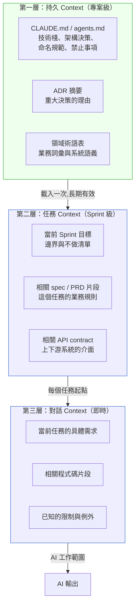

# 第 50 章|有效使用 AI 輔助
## ⸺ 委派設計與 Context Engineering

> **前置閱讀**：[Ch 38 Context-Driven Engineering](../part-07-ai-era/ch-38-context-driven-engineering.md)、[Ch 49 AI 能力地圖](./ch-49-ai-capability-map.md)
> **下游章節**：[Ch 51 人類不能外包的邊界](./ch-51-human-judgment-boundary.md)、[Ch 53 AI 程式碼的審計哲學](./ch-53-ai-code-audit.md)
> **延伸補章**：[Ch 54 工程直覺保護手冊](./ch-54-engineering-intuition.md)

---

## 50.1 冷觀察 ⸺ 生產力 2.1x，六個月後回基線

2026 年第一季，虛構 B2B SaaS 工具平台 **GridForge**（`CASE-SAS-011`）的 28 人工程團隊在 CPO 的力推下，全面導入 Cursor + Claude Code。

第一個月的週報裡有一張圖，CTO 截圖傳到 Slack 上，標題是「這是我今年看到最好的工程指標」：PR 合入速率從日均 3.4 提升到 7.1，Code Review 往返次數從平均 4.2 次降到 2.6 次，Bug 逃逸率（Escaped Defect Rate）從 12% 降到 7%。整個工程組織欣喜若狂。

第二個月，數字繼續好看。第三個月，略微回落，但 CTO 說「正常收斂」。

第六個月，PR 合入速率回到 3.7，Bug 逃逸率回到 11%。

工程部門做了一次事後調查。他們讓每個工程師回答：「你現在用 Cursor / Claude Code 的方式，和三個月前一樣嗎？」

結果觸目驚心。

28 個工程師裡，23 人有自己的 CLAUDE.md，但這 23 份檔案有 23 種不同的設定內容；剩下 5 人根本沒有 CLAUDE.md，直接用預設。有人在 CLAUDE.md 裡寫了「prefer functional programming style」，有人寫了「always use TypeScript strict mode」，有人完全沒有寫技術偏好，只寫了「you are a helpful assistant」。**所有人的 CLAUDE.md 都沒有記載 GridForge 的業務規則、架構決策或 API 約定**。

差異不只是風格偏好。事後調查翻出了兩件具體事故：

**事故 A（第三個月，PR #447）**：工程師 Marcus 的 CLAUDE.md 沒有任何架構規範，他請 AI 幫他實作「方案降級後更新訂閱狀態」的功能，AI 直接在 `SubscriptionService` 裡更新了 `subscriptions.plan_id`，沒有寫入 `plan_change_events`。Marcus review 時沒有發現（「看起來沒問題」），合入了。兩週後帳務對帳時才發現降級紀錄有缺口，rollback 加修復花了整整一天。同一週，工程師 Yuna 的 CLAUDE.md 有一條「方案升降必須先寫 plan_change_events，再更新 subscriptions.plan_id」，她請 AI 做類似功能，AI 正確地生成了雙步驟寫入。同一個需求、不同的 CLAUDE.md，產生了截然不同的結果。

**事故 B（第五個月，code review 往返次數回升）**：無統一規範的情況下，AI 在不同人的對話裡給出了相互矛盾的架構建議——A 的 AI 說「應該用 Repository pattern 封裝 DB 存取」，B 的 AI 說「直接用 ORM 就好，過度抽象」。兩人爭論架構選擇，code review 往返從 2.6 次回升到 4.8 次，抵消了大半個月的效率增益。

每個工程師每天早上打開 Cursor，都是在重新跟一個失憶的同事解釋這個專案是什麼。

Head of Engineering 在覆盤會上把這件事說得很清楚：

> 「我們把 AI 當工具買進來了，但沒有當同事訓練它。一個新進同事第一天報到，你會給他一週 onboarding；我們的 AI 每個對話都是第一天報到，然後我們奇怪為什麼它越來越沒用。」

---

## 50.2 真問題 ⸺ AI 的有效性取決於 Context 的品質，不是工具的版本

AI 工具的生產力收益有一個沒有人在銷售簡報裡提到的前提：**AI 能做出好決策的範圍，等於你給它的 Context 的品質邊界**。

Context 不完整，AI 就只能靠訓練資料的「通常情況」來補全。「通常情況」大多數時候夠用，但在你的系統有非標準決策、業務特殊規則、或歷史技術債的時候，「通常情況」會給你一個看起來合理但在你的脈絡下是錯的答案。

把有效使用 AI 輔助這件事拆成三個問題：

| 問題 | 典型錯誤 | 正確框架 |
|---|---|---|
| **委派什麼** | 「把任務丟給 AI，看它給什麼」 | 根據 Ch 48 可靠性地圖，決定委派模式 |
| **怎麼指定** | 「用自然語言描述需求」 | Context Engineering：給 AI 決策所需的完整脈絡 |
| **怎麼驗收** | 「看起來沒問題就 LGTM」 | 用業務語義而非技術正確性驗收 |

三個問題裡，中間那個「怎麼指定」是最容易被忽略、但影響最大的。

---

## 50.3 決策框架 ⸺ Context Engineering 三層設計

Context Engineering（上下文工程）指的是**有意識地設計 AI 在每次互動中能取用的資訊結構**，而不是每次對話都從零開始描述需求。

### 50.3.1 三層 Context 架構



**第一層是投資**：寫好 CLAUDE.md 是一次性成本，但它讓之後每次 AI 互動都不需要重新解釋基礎。這一層的投資報酬率最高，也最常被跳過。

**第二層是任務準備**：在把任務委給 AI 之前，先確認這個任務相關的 spec 和 API 約定是否可以讓 AI 取用。如果相關文件沒有 AI 可讀的版本，先花十五分鐘整理，再開始委派。

**第三層是正常的 prompt 設計**：大多數人做的事都在這一層。三層都有，第三層才能有效。

### 50.3.2 CLAUDE.md 最小有效設計

一份有效的 CLAUDE.md 需要回答四個問題。在看範例之前，先理解一個關鍵區分：

**CLAUDE.md 裡有兩種不同性質的內容，混淆它們是最常見的結構錯誤：**

| 類型 | 定義 | 放在哪裡 | 放進 CLAUDE.md 的理由 |
|---|---|---|---|
| **架構規則** | 有意識選擇的技術決策（Clean Architecture、Repository pattern） | ADR，CLAUDE.md 引用摘要 | AI 的訓練資料裡有「通常做法」，會覆蓋你的歷史決策 |
| **隱性業務語義** | 從未在標準文件裡出現、但系統賴以正確運作的業務邏輯 | **只存在於老員工腦袋裡** | AI 無從得知，標準文件也沒有，不寫進來就一定踩坑 |

第二類才是 CLAUDE.md 最核心的價值。GridForge 的 `plan_change_events` 問題之所以反覆出現，不是因為沒有 ADR，而是因為「**升降方案時要先寫事件紀錄、再更新訂閱狀態，這個順序是有業務含義的**」這件事從來沒有被記錄在任何 AI 可讀的地方。它不像 Clean Architecture 那樣有書可查，它是 GridForge 自己跑通帳務審計之後才確立的規則。

**隱性業務語義的判斷標準**：如果一個新進工程師第一週不問任何人、只看 spec 和 ADR 就能正確實作，那它不是隱性語義。如果他一定會在 code review 被打回來說「這邊邏輯不對，因為我們的業務是...」，那它就是隱性語義，應該在 CLAUDE.md 裡。

**資源有限時的優先順序**：不是所有隱性語義都需要同時文件化。團隊剛開始時，優先記錄以下三類：第一，**過去曾經造成 bug 或 code review 往返**的規則（例如 GridForge 的 `plan_change_events` 順序）；第二，**違反訓練資料預設做法**的決策（例如你的系統刻意不用某個框架的標準寫法）；第三，**涉及跨系統邊界的依賴**（例如上下游 API 的隱性時序假設）。架構規則和命名規範可以之後補充；隱性業務語義越晚記錄，踩坑代價越高。

```markdown
# [專案名] CLAUDE.md

## 這個專案是什麼
（一段話，讓 AI 知道它在哪個業務脈絡下工作）
GridForge 是一個 B2B SaaS 工作流自動化平台，服務對象是
中型製造業的 IT 部門。核心產品是可視化的規則引擎與觸發器系統。

## 技術棧與版本
- Backend: Spring Boot 3.3, Java 21, PostgreSQL 17
- Frontend: React 19, TypeScript 5.4, Tailwind CSS 3.x
- Infra: Kubernetes 1.31, Istio 1.22, Kafka 3.7
- AI: Claude Sonnet 4.6（內部工具）

## 架構禁令（AI 的訓練資料有「通常做法」，這裡是 GridForge 的不同選擇）
- 禁止：在 domain 層直接依賴 infrastructure（Clean Architecture，見 ADR-014）
- 禁止：用 @Transactional 跨越 Bounded Context 邊界（見 ADR-017）
- 禁止：在前端 component 直接呼叫 API，一律走 custom hook

## 隱性業務語義（這裡是標準文件不會記載、但新人一定踩坑的規則）
- 方案升降流程：先寫入 plan_change_events（記錄升降前的 plan_id），
  再更新 subscriptions.plan_id。順序不能對調——帳務審計依賴事件紀錄
  重建歷史狀態，若先更新訂閱再補事件，重建結果會錯。
- Workspace 之間資料完全隔離；任何跨 Workspace 的查詢都是業務錯誤，
  不是技術選擇。

## 業務術語對照
- Workspace = 多租戶的頂層隔離單位（≠ Organization，≠ K8s namespace）
- Rule = 業務規則的邏輯單元（≠ DB row-level security）
- Trigger = 自動觸發規則執行的事件（≠ DB trigger）

## 常見陷阱
- `plan_id` 在 subscriptions 是「當前生效方案」，在 plan_change_events
  是「升降前的方案 ID」——兩個欄位同名但語義不同
- 所有金額單位是分（cents），DB schema 與 API 一致；UI 才換算
```

這份文件的目標不是完整描述整個系統——是把那些「老員工知道、新人（和 AI）一定踩坑」的隱性語義從腦袋裡搬出來，讓每次 AI 互動都有機會避開它們。

### 50.3.3 委派設計：三個問題清單

在把一個任務委給 AI 之前，先問三個問題。這三個問題對應三層 Context 架構的完整性檢查：Q1 確認 L1（持久 Context）與 L2（任務 Context）的資訊是否就位；Q2 確認 L2 裡的業務規則足以支撐驗收；Q3 確認 L3（即時 Context）的反饋迴圈夠短。三層都有缺口，委派就有風險。

**Q1：AI 做這個決定需要哪些資訊，這些資訊它現在能取用嗎？**

如果答案是「有部分資訊它拿不到」，先把資訊補進 Context（CLAUDE.md 或任務描述），再委派。

**Q2：這個任務的輸出，有沒有可以獨立於 AI 輸出的驗收標準？**

「看起來沒問題」不是驗收標準。「能通過 X 測試、或符合 Y 業務規則」才是。

**Q3：如果 AI 的輸出是完全錯的，我多快能發現？**

時間越長，代價越高。為高風險任務設計快速反饋機制（自動測試、staging 驗證、短週期 review）。

---

## 50.4 踩坑清單

### 常見反模式

**反模式 1：CLAUDE.md 是個人的，不是團隊的**

每個工程師自己維護一份 CLAUDE.md，導致 AI 在不同工程師手上表現差異很大。同一個 PR，A 的 AI 說「應該用 Repository pattern」，B 的 AI 說「直接用 ORM 就好」。

> **修正方向**：CLAUDE.md 是程式碼庫的一部分，放進 Git，和程式碼一起 review 和更新。個人偏好寫進 `~/.claude/CLAUDE.md` 或各自的設定檔，不要混入專案設定。

---

**反模式 2：把委派當成卸責**

「這是 AI 寫的」不是 PR 說明。更不是架構決策的理由。

> **修正方向**：委派不改變工程師對輸出的責任。AI 是工具，驗收是你的工作。PR 描述應該說清楚這個改動的業務理由，而不是它的產出來源。

---

**反模式 3：Context 只在需要時才加**

「等出問題再補 CLAUDE.md」的結果是：你在錯誤發生之後才開始管理 Context，而不是在錯誤發生之前。

> **修正方向**：CLAUDE.md 和 ADR 同步更新——每次做一個重大架構決策，順手把「不要這樣做」的規則加進 CLAUDE.md。

---

**反模式 4：用同一個 prompt 問不同可靠性層次的問題**

「幫我實作這個功能，順便告訴我這樣的設計有沒有安全問題。」前半段 AI 可靠，後半段不可靠，但你得到的回答看起來一樣有把握。

> **修正方向**：把任務依可靠性分層，分開委派，分開驗收。安全設計的 review 不應該由同一個會話的 AI 兼任。

---

## 50.5 交付清單 ⸺ 一頁式 CLAUDE.md + 委派配置卡

每當團隊決定引入 AI coding assistant，第一份要產出的不是功能清單，而是一份讓 AI 知道「自己在哪個業務脈絡」的 CLAUDE.md——沒有它，每次對話都從第一天 onboarding 重新開始。

**可帶走 Artifact：GridForge 式 CLAUDE.md 模板**

把它存在 `docs/ai-context/`，跟程式碼同 repo，跟 README 同層。

````markdown
# [專案名] — CLAUDE.md
> 版本:v0.1 | 撰寫日期:YYYY-MM-DD | 擁有人:{名字}

## 1. 專案定位（一段話）
[讓 AI 知道它在哪個業務脈絡]

## 2. 技術棧（含版本）
- Backend:
- Frontend:
- Infrastructure:
- AI/ML（若有）:

## 3. 架構禁令（不做清單）
- 禁止:
- 禁止:
- 注意（容易出錯但非禁令）:

## 4. 業務術語對照
| 術語 | 在本系統的意義 | 常見混淆 |
|---|---|---|
|   |   |   |

## 5. 常見陷阱
[列出過去 AI 曾經犯過的業務語義錯誤]
1.
2.

## 6. 本 Sprint 優先級（每 Sprint 更新）
> 當前 Sprint 目標:
> 本 Sprint 不做:
````

---

### 50.5.1 範例：GridForge 第六個月該寫卻沒寫的那份 CLAUDE.md

GridForge（`CASE-SAS-011`）28 個工程師裡有 23 種 CLAUDE.md，等於 23 種失憶的同事。下面這份是事後整理出來、本來應該在導入 Cursor 第一週就放進 `repo:/CLAUDE.md` 的版本：

````markdown
# GridForge Workflow Platform — CLAUDE.md
> 版本: v1.0   最後更新: 2026-03-12   維護者: Platform Team

## 1. 專案定位
GridForge 是一個 B2B SaaS 工作流自動化平台，服務對象是中型製造業 IT 部門。
核心產品是可視化規則引擎與觸發器系統，跨多 workspace 多租戶。

## 2. 技術棧
- Backend: Spring Boot 3.3, Java 21, PostgreSQL 17
- Frontend: React 19, TypeScript 5.4, Tailwind 3.x
- Infra: Kubernetes 1.31, Istio 1.22, Kafka 3.7
- AI: Claude Sonnet 4.6（內部工具）

## 3. 架構禁令
<!-- 為什麼這欄:這四條是過去 6 個月 PR 出事最頻繁的位置;
     沒寫進來,AI 會以「通常做法」蓋過 GridForge 的歷史決策。 -->
- 禁止:在 domain 層直接依賴 infrastructure（Clean Architecture，ADR-014）
- 禁止:用 @Transactional 跨越 Bounded Context 邊界
- 禁止:前端 component 直接呼叫 API，一律走 custom hook
- 注意:方案升降必須先寫 plan_change_events，再更新 subscriptions.plan_id（同單交易）

## 4. 業務術語對照
<!-- 為什麼這欄:這三個詞在 GridForge 與工業界的「常識」意思不一致;
     不對齊就會把 K8s 的 namespace、DB 的 trigger 當成 Workspace 與 Trigger。 -->
| 術語 | 在 GridForge 的意義 | 常見混淆 |
|---|---|---|
| Workspace | 多租戶頂層隔離單位 | ≠ Organization、≠ K8s namespace |
| Rule | 業務規則邏輯單元 | ≠ DB row-level security |
| Trigger | 自動執行規則的事件 | ≠ DB trigger |

## 5. 常見陷阱
1. `plan_id` 在 subscriptions 是「當前生效方案」，在 plan_change_events 是「升降前方案 ID」
2. 所有金額單位是分（cents），DB schema 與 API 一致；UI 才換算
3. Workspace 之間的資料完全隔離，不要寫「跨 workspace 聚合」的查詢

## 6. 本 Sprint 優先級
> 當前 Sprint 目標:把 Trigger 模組從 polling 改為 Kafka consumer
> 本 Sprint 不做:Workspace 之間的 Rule 共享（已在 ADR-018 暫緩）
````
這份不到一頁的東西,**換的是讓 AI 每次對話不再從第一天 onboarding 開始**。第二層、第三層的 Context 才有地方往上長。

---

## 50.6 本章交付清單 Recap

讀完本章，你應該已經能做到：

- [ ] 用三層 Context 架構（持久 Context / 任務 Context / 對話 Context）設計 AI 委派的資訊結構
- [ ] 為現有專案寫出回答四個問題的 CLAUDE.md（系統定位、技術棧、架構禁令、業務術語）
- [ ] 在委派任務之前，用三個問題清單確認資訊完整性、驗收標準、與快速反饋機制
- [ ] 說明為何 CLAUDE.md 應納入 Git 版控，以及個人偏好與專案設定應如何分離

如果先挑一項做，建議是 ⸺ **為現在的專案寫第一版 CLAUDE.md**，只需要回答那四個問題，20 分鐘以內完成；理由是它是整個三層 Context 架構的第一層投資，每一次 AI 互動都會從中受益。

---

## Cross-References

- **前置閱讀**：[Ch 38 Context-Driven Engineering](../part-07-ai-era/ch-38-context-driven-engineering.md)、[Ch 49 AI 能力地圖](./ch-49-ai-capability-map.md)
- **下游章節**：[Ch 51 人類不能外包的邊界](./ch-51-human-judgment-boundary.md)、[Ch 53 AI 程式碼的審計哲學](./ch-53-ai-code-audit.md)
- **延伸補章**：[Ch 54 工程直覺保護手冊](./ch-54-engineering-intuition.md)

## 引用

本章無外部文獻引用。

<!-- PROPOSED-REFS
glossary:
  - anchor: context-engineering
    name: Context Engineering（上下文工程）
    body: |
      有意識地設計 AI 在每次互動中能取用的資訊結構，而不是每次對話從零開始描述需求。
      分為三層：持久 Context（專案級）、任務 Context（Sprint 級）、對話 Context（即時）。
      由 Ch 49 提出，是 CDE（Context-Driven Engineering，Ch 37）在日常工程實踐層面的具體操作方法。
-->

