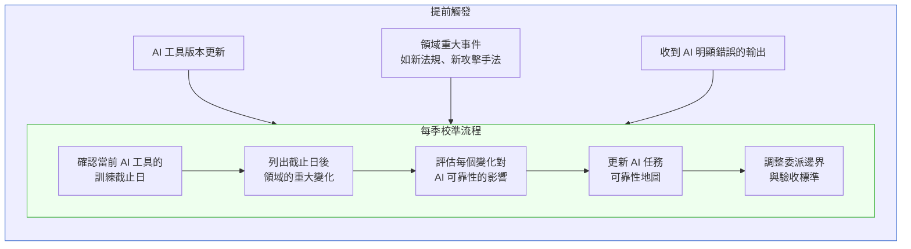

# 第 52 章|主動研究 AI 弱點
## ⸺ Red Team 思維與持續校準

> **前置閱讀**：[Ch 49 AI 能力地圖](./ch-49-ai-capability-map.md)、[Ch 45 AI Eval / Drift / Red Team](../part-07-ai-era/ch-45-ai-eval-drift-redteam.md)
> **下游章節**：[Ch 53 AI 程式碼的審計哲學](./ch-53-ai-code-audit.md)
> **延伸補章**：[Ch 46 Agentic QA](../part-07-ai-era/ch-46-agentic-qa.md)、[Ch 54 工程直覺保護手冊](./ch-54-engineering-intuition.md)

---

## 52.1 冷觀察 ⸺ 六個月連續通過，第七個月資料外洩

2026 年第一季末，虛構數位資產託管平台 **ClearVault**（`CASE-FIN-013`）的安全工程師 Kevin 正在做第七個月的例行安全審查。

ClearVault 管理企業客戶的數位資產冷儲存（Cold Wallet），每個月的安全審查包含：程式碼靜態分析、API 端點手動測試、以及一份用 Claude Sonnet 4.6 輔助的「已知弱點掃描報告」。前六個月，AI 輔助報告每次都回傳「未發現重大安全風險，建議持續監控以下低風險項目...」Kevin 對這個結果越來越放心——AI 每個月都在掃，每個月都沒有重大問題，代表系統應該是安全的。

這裡有一個值得停下來問的問題，但 Kevin 沒有問：**六次連續的「未發現重大風險」，算不算一種信號？**

它可能代表系統真的很安全。但它也可能代表：**這個工具掃的是它訓練資料裡熟悉的攻擊類型，而威脅環境已經往它不認識的方向移動了。** 一把只量得到公分的尺，量了六次都回傳同樣的數字，不代表量對了——代表這把尺的量程沒有覆蓋真正在變動的那個維度。

Kevin 知道 Claude Sonnet 4.6 的訓練截止日是 2025 年 4 月。這不是祕密，文件上寫得很清楚。但知道這個事實，和把它納入安全審查的設計邏輯，是兩件不同的事。六個月裡，Kevin 每個月讓同一個工具跑同一份掃描，沒有問過：「這個工具的威脅模型，有沒有追得上這六個月裡出現的新型攻擊？」

這是組織層面的靜態性陷阱：**把一個知識截止在固定時間點的工具，當成動態威脅環境的持續哨站**。工具本身沒有失職；失職的是使用流程沒有為工具的已知侷限設計補償機制。

第七個月，ClearVault 的一個 B2B API 端點被攻擊。攻擊手法是**間接提示注入（Indirect Prompt Injection）**[^CIT-400]：攻擊者在一份他們上傳的文件裡嵌入了特製的指令，當 ClearVault 的 AI 輔助文件處理功能讀取這份文件時，AI 被引導執行了預定之外的 API 呼叫，最終洩露了部分 API 金鑰。

Kevin 把這個攻擊手法拿去問 Claude：「這種間接提示注入攻擊，你之前為什麼沒有在安全審查裡提到？」

Claude 的回答坦率：

> 「間接提示注入作為一種攻擊向量，在學術界大約從 2023 年開始被廣泛討論 [^CIT-401]，但大規模的真實攻擊案例在 2025 年下半年才開始顯著增加。我的訓練資料截止日是 2025 年 4 月，訓練資料裡對這種攻擊的具體防禦模式和案例累積仍然有限。我在之前的安全審查裡，針對的主要是我訓練資料中更成熟的攻擊類別。」

ClearVault 的 CISO（首席資訊安全長）在覆盤會上說了一句話：

> 「我們用 AI 審安全，但我們假設 AI 的威脅知識和我們的威脅環境是同步更新的。它們不是。」

---

## 52.2 真問題 ⸺ AI 的威脅知識有截止日，你的威脅環境沒有

ClearVault 的問題可以拆成兩個獨立的認知：

**第一個認知**：AI 的知識有截止日（training cutoff），而且截止日不等於「知識的有效期限」。一個攻擊手法可能在訓練截止日前就已經存在，但因為當時的公開討論和案例累積不夠，AI 對它的理解是片面的。隨著時間推移，訓練截止日和當前威脅環境的差距只會擴大，不會縮小。

**第二個認知**：AI 的「沒有發現問題」不等於「沒有問題」。這和 Ch 50 討論的判斷邊界一致，但在安全領域後果特別嚴重——因為安全漏洞的代價往往是不可逆的。

把這兩個認知合在一起，得出一個工程結論：**不能用 AI 的掃描結果作為安全狀態的最終評估，而是要主動設計機制來發現 AI 的盲點**。

這不是說不要用 AI 做安全審查。而是把 AI 的角色從「安全評估者」改成「已知模式的快速檢查者」，同時建立一個並行的機制來持續校準 AI 的盲點範圍。

---

## 52.3 決策框架 ⸺ AI 弱點研究的三個層次

主動研究 AI 弱點，可以從三個層次進行，複雜度遞增：

### 層次一：訓練截止日偏差監測

最基本的層次：定期追蹤你使用的 AI 工具的訓練截止日，並評估在截止日之後，你的工作領域發生了哪些重大變化。



**實作建議**：把這個流程設成季度 calendar event，和每季的技術回顧會議一起做。每次不超過一小時，但要有明確的輸出：「這一季 AI 的哪些使用場景可靠性下降了，我們怎麼調整。」

### 層次二：領域專屬 Failure Catalog

比訓練截止日偏差更精細的層次：建立一份你的工程團隊在實際使用 AI 時累積的「AI 失敗案例目錄」。

**Failure Catalog 的結構**：

| 欄位 | 說明 |
|---|---|
| 案例 ID | 流水號，如 FC-001 |
| 日期 | 發現日期 |
| AI 工具與版本 | 哪個模型、哪個版本 |
| 任務類型 | 代碼生成 / 架構建議 / 安全審查 / 其他 |
| 失敗描述 | AI 給出了什麼、為什麼是錯的 |
| 根本原因 | 訓練截止日 / Context 不足 / 業務語義缺失 / 其他 |
| 影響範圍 | 只影響這個任務 / 影響類似任務 |
| 預防措施 | 對 CLAUDE.md 或委派流程做了什麼改變 |

Failure Catalog 的價值不只在記錄——在於讓整個團隊能從每次失敗中更新對 AI 的理解，而不是每個人各自累積各自的直覺。

### 層次三：主動 Red Team

最主動的層次：設計特定的測試情境，主動探索 AI 在你的工作領域的邊界。

**Red Team 基本設計**：

```
目標：找出 AI 在 [特定領域 / 任務類型] 的系統性盲點

步驟：
1. 選定一個 AI 目前被用來輔助的重要任務類型
2. 先做「主題選題」（見下方說明），確定 Red Team 要瞄準哪類盲點
3. 設計 10–20 個測試案例，涵蓋：
   a. 正常情況（驗證 AI 目前可靠性）
   b. 邊界情況（找 AI 開始不穩定的邊界）
   c. 對抗情況（刻意給出會讓 AI 誤判的輸入）
4. 記錄每個案例的 AI 輸出，與人工判斷對比
5. 彙整成 Failure Catalog 條目，更新委派邊界
```

**Red Team 主題選題：如何思考「AI 不知道什麼」**

Red Team 有一個根本的循環悖論：要設計測試案例去發現盲點，你得先知道盲點可能在哪裡。這個循環不能靠 AI 自己打破——它必須靠人主動推理。

盲點是系統性的，不是隨機的。推理路徑如下：

| 使用場景 | AI 盲點的系統性來源 | Red Team 應瞄準的方向 |
|---|---|---|
| 安全審查 | 訓練截止日後出現的攻擊手法 | 截止日後發表的學術 PoC、CVE、安全研究論文 |
| 業務邏輯審查 | 訓練資料裡沒有的領域特定規則 | 你的行業法規、公司內部業務術語、非標準流程 |
| 架構建議 | 訓練資料裡罕見的非標準技術模式 | 你的 codebase 獨有的設計決策、自研框架 |
| 合規審查 | 截止日後更新的法規或監理解釋函 | 法規更新時間線 vs. 模型截止日的差距 |

以 ClearVault 為例：要在攻擊發生前找到這個缺口，Red Team 的選題邏輯應該是——「我們的 AI 安全審查工具截止日是 2025 年 4 月。間接提示注入這個攻擊類別，2025 年前的真實案例很少，但 2025 年下半年公開的論文和 PoC 顯著增加。因此，我應該**把 2025 年 Q4 以後發表的攻擊論文作為 Red Team 的材料來源**，而不是讓 AI 自己設計測試案例——那只會測試它已經知道的東西。」

這個推理路徑不需要你已經知道答案；它只需要你知道：「截止日之後，我的領域裡發生了哪些 AI 不知道的變化？」

**安全領域的 Red Team 重點**：

針對安全審查的 AI Red Team，應特別測試：
- **新型攻擊手法**：把最近三個月的公開漏洞報告（CVE、安全研究論文）作為測試輸入，看 AI 是否能識別
- **間接提示注入**：測試 AI 在處理外部輸入（文件、API 回應）時，是否可能被引導執行非預期行為
- **業務邏輯漏洞**：純技術正確但業務語義有安全風險的設計（如 ClearVault 的 API 金鑰洩露）

---

## 52.4 踩坑清單

### 常見反模式

**反模式 1：把 AI 的掃描當成最終審查**

「AI 掃過了沒問題」是充分條件的表述，但 AI 的可靠性只支撐必要條件的主張：「AI 沒發現問題」≠「沒有問題」。

> **修正方向**：AI 的掃描是第一道篩選，不是最後一道。對高風險任務（安全、合規、不可逆操作），AI 之後必須有人工的確認步驟。

---

**反模式 2：模型更新後不重新校準**

模型從 Sonnet 4.5 升到 Sonnet 4.6，訓練資料更新，部分能力提升——但也可能有部分原本可靠的輸出方式被改變。模型更新不只是「更強了」，而是「不同了」。

> **修正方向**：把模型版本更新加入 Failure Catalog 的觸發條件，主動做一輪已知任務的重新驗證，確認可靠性地圖仍然有效。

---

**反模式 3：Red Team 只做一次**

AI 的弱點是動態的。一次 Red Team 發現的盲點，在模型更新後可能已被修正——但同時也可能有新的盲點出現。

> **修正方向**：Red Team 是週期性活動，建議每季至少針對最高風險的任務類型做一次，而不是一次性的「安全評估」。

---

**反模式 4：Failure Catalog 只記不用**

有些團隊建立了 Failure Catalog，但它只是文件，沒有連接到委派流程的調整。

> **修正方向**：每個 Failure Catalog 條目都應該有對應的「預防措施」欄位，並追蹤這個措施是否已經實施（CLAUDE.md 更新、委派邊界調整、驗收標準修改）。

---

## 52.5 交付清單 ⸺ 一頁式季度校準 + Failure Catalog 更新卡

**可帶走 Artifact：AI 弱點研究季度流程**

```markdown
## AI 弱點研究 — 季度校準 Checklist
季度：______  負責人：______  日期：______

### 訓練截止日偏差
☐ 確認當前使用的 AI 工具版本與訓練截止日
☐ 列出本季在 [你的工作領域] 發生的重大變化（新攻擊手法、新法規、新技術模式）
☐ 評估每個變化對 AI 可靠性的影響（高影響 / 低影響 / 待評估）

### Failure Catalog 更新
☐ 回顧本季的 AI 失敗案例，確認都已記錄
☐ 分析失敗模式：本季最常見的根本原因是？
☐ 確認每個案例的預防措施已實施

### Red Team（高風險任務類型）
☐ 選定本季最高風險的 AI 輔助任務類型（通常 1–2 個）
☐ 設計 10 個測試案例（含邊界和對抗情況）
☐ 執行並記錄結果
☐ 將新發現加入 Failure Catalog

### 委派邊界調整
☐ 根據本季的校準結果，是否需要調整任何任務的委派模式？
☐ 是否需要更新 CLAUDE.md 的禁止事項或業務術語？

### 下季計畫
☐ 下季重點 Red Team 目標：______
☐ 需要重新驗證的模型版本更新：______
```

**Failure Catalog 單一條目模板**：

```markdown
## FC-[序號]

- **日期**：YYYY-MM-DD
- **AI 工具 / 版本**：Claude Sonnet 4.6
- **任務類型**：[代碼生成 / 架構建議 / 安全審查 / 文件撰寫 / 其他]
- **失敗描述**：AI 給出了 [X]，但正確答案是 [Y]
- **根本原因**：[訓練截止日 / Context 不足 / 業務語義缺失 / 其他]
- **影響範圍**：[只影響此任務 / 影響類似任務，列出]
- **預防措施**：[已做：CLAUDE.md 加入 / 委派邊界調整 / 驗收標準修改]
- **狀態**：[已實施 / 待實施]
```

---

### 52.5.1 範例：ClearVault 第七個月該存在的那份季度校準與 FC-007

如果 ClearVault（`CASE-FIN-013`）的 Kevin 在第三個月就跑過這份季度校準、在 Failure Catalog 留下 FC-007，那次間接提示注入攻擊就有相當機率在第六個月的 Red Team 重跑時被攔下來。下面是事故覆盤後團隊**應該**保留的當期版本：

````markdown
## AI 弱點研究 — 季度校準 Checklist
季度：2026-Q1   負責人：CISO Office Kevin   日期：2026-03-30

### 訓練截止日偏差
<!-- 為什麼這欄:Claude Sonnet 4.6 截止日在 2025-04,間接提示注入的真實案例累積在那之後;
     沒這條,AI 的「未發現重大風險」會被當成「沒有風險」用六個月。 -->
☑ Claude Sonnet 4.6 訓練截止 2025-04；ClearVault 主要用於月度安全審查
☑ 截止日後重大變化:Indirect Prompt Injection 真實案例在 2025-Q4 顯著增加
☑ 影響評估:【高影響】月度 AI 安全審查可靠性下降，需加紅隊補強

### Failure Catalog 更新
☑ 本季新增 FC-007（見下）
☑ 本季最常見根因:訓練截止日（3 件）> Context 不足（1 件）

### Red Team（高風險任務類型）
<!-- 為什麼這欄:把最近三個月公開的 CVE 與攻擊論文當成測試輸入,是把訓練截止日壓回現在的最小操作;
     一次 Red Team 不做,六個月後就是 ClearVault 的當天頭版。 -->
☑ 高風險任務:文件處理 AI 助手對外部上傳檔案的解析
☑ 設計 12 個案例（含 5 條間接提示注入,材料來自 2025-Q4 公開 PoC）
☑ 結果:5 條注入有 3 條穿透；建立 FC-007，CLAUDE.md 加入「外部檔案內容須先 sanitize」

### 委派邊界調整
☑ 月度安全審查不再單押 AI；改為「AI 第一道掃描 + 人工針對截止日後新型攻擊」雙軌
☑ CLAUDE.md 「禁止事項」加入:AI 安全審查報告不得作為唯一安全狀態評估依據

### 下季計畫
☑ 下季 Red Team 重點:Tool Misuse + 多步驟 Agent 攻擊鏈
☑ Sonnet 4.7 上線後須重跑 FC-001 至 FC-007 全部驗證
````

````markdown
## FC-007
- **日期**：2026-03-22
- **AI 工具 / 版本**：Claude Sonnet 4.6
- **任務類型**：安全審查（外部文件解析路徑）
- **失敗描述**：對含特製指令的 PDF，AI 未識別為間接提示注入；月度報告寫「未發現重大風險」
- **根本原因**：訓練截止日（2025-04）早於該攻擊類別的真實案例累積
- **影響範圍**：影響所有「AI 讀外部使用者上傳內容」的功能（文件處理 / KYC / 客服)
- **預防措施**：CLAUDE.md 加入外部內容 sanitize 規則；AI 審查報告改為輔助；新增 4 條紅隊測試入 CI
- **狀態**：已實施
````
這份東西不是給 AI 自己看的,**是給三個月後的 Kevin 看的**。當下省的一小時季度校準,六個月後可能變成那篇外洩公告。

## 52.6 本章交付清單 Recap

讀完本章，你應該已經能做到：

- [ ] 解釋 AI 威脅知識的截止日偏差，以及為何「AI 沒發現問題」≠「沒有問題」
- [ ] 設計三層 AI 弱點研究流程（訓練截止日偏差監測 → Failure Catalog → 主動 Red Team）
- [ ] 建立領域專屬 Failure Catalog 並追蹤每條記錄的預防措施
- [ ] 完成「AI 弱點研究季度校準 Checklist」，為最高風險任務類型設計 Red Team 測試方案

如果先挑一項做，建議是 ⸺ **為手上最高風險的一個 AI 輔助任務類型，設計十個 Red Team 測試案例（含邊界和對抗情況）**，理由是它能立即揭露你目前委派邊界的具體盲點，而不是等到問題發生才發現。

---

## Cross-References

- **前置閱讀**：[Ch 49 AI 能力地圖](./ch-49-ai-capability-map.md)、[Ch 45 AI Eval / Drift / Red Team](../part-07-ai-era/ch-45-ai-eval-drift-redteam.md)
- **下游章節**：[Ch 53 AI 程式碼的審計哲學](./ch-53-ai-code-audit.md)
- **延伸補章**：[Ch 46 Agentic QA](../part-07-ai-era/ch-46-agentic-qa.md)、[Ch 54 工程直覺保護手冊](./ch-54-engineering-intuition.md)

## 引用

[^CIT-400]: Riley et al., "Indirect Prompt Injection Attacks on LLM-Integrated Applications" (arXiv, 2023). 間接提示注入（Indirect Prompt Injection）指透過操控 AI 系統會讀取的外部資料（文件、網頁、API 回應），讓 AI 執行攻擊者預定的指令，而非系統設計的行為。

[^CIT-401]: Greshake et al., "Not what you've signed up for: Compromising Real-World LLM-Integrated Applications with Indirect Prompt Injections" (arXiv, 2023). 這篇論文是間接提示注入攻擊的重要早期研究，系統性地分類了攻擊向量和防禦策略。

<!-- PROPOSED-REFS
glossary:
  - anchor: indirect-prompt-injection
    name: 間接提示注入（Indirect Prompt Injection）
    body: |
      攻擊者透過操控 AI 系統會讀取的外部資料（文件、網頁、API 回應），使 AI 執行預定之外的
      指令。與直接提示注入（攻擊者直接在 prompt 中注入指令）不同，間接攻擊不需要直接存取
      AI 的輸入介面。見 Ch 51.1，ClearVault 案例。
  - anchor: training-cutoff
    name: 訓練截止日（Training Cutoff）
    body: |
      AI 模型訓練資料的時間截止點。截止日之後發生的事件、攻擊手法、法規變化，AI 對其的
      理解可能片面或缺乏。截止日不等於「知識的有效期限」——某些領域的知識衰退速度遠快於
      截止日本身的距離。見 Ch 51.2。
citations:
  - id: CIT-400
    ref: "Riley et al., \"Indirect Prompt Injection Attacks on LLM-Integrated Applications\" (arXiv, 2023)"
  - id: CIT-401
    ref: "Greshake et al., \"Not what you've signed up for: Compromising Real-World LLM-Integrated Applications with Indirect Prompt Injections\" (arXiv, 2023)"
-->
