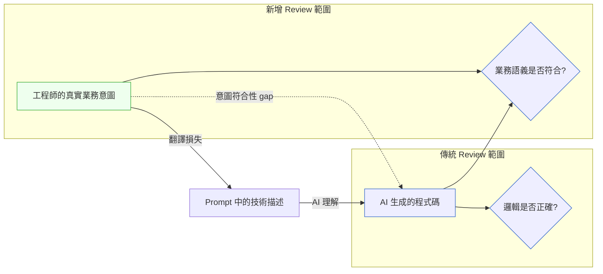

# 第 53 章|AI 程式碼的審計哲學
## ⸺ 從 LGTM 到意圖符合性驗證

> **前置閱讀**：[Ch 49 有效使用 AI 輔助](./ch-50-effective-ai-assistance.md)、[Ch 34 架構適應度函式](../part-06-engineering/ch-34-fitness-functions.md)
> **下游章節**：[Ch 53 工程直覺保護手冊](./ch-54-engineering-intuition.md)
> **延伸補章**：[Ch 45 Agentic QA](../part-07-ai-era/ch-46-agentic-qa.md)

---

## 44.1 冷觀察 ⸺ 測試全過，三週後訂單狀態靜默錯誤

2026 年第一季，虛構跨境電商 B2B 平台 **PortBridge**（`CASE-ECM-010`）正在推一個功能：跨時區訂單狀態同步。買賣雙方可能在不同時區，買方的「已確認」需要即時反映到賣方的系統，同時對接三個物流合作夥伴的 webhook。

Tech Lead 把需求 spec 和相關的 API 文件整理好，丟進 Claude Code。三十分鐘後，AI 生成了 240 行 Go 程式碼，涵蓋 webhook 接收、狀態解析、狀態更新、和錯誤處理。Engineer 做了快速 review：邏輯清楚、錯誤處理有、邊界條件看起來都有覆蓋、單元測試 36 個全過。PR 通過，上線。

三週後，客服開始收到投訴：有買方說「我已經確認訂單了，為什麼賣方那邊還顯示待確認？」工程師去查 log，webhook 有收到、狀態解析正確、資料庫更新紀錄也在。

問題在哪裡？

查了兩天才找到。PortBridge 的「已確認」在買方端和賣方端語義不同：

- **買方「已確認」（`buyer_confirmed`）**：買方按下確認鍵，代表「買方願意繼續這筆交易」，但訂單還沒進入不可取消狀態。
- **賣方「已確認」（`seller_confirmed`）**：賣方系統收到買方確認後，需要驗證庫存和付款授權，才會進入「賣方已確認」狀態。

AI 生成的程式碼假設「買方 `confirmed` → 更新訂單狀態為 `confirmed`」是一個原子操作，但 PortBridge 的業務邏輯要求這中間必須有賣方的庫存驗證步驟。這個步驟不在任何 AI 能讀到的 API 文件裡——它在一份三年前寫的「跨境訂單業務流程說明」PDF，存在某個 Confluence 頁面，連結已經失效。

CTO 在覆盤會上說了一句話：

> 「AI 讀懂了我們的 API，但沒讀懂我們的業務。這兩件事之間的差距，就是我們忘記 review 的那個部分。」

---

## 44.2 真問題 ⸺ AI 程式碼的 review 需要一個新的認識論

傳統的 Code Review 問一個問題：**「這段程式碼做的事情，邏輯上是對的嗎？」**

AI 程式碼的 review 需要問兩個問題：
1. **「這段程式碼做的事情，邏輯上是對的嗎？」**（傳統問題）
2. **「這段程式碼做的事情，是我真正想要它做的事嗎？」**（新問題）

這兩個問題不一樣。第一個問題用技術正確性回答。第二個問題用**意圖符合性**回答。

AI 在第一個問題上通常可靠——它見過太多程式碼，知道「這樣寫是對的」。AI 在第二個問題上系統性地有風險——因為它理解的「你想要什麼」，等於你給它的 prompt 的語義，不等於你腦袋裡真正的業務意圖。

PortBridge 的問題就是意圖符合性失敗：AI 正確地實作了「webhook 收到後更新狀態」這個技術需求，但沒有實作「買方確認需要觸發賣方庫存驗證才能改狀態」這個業務需求——因為後者從來沒有被明確地表達進 Context。



---

## 44.3 決策框架 ⸺ 三層 AI 程式碼審計框架

### 第一層：技術正確性（傳統 Review）

這一層和過去的 Code Review 基本一致，但有幾個 AI 特有的高風險區：

**AI 的三個高風險區**：

| 區域 | 為什麼高風險 | 重點看什麼 |
|---|---|---|
| **錯誤處理** | AI 傾向生成 happy path，錯誤處理常常只有 `catch(e) { log(e) }` | 每個錯誤路徑是否有明確的恢復或中止策略 |
| **邊界條件** | AI 用訓練資料裡的「通常邊界」，不是你的系統的真實邊界 | 空值、零值、最大值、並發情況是否被正確處理 |
| **安全假設** | AI 常對「呼叫者已驗證」做隱性假設 | 每個 API 端點的輸入驗證是否獨立、完整 |

### 第二層：意圖符合性驗證（新增）

這是 AI 程式碼 review 的核心新增項目。目標是驗證「AI 做的事是否等於我想要它做的事」。

**意圖符合性驗證的三個步驟**：

**步驟 1：把 AI 的隱性假設顯性化**

在 review 之前，問 AI：「你在寫這段程式碼的時候，做了哪些假設？」AI 通常能列出它自己的假設清單。把這些假設逐一對照業務需求，找出不一致的地方。

```
範例問題：
「你在實作訂單狀態同步時，你假設 buyer_confirmed 事件直接對應到
 什麼業務動作？你有沒有假設中間需要任何驗證步驟？」

AI 的回答（理想情況）：
「我假設 buyer_confirmed webhook 收到後，訂單狀態應直接更新為 confirmed。
 我沒有在 spec 裡看到中間需要庫存驗證的描述。」

→ 這就是意圖符合性 gap 的位置。
```

**步驟 2：逆向驗證——從業務語義往回找程式碼**

不是從程式碼往前看「這樣對嗎」，而是從業務語義往後找「這段業務規則在哪裡被實作了」。

對每一條業務規則，在 AI 生成的程式碼裡找到對應的實作。如果找不到——那就是 gap。

```
業務規則清單（手工整理）：
1. 買方確認 → 觸發賣方庫存驗證 → 驗證通過才更新狀態
2. 驗證失敗 → 訂單進入 pending_seller_review 狀態，不是失敗
3. 跨時區時，使用買方時間作為確認時間戳

在 AI 程式碼裡找：
1. ☐ 庫存驗證步驟在哪裡？→ 找不到
2. ☐ pending_seller_review 狀態在哪裡？→ 找不到
3. ☐ 時間戳邏輯在哪裡？→ 找到，在 line 87
```

**步驟 3：測試設計的業務覆蓋率**

AI 生成的測試通常覆蓋技術路徑，不一定覆蓋業務場景。在驗收 AI 的測試時，額外確認：每一條**業務規則**是否有對應的測試案例。

### 第三層：架構符合性（系統級）

AI 在局部的設計上通常合理，但不一定尊重整個系統的架構約定。這一層確認 AI 的輸出沒有違反已建立的架構規則。

**架構符合性檢查清單**：

```
☐ 依賴方向是否正確？（Clean Architecture：domain 不依賴 infrastructure）
☐ Bounded Context 邊界是否被尊重？
☐ API 契約是否和 spec 一致？
☐ 是否有違反 CLAUDE.md 中的禁止事項？
☐ 新引入的抽象是否和既有的命名慣例一致？
```

---

## 44.4 踩坑清單與交付清單

### 常見反模式

**反模式 1：橡皮圖章（Rubber-Stamp Review）**

測試全過 → LGTM。這個流程對傳統代碼已經有風險，對 AI 代碼更危險，因為 AI 的測試不保證業務語義覆蓋。

> **修正方向**：AI 程式碼的 review 時間不應該比人寫的程式碼短——它應該更長，因為需要多做意圖符合性驗證這一層。

---

**反模式 2：用「AI 寫的」解釋 PR**

「這段是 Claude 寫的，你看一下有沒有問題。」把理解責任轉移給 reviewer。reviewer 看的是「這段看起來合理嗎」，但沒有人知道「這段是不是你想要的」。

> **修正方向**：PR 描述應該包含：這段程式碼要解決的業務問題是什麼、AI 做了哪些假設（顯性化後）、reviewer 應重點確認什麼。

---

**反模式 3：只測試技術路徑，不測業務場景**

AI 生成了 36 個測試，全部針對不同的技術邊界（空指標、逾時、重試）。但沒有一個測試對應到「買方確認需要觸發賣方庫存驗證」這條業務規則。

> **修正方向**：在 PR 合入前，對照業務規則清單，確認每條規則有對應的測試案例。如果 AI 的測試沒有覆蓋，補寫。

---

**反模式 4：review 之後不追蹤意圖符合性問題**

在 review 中發現一個意圖符合性 gap，修正了，但沒有把這個 gap 的根本原因加進 CLAUDE.md 或 Failure Catalog。下一次同類任務，同樣的 gap 可能重複出現。

> **修正方向**：意圖符合性 gap 是 CLAUDE.md 和 Failure Catalog 的更新觸發器。每次發現一個，花五分鐘決定：這個業務規則是否應該進 CLAUDE.md？

---

### 交付清單

**可帶走 Artifact：AI 程式碼審計三層 Checklist**

```markdown
## AI 程式碼 Review — 三層審計清單
PR：______  審計者：______  日期：______

### 第一層：技術正確性
☐ 錯誤路徑：每個可能的失敗情況都有明確的處理策略（非只 log）
☐ 邊界條件：空值、零值、最大值、並發情況已確認
☐ 安全假設：每個輸入路徑都有獨立的驗證，無隱性信任假設

### 第二層：意圖符合性
☐ AI 的隱性假設已顯性化（詢問 AI「你做了哪些假設」）
☐ 業務規則清單已準備，每條規則在程式碼中找到對應實作
  - 規則 1：______  → 在 line ______
  - 規則 2：______  → 在 line ______（或 ☐ 未找到，待補）
☐ 測試業務覆蓋率確認：每條業務規則有對應測試案例

### 第三層：架構符合性
☐ 依賴方向正確（不違反 Clean Architecture / Hexagonal 等已定義規則）
☐ Bounded Context 邊界未被違反
☐ CLAUDE.md 禁止事項無違規
☐ 命名慣例一致

### 後續行動
☐ 發現的意圖符合性 gap 是否需要更新 CLAUDE.md？
☐ 是否需要新增 Failure Catalog 條目？
```

---

## 44.5 本章交付清單 Recap

讀完本章，你應該已經能做到：

- [ ] 說明「意圖符合性」與「技術正確性」的差距，以及 AI 程式碼 review 為何需要新增意圖符合性驗證
- [ ] 用三步驟執行意圖符合性驗證（顯性化假設 → 逆向驗證 → 業務覆蓋率確認）
- [ ] 完成「AI 程式碼審計三層 Checklist」，在 PR review 中覆蓋技術正確性、意圖符合性、架構符合性三層
- [ ] 識別意圖符合性 gap，並判斷是否需要更新 CLAUDE.md 或 Failure Catalog

如果先挑一項做，建議是 ⸺ **在下一個含有 AI 生成程式碼的 PR，先列出業務規則清單，再做逆向驗證**，理由是這個動作讓「意圖符合性」從抽象概念變成具體的可操作步驟，五分鐘就能有第一個輸出。

---

## Cross-References

- **前置閱讀**：[Ch 49 有效使用 AI 輔助](./ch-50-effective-ai-assistance.md)、[Ch 34 架構適應度函式](../part-06-engineering/ch-34-fitness-functions.md)
- **下游章節**：[Ch 53 工程直覺保護手冊](./ch-54-engineering-intuition.md)
- **延伸補章**：[Ch 45 Agentic QA](../part-07-ai-era/ch-46-agentic-qa.md)

## 引用

本章無外部文獻引用。

<!-- PROPOSED-REFS
glossary:
  - anchor: intent-conformance
    name: 意圖符合性（Intent Conformance）
    body: |
      AI 生成程式碼的審計維度之一：驗證 AI 實作的行為是否等於工程師真正想要的業務行為。
      有別於「技術正確性」（程式碼邏輯是否無誤），意圖符合性關注的是「業務語義是否被完整
      實現」。PortBridge 訂單狀態同步案例（Ch 52.1）是典型的意圖符合性失敗：技術上正確，
      業務語義上不完整。
-->
