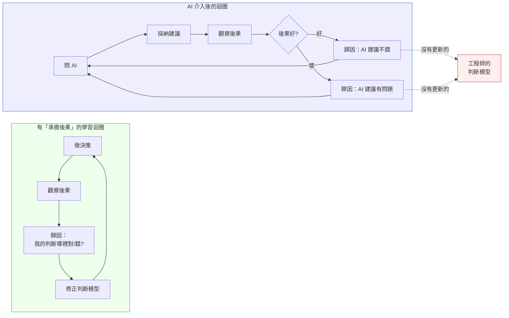
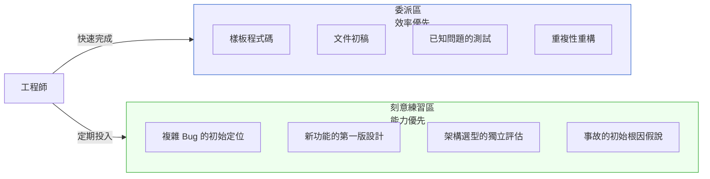

# Ch 53｜工程直覺保護手冊
## ⸺ 在 AI 加速下不讓判斷力退化

> **前置閱讀**：[Ch 50 人類不能外包的邊界](./ch-50-human-judgment-boundary.md)、[Ch 52 AI 程式碼的審計哲學](./ch-52-ai-code-audit.md)
> **下游章節**：[Ch 47 Capstone](../part-08-synthesis/ch-47-capstone.md)（全書收束）

---

## 53.1 冷觀察 ⸺ 六小時，找不到一個原本三十分鐘能解決的問題

2026 年第三季某個週三下午，虛構 SaaS 分析平台 **NovaDeck**（`CASE-SAS-012`）發生了一次生產環境的記憶體洩漏。症狀是：某個數據處理 worker 的 RSS（常駐記憶體大小）在過去六個小時持續爬升，從正常的 480MB 到 2.1GB，觸發了 OOM killer。

這本來是一個正常的 debug 任務。但這一天，Anthropic API 和 OpenAI API 同時發生服務中斷，Cursor、Claude Code、GitHub Copilot 全線不可用。

負責這個 worker 的 Engineer Leon，在這個 codebase 工作了兩年，是資深的 Go 工程師，入行八年。他打開 pprof、看了 heap dump、trace 了 goroutine 的生命週期。但兩個小時過去了，他沒有找到洩漏點。他嘗試了三個假說，都被排除了。第三個小時，他開始打開瀏覽器搜尋「Go memory leak goroutine channel」——這是他平常在入門工程師身上看到的行為，不是他自己的。

四個小時後，他的 Tech Lead 旁觀了一下，問他：「你有沒有想過是 event listener 沒有被 deregister？」

Leon 停頓了兩秒，打開 `event_bus.go`，看了 30 行，找到了。一個被 goroutine 持有的 channel 在特定條件下沒有被正確關閉，導致 goroutine 無法被 GC 回收。

修復花了三分鐘。

但事後 Leon 在團隊的 retrospective 上說了一句讓所有人沉默的話：

> 「這個問題，兩年前的我，三十分鐘就能找到。我不知道這兩年我把什麼東西搞丟了。」

事後覆盤：Leon 在過去兩年裡，debug 的方式從「觀察 → 形成假說 → 驗證 → 推進」演變成「描述問題 → 問 AI → 嘗試 AI 的建議 → 問 AI 為什麼不對 → 繼續嘗試」。他的 debug 能力沒有消失，但他的 debug 肌肉——那種從觀察中形成假說的直覺——已經因為長期不用而顯著退化。

---

## 53.2 真問題 ⸺ 工程直覺是易逝技能，AI 加速不會讓它自動保存

工程直覺（Engineering Intuition）是一種高度壓縮的知識形式。它是「看到這個錯誤訊息，第一反應是去看那裡」，是「這段程式碼感覺不對，說不出來為什麼，但後來確實在那裡找到了 bug」。

直覺不是神秘的東西——它是長時間、高密度接觸真實系統，形成的模式識別能力。問題是：**模式識別能力需要持續練習才能保持，如果長期被代替，它會退化**。

AI 工具正在系統性地接管工程師的某些判斷動作：

| 工程動作 | 過去的練習機制 | AI 介入後 |
|---|---|---|
| 技術選型 | 評估選項、做決策、承擔後果、修正 | 問 AI，採納建議，少了「承擔後果」這個回饋環 |
| Debug | 觀察 → 假說 → 驗證循環 | 描述問題 → AI 給方向 → 驗證 AI 的建議 |
| 程式碼設計 | 從需求到設計，填補空白 | 給 AI 需求，評估輸出，少了「從空白開始」的練習 |
| 錯誤處理設計 | 想「這裡能出什麼問題」 | AI 的錯誤處理看起來有，少了親自想的練習 |

每一個個別的委派都是合理的效率決策。累積在一起，就是 Leon 那兩年的經歷：合理的每一步，不合理的總和。

### 53.2.1 「承擔後果」的回饋環為什麼是直覺的燃料

上面的表裡，「技術選型」那一行特別值得停下來看。

過去的練習機制是：**評估選項 → 做決策 → 承擔後果 → 修正**。這個循環裡，「承擔後果」是關鍵步驟，不是因為它讓人痛苦，而是因為**它是讓大腦把「這個決定」和「它後來的結果」連結在一起的唯一機制**。沒有這個連結，就沒有模式識別；沒有模式識別，就沒有直覺。

工程師花三年時間在六個系統上做技術選型，每次選型後承擔那個選擇帶來的成本和收益——PostgreSQL 那次撐過了，Cassandra 那次後悔了，自幹佇列那次讓他在生產環境熬了兩個通宵——這些記憶壓縮成一種感覺：「下次看到這個需求形狀，要往哪個方向想。」

AI 介入之後，這個回饋環斷掉的方式有兩種：

**第一種是無意識的**：工程師問 AI，AI 給建議，工程師採納，事後好壞都歸因給 AI 的建議本身，而不是「我評估 AI 建議的判斷是對的還是錯的」。學習發生的地方是後者，但注意力放在前者，所以沒有學習。

**第二種是有意識的迴避**：這是更核心的問題，也是容易被忽視的那一面——**「AI 說的」是一個組織結構上有效的責任盾牌**。

當決策來自工程師自己，決策失敗時，工程師必須解釋「我為什麼做了這個選擇」，這個解釋的壓力會促使工程師事前想清楚。當決策來自 AI，失敗時可以說「AI 給的建議，我也沒想到會這樣」——這句話在很多組織裡是足夠的。它不是謊言，但它讓工程師跳過了「我評估 AI 建議的能力需要接受後果的修正」這個環節。

久了，就形成一種隱性的組織默契：AI 給建議，工程師執行，出了問題是 AI 的問題。這個默契對任何人都有短期好處（減少問責），但對工程師的長期判斷能力是結構性的損害——**因為他持續在做決策，但持續不需要承擔決策的後果，所以他的判斷能力停在了開始用 AI 的那一天**。



圖裡的關鍵是右側的歸因動作：不管結果好壞，歸因都指向「AI 的建議」，而不是「我評估 AI 建議的判斷」。工程師的判斷模型因此沒有輸入，沒有更新。

**打破這個迴圈的方式不是拒絕用 AI，而是主動把歸因拉回來**：

> 不是「這個 AI 建議好不好」，而是「我識別這個 AI 建議的好壞的能力，這次是準確的嗎？」

這個問題的轉向，才是讓「承擔後果」這個回饋環在 AI 時代仍然有效的關鍵操作。它要求工程師持續對自己的評估能力負責，而不只是對「有沒有問 AI」負責。

---

## 53.3 決策框架 ⸺ 工程直覺保護的三個設計

工程直覺的保護不是「少用 AI」，而是**有意識地設計哪些類型的練習不委派給 AI**。

### 53.3.1 刻意練習區的設計

把工程活動分成兩個區：



**刻意練習區的操作原則**：

1. **先獨立嘗試，再問 AI**：對於刻意練習區的任務，設定一個時間門檻（如 30 分鐘），在這段時間內獨立工作，不開 AI。時間到了，再用 AI 驗證或加速。
2. **保留「從空白開始」的任務**：每個 Sprint，至少有一個技術任務是從需求出發、自己做設計、不先問 AI。
3. **Debug 的第一個假說自己提**：收到 bug report，先花十五分鐘自己形成假說，再用 AI 驗證。不要讓「問 AI 是什麼問題」成為 debug 的第一步。

### 53.3.2 AI 輸出的解構練習

用 AI 輸出作為練習材料，而不只是使用材料。

每隔一段時間（建議每週一次），選一段 AI 生成的程式碼或設計建議，做以下練習：

1. **不看 AI 的解釋，自己讀一遍，說出這段程式碼在做什麼**
2. **找出你認為 AI 做的假設**
3. **設計三個你認為這段程式碼會失敗的邊界條件**
4. **如果這是你自己寫的，你會怎麼寫得不一樣？為什麼？**

這個練習的目的不是找 AI 的錯——是讓自己的批判性閱讀能力保持活躍。

### 53.3.3 建立個人的「無 AI 情境」清單

主動識別哪些情境下你**應該能在不依靠 AI 的情況下工作**，並定期驗證自己仍然可以：

```markdown
## 我的無 AI 能力清單（每季自我評估）

### 系統理解
☐ 能在三分鐘內口頭解釋這個系統的核心業務流程
☐ 能畫出這個系統最重要的三個資料流（不查文件）
☐ 能說出過去六個月最重要的三個架構決策，以及理由

### Debug 能力
☐ 給一個生產環境的 error log，能在三十分鐘內形成至少兩個有根據的假說
☐ 對一個新的 bug，能先做獨立分析再用 AI 驗證

### 設計能力
☐ 對一個新功能需求，能在二十分鐘內獨立產出一個設計草稿
☐ 能評估 AI 給的設計方案的優缺點，並說出你不同意的地方

### 判斷能力
☐ 能識別 AI 輸出中可能有業務語義問題的部分
☐ 能說出這個系統中「不能委給 AI 判斷」的五件事
```

這份清單每季評估一次。如果發現某個項目答不上來，那就是需要刻意練習的訊號。

---

## 53.4 踩坑清單與交付清單

### 常見反模式

**反模式 1：以效率為由跳過刻意練習**

「現在工作很忙，等有空了再說。」工程直覺的退化是漸進的，不容易被及時發現——直到你需要它的時候才知道它不在了，像 Leon 那樣。

> **修正方向**：把刻意練習設為固定的時間預算（如每週兩個小時），不是「有空再做」的事。效率和能力之間的平衡不是自然達成的，需要主動設計。

---

**反模式 2：AI 的解釋替代自己的理解**

「AI 解釋了這個 bug 的原因，我理解了。」但你理解的是 AI 的解釋，不一定是系統本身。下次遇到類似問題，AI 不在的時候，你仍然需要從觀察出發。

> **修正方向**：AI 的解釋是起點，不是終點。每次 AI 幫你解釋了一個問題，花額外的十分鐘獨立驗證——在系統裡找到對應的行為，讓理解從 AI 的語言層回到你自己對系統的直接觀察。

---

**反模式 3：忽略「感覺不對」的直覺訊號**

有時候你看一段 AI 生成的程式碼，有個隱隱的「感覺不對」，但說不出來為什麼，結果因為測試過了就合入了。三週後，那個感覺是對的。

> **修正方向**：工程直覺發出的訊號，即使說不清楚原因，也值得投入三十分鐘探索。說不清楚的直覺，通常是因為你在潛意識裡識別了一個你還沒有語言化的模式。把那個模式挖出來，語言化它，它就從直覺變成知識。

---

**反模式 4：把「善用 AI」詮釋成「讓 AI 做所有事」**

「善用 AI」是一種工具使用哲學，不等於「最大化 AI 的工作量」。善用工具的定義是：在最適合的地方用，在不適合的地方不用，清楚知道兩者的邊界。

> **修正方向**：「善用 AI」的評估標準不只是效率指標，也應該包括：「我的判斷能力在這個過程中是否被保留？」

---

### 交付清單

**可帶走 Artifact：工程直覺維護計畫（個人版）**

```markdown
## 工程直覺維護計畫
工程師：______  最後更新：______

## 1. 我的刻意練習區（不委派 AI 的任務類型）
1.
2.
3.

## 2. 每週刻意練習時間預算
目標：______ 小時 / 週
本週實際：______ 小時

## 3. 本季的無 AI 能力自我評估
（從 G.3.3 的清單，評估哪些能做到、哪些需要加強）

| 能力 | 上季狀態 | 本季狀態 | 行動計畫 |
|---|---|---|---|
|   |   |   |   |

## 4. 本季的 AI 輸出解構練習紀錄
（選一段 AI 輸出，做 G.3.2 的四個練習，記錄發現）

日期：______
選取的 AI 輸出：______
發現：

## 5. 本季的「感覺不對」訊號記錄
（記錄任何你有直覺但說不清楚的 AI 輸出，以及後來是否被驗證）

| 日期 | 訊號描述 | 後來驗證結果 | 語言化的模式 |
|---|---|---|---|
|   |   |   |   |
```

**可帶走 Artifact：團隊工程直覺健康指標**

```markdown
## 團隊工程直覺健康評估（每季）
團隊：______  評估者：______  日期：______

### 指標 1：獨立 Debug 能力
上季平均 P50 bug 解決時間（無 AI 輔助）：______
（基準：每人每季至少有三個 bug 完全不使用 AI 解決，作為能力基準）

### 指標 2：設計獨立性
上季有多少個功能，工程師做了完整的獨立設計草稿再交給 AI 驗證：______
（目標：> 30% 的新功能）

### 指標 3：直覺訊號轉化率
上季記錄的「感覺不對」訊號中，最終被確認正確的比例：______
（評估直覺校準度；比例過低代表過度謹慎，過高代表過度自信）

### 行動計畫
需要加強的能力：
本季刻意練習的重點：
```

---

## 53.5 本章交付清單 Recap

讀完本章，你應該已經能做到：

- [ ] 解釋「承擔後果回饋環」如何形成工程直覺，以及 AI 介入後迴圈斷裂的兩種機制
- [ ] 設計個人的「刻意練習區」，識別不應委派 AI 的三個以上任務類型
- [ ] 建立「無 AI 能力清單」並完成本季的初次自我評估
- [ ] 完成「工程直覺維護計畫（個人版）」第一版，含每週刻意練習時間預算

如果先挑一項做，建議是 ⸺ **完成「無 AI 能力清單」的一次自我評估**，理由是它只需要十五分鐘，但能立即讓你看見哪些工程能力已因長期委派而開始退化——這是整個直覺保護計畫的起點。

---

## Cross-References

- **前置閱讀**：[Ch 50 人類不能外包的邊界](./ch-50-human-judgment-boundary.md)、[Ch 52 AI 程式碼的審計哲學](./ch-52-ai-code-audit.md)
- **下游章節**：[Ch 47 Capstone](../part-08-synthesis/ch-47-capstone.md)（全書收束）

## 引用

本章無外部文獻引用。

<!-- PROPOSED-REFS
glossary:
  - anchor: engineering-intuition
    name: 工程直覺（Engineering Intuition）
    body: |
      工程師透過長時間、高密度接觸真實系統所形成的高度壓縮模式識別能力。它是「看到這個
      錯誤訊息，第一反應是去看那裡」的能力，其核心燃料是「承擔後果」的回饋環——決策 →
      觀察後果 → 歸因 → 修正判斷模型。AI 介入後，若後果歸因指向「AI 建議」而非「工程師
      評估 AI 建議的能力」，該回饋環中斷，直覺退化。見 Ch 53.2.1。
-->
