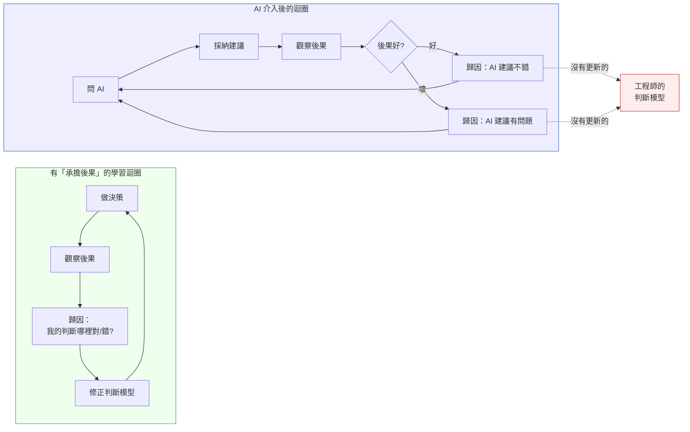
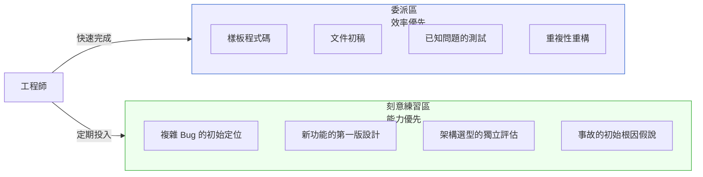

# 第 54 章｜工程直覺保護手冊
## ⸺ 在 AI 加速下不讓判斷力退化

> **前置閱讀**：[Ch 51 人類不能外包的邊界](./ch-51-human-judgment-boundary.md)、[Ch 53 AI 程式碼的審計哲學](./ch-53-ai-code-audit.md)
> **下游章節**：[Ch 48 Capstone](../part-08-synthesis/ch-48-capstone.md)（全書收束）

---

## 54.1 冷觀察 ⸺ 六小時，找不到一個原本三十分鐘能解決的問題

2026 年第三季某個週三下午，虛構 SaaS 分析平台 **NovaDeck**（`CASE-SAS-012`）發生了一次生產環境的記憶體洩漏。症狀是：某個數據處理 worker 的 RSS（常駐記憶體大小）在過去六個小時持續爬升，從正常的 480MB 到 2.1GB，觸發了 OOM killer。

負責這個 worker 的 Engineer Leon，在這個 codebase 工作了兩年，是資深的 Go 工程師，入行八年。他打開 pprof、看了 heap dump、trace 了 goroutine 的生命週期——然後，跟過去兩年裡每一次 debug 一樣，他切換到 Cursor，把 pprof 輸出貼進去，問：「這段 heap profile 顯示什麼洩漏模式？」

AI 給出了三個方向：sync.Map 的競爭條件、HTTP client 沒有被正確關閉、goroutine 在 context 取消後沒有退出。Leon 逐一嘗試，花了兩個小時，全部排除。他繼續問 AI，AI 繼續給新的方向。第三個小時，他意識到自己陷入了一個循環：他沒有在閱讀系統，他在執行 AI 給的 checklist。

問題的關鍵線索其實就在他最初看的 heap dump 裡——goroutine 數量在特定 API 路徑觸發後線性成長，這是一個很典型的 event listener 未被 deregister 的特徵。兩年前，Leon 會在二十分鐘內形成這個假說。（這不是自我安慰。Tech Lead Maya 記得 2024 年 Q2 有一次 staging 環境的 goroutine 池在壓測後沒有回落，Leon 獨立讀了 pprof trace，十八分鐘後在站會裡說出了根因：一個 HTTP client 在 redirect 路徑沒有被 close。那次他沒有問任何人。）但這一天，他沒有形成任何假說，他只是在把觀察資料不斷喂給 AI，等待 AI 告訴他去哪裡看。

四個小時後，他的 Tech Lead 旁觀了一下，問他：「你有沒有想過是 event listener 沒有被 deregister？」

Leon 停頓了兩秒，打開 `event_bus.go`，看了 30 行，找到了。一個被 goroutine 持有的 channel 在特定條件下沒有被正確關閉，導致 goroutine 無法被 GC 回收。

修復花了三分鐘。

但事後 Leon 在團隊的 retrospective 上說了一句讓所有人沉默的話：

> 「這個問題，兩年前的我，三十分鐘就能找到。AI 工具都在，我就是看不到。我不知道這兩年我把什麼東西搞丟了。」

事後覆盤：Leon 的問題不是 AI 不好用，而是他已經停止獨立形成假說超過兩年。每次 debug，第一步是問 AI，觀察資料的作用變成「找到足夠描述問題的語言來問 AI」，而不是「從觀察中生成假說」。這個轉變發生在每一個合理的效率決策裡，沒有任何一天是錯的——但累積下來，「從觀察到假說」這條肌肉長期閒置，悄悄退化了。AI 工具全程可用，但 Leon 缺少的那個東西，AI 無法代替：在看到資料的前三分鐘，那個腦袋裡安靜運作的模式識別。

---

## 54.2 真問題 ⸺ 工程直覺是易逝技能，AI 加速不會讓它自動保存

工程直覺（Engineering Intuition）是一種高度壓縮的知識形式。它是「看到這個錯誤訊息，第一反應是去看那裡」，是「這段程式碼感覺不對，說不出來為什麼，但後來確實在那裡找到了 bug」。

直覺不是神秘的東西——它是長時間、高密度接觸真實系統，形成的模式識別能力。問題是：**模式識別能力需要持續練習才能保持，如果長期被代替，它會退化**。

AI 工具正在系統性地接管工程師的某些判斷動作：

| 工程動作 | 過去的練習機制 | AI 介入後 |
|---|---|---|
| 技術選型 | 評估選項、做決策、承擔後果、修正 | 問 AI，採納建議，少了「承擔後果」這個回饋環 |
| Debug | 觀察 → 假說 → 驗證循環 | 描述問題 → AI 給方向 → 驗證 AI 的建議 |
| 程式碼設計 | 從需求到設計，填補空白 | 給 AI 需求，評估輸出，少了「從空白開始」的練習 |
| 錯誤處理設計 | 想「這裡能出什麼問題」 | AI 的錯誤處理看起來有，少了親自想的練習 |

每一個個別的委派都是合理的效率決策。累積在一起，就是 Leon 那兩年的經歷：合理的每一步，不合理的總和。

### 54.2.1 「承擔後果」的回饋環為什麼是直覺的燃料

上面的表裡，「技術選型」那一行特別值得停下來看。

過去的練習機制是：**評估選項 → 做決策 → 承擔後果 → 修正**。這個循環裡，「承擔後果」是關鍵步驟，不是因為它讓人痛苦，而是因為**它是讓大腦把「這個決定」和「它後來的結果」連結在一起的唯一機制**。沒有這個連結，就沒有模式識別；沒有模式識別，就沒有直覺。

工程師花三年時間在六個系統上做技術選型，每次選型後承擔那個選擇帶來的成本和收益——PostgreSQL 那次撐過了，Cassandra 那次後悔了，自幹佇列那次讓他在生產環境熬了兩個通宵——這些記憶壓縮成一種感覺：「下次看到這個需求形狀，要往哪個方向想。」

AI 介入之後，這個回饋環斷掉的方式有兩種：

**第一種是無意識的**：工程師問 AI，AI 給建議，工程師採納，事後好壞都歸因給 AI 的建議本身，而不是「我評估 AI 建議的判斷是對的還是錯的」。學習發生的地方是後者，但注意力放在前者，所以沒有學習。

**第二種是有意識的迴避**：這是更核心的問題，也是容易被忽視的那一面——**「AI 說的」是一個組織結構上有效的責任盾牌**。

當決策來自工程師自己，決策失敗時，工程師必須解釋「我為什麼做了這個選擇」，這個解釋的壓力會促使工程師事前想清楚。當決策來自 AI，失敗時可以說「AI 給的建議，我也沒想到會這樣」——這句話在很多組織裡是足夠的。它不是謊言，但它讓工程師跳過了「我評估 AI 建議的能力需要接受後果的修正」這個環節。

這裡需要停下來釐清一個關鍵區別：**工程師不一定是「主動想逃避責任」**，更常見的情況是組織的**決策歸責模式**在無意間強化了這個行為。在「決策失敗追責」文化明顯的團隊裡，使用 AI 建議的工程師在出問題時只需要說「我是按照工具的建議執行的」——管理層通常也沒有更好的反駁依據，因為 AI 建議在這個情境下是「最佳實踐的代理人」。這種文化下，謹慎的工程師會理性地學到：多問 AI、少做個人判斷，是降低職業風險的策略。設想 NovaDeck 的 Leon 如果在一個每次事故後都要個人說明「你當時為什麼做這個選擇」的團隊——他多問 AI、少做個人判斷，完全是一個理性的自我保護決策，而不是懶惰。問題不在 Leon，而在這個結構下，他的判斷能力沒有足夠的使用機會，也沒有足夠的後果回饋，自然就退化了。

久了，就形成一種隱性的組織默契：AI 給建議，工程師執行，出了問題是 AI 的問題。這個默契對任何人都有短期好處（減少問責），但對工程師的長期判斷能力是結構性的損害——**因為他持續在做決策，但持續不需要承擔決策的後果，所以他的判斷能力停在了開始用 AI 的那一天**。



圖裡的關鍵是右側的歸因動作：不管結果好壞，歸因都指向「AI 的建議」，而不是「我評估 AI 建議的判斷」。工程師的判斷模型因此沒有輸入，沒有更新。

**打破這個迴圈的方式不是拒絕用 AI，而是主動把歸因拉回來**：

> 不是「這個 AI 建議好不好」，而是「我識別這個 AI 建議的好壞的能力，這次是準確的嗎？」

這個問題的轉向，才是讓「承擔後果」這個回饋環在 AI 時代仍然有效的關鍵操作。它要求工程師持續對自己的評估能力負責，而不只是對「有沒有問 AI」負責。

### 54.2.2 不只是 Debug：AI 正在侵蝕的五種工程能力

Leon 的案例是 debug 能力的退化，但這不是孤立的例子。研究與現場觀察指向同一個模式：**AI 代替的不只是執行，更在代替思考的準備動作**。以下五個領域的退化，都有實證支撐。

**1. Debug 直覺（本章核心案例）**
已見於 §54.1。退化機制：「描述問題 → 等待 AI 方向」取代「觀察 → 假說 → 驗證」的循環，讓「從資料生成假說」這條肌肉長期閒置。Anthropic（2026）的隨機對照試驗（N=52）發現，使用 AI 輔助學習新程式庫的工程師，在 debug 題型上的理解分數比對照組低 17%——差距最大的正是需要從觀察自行推斷的問題。

**2. 架構設計能力**
工程師在新功能設計的第一步，從「在白板畫出初始拓樸」變成「給 AI 需求、評估輸出」。長期下來，「從空白開始設計」的能力弱化：具體表現是拿到需求，腦袋裡不會自動形成第一版草圖，而是本能地打開 AI 等答案。Xu 等人（arXiv，2025）記錄了這個現象：資深工程師在頻繁使用 AI coding 工具後，在架構層次的判斷能力出現可量測的退步——AI 生成的程式碼缺乏架構考量，而工程師在 review 時也越來越難識別這些問題，因為他們做獨立架構設計的練習越來越少。

**3. Code Review 的批判性閱讀**
Catalan 等人（Samsung / CHI-Tools 2026）用民族誌研究記錄了一個典型模式：工程師在 review AI 生成的程式碼時，認知投入度隨著任務進行持續下降，最終以「表面性接受」收尾。受訪者的原話是 *"I'm not reading all of that"*。這不是個別人的懶惰，而是 agentic 工具的介面設計提供了太少反思與驗證的著力點，導致深度閱讀的習慣被系統性侵蝕。長期後果：無法識別 AI 輸出中邏輯正確但業務語義有問題的程式碼。

**4. 批判性思考與系統性評估**
Microsoft Research 與 Carnegie Mellon University（Lee 等人，CHI 2025）針對 319 名知識工作者收集 936 個 AI 使用第一手案例，發現高度信任 AI 與批判性思考投入顯著負相關：工作者主動將評估、綜合、生成等思考動作外包給 AI，自身的批判性評估能力因此退化。論文將此稱為「萎縮悖論」（atrophy paradox）：自動化移除了例行練習的機會，讓工作者在面對例外狀況時「已萎縮且沒有準備」。SBS Swiss Business School 的 Gerlich（2025，N=666，*Societies* / MDPI）也在跨行業調查中發現，AI 工具使用頻率與批判性思考能力之間存在顯著負相關，且在 17–25 歲的最年輕族群中差距最大。

**5. 跨領域的最強直接實證：醫療診斷（平行案例）**
2025 年《刺胳針腸胃科》（*Lancet Gastroenterology & Hepatology*）的隨機對照試驗（N=1,443 名患者，Romańczyk 等人）提供了迄今最強的 AI 技能侵蝕實證：接受 AI 輔助訓練的內視鏡醫師，在撤除 AI 後，息肉偵測率從 28.4% 降至 22.4%，退步幅度達 **20%**——相當於喪失整個訓練期的進步。Romańczyk 將此比喻為「Google Maps 效應」：依賴形成很快，基線能力的損耗卻要到工具不在的那天才被發現。軟體工程中的對應場景是：生產環境安全限制、AI 服務中斷、或入職一個禁用 AI 的客戶環境——工程師突然需要完全獨立工作的那一天。

**研究匯整**

| 退化領域 | 最強實證 | 關鍵發現 |
|---|---|---|
| Debug 直覺 | Anthropic RCT（2026，N=52） | AI 輔助組 debug 理解分數低 17% |
| 架構設計判斷 | Xu 等人（arXiv，2025） | 資深工程師架構判斷力可量測退步 |
| Code Review 深度 | Catalan 等人（Samsung/CHI，2026） | 認知投入持續下降，表面性接受成主流 |
| 批判性思考 | Lee 等人 / Microsoft Research（CHI，2025，N=319） | AI 信任越高，批判性思考投入越低 |
| 臨床診斷（平行） | Romańczyk/Lancet（2025，N=1,443） | AI 撤除後診斷能力退步 20% |

共同機制：**認知外包（cognitive offloading）在每一個合理的效率決策裡發生，在累積的尺度上讓練習機會消失，讓技能退化在不知不覺中完成**——Macnamara 等人（2024，*Cognitive Research: Principles and Implications*）將此命名為「能力幻覺」（illusion of competence）：專業人士在自我評估上仍然自信，但實際表現已悄悄退步，因為不再有機會發現差距。Leon 那六個小時，是能力幻覺終於被戳破的一刻。

---

## 54.3 決策框架 ⸺ 工程直覺保護的三個設計

工程直覺的保護不是「少用 AI」，而是**有意識地設計哪些類型的練習不委派給 AI**。

### 54.3.1 刻意練習區的設計

把工程活動分成兩個區：



**刻意練習區的操作原則**：

1. **先獨立嘗試，再問 AI**：對於刻意練習區的任務，設定一個時間門檻（如 30 分鐘），在這段時間內獨立工作，不開 AI。時間到了，再用 AI 驗證或加速。
2. **保留「從空白開始」的任務**：每個 Sprint，至少有一個技術任務是從需求出發、自己做設計、不先問 AI。
3. **Debug 的第一個假說自己提**：收到 bug report，先花十五分鐘自己形成假說，再用 AI 驗證。不要讓「問 AI 是什麼問題」成為 debug 的第一步。

### 54.3.1.1 組織誘因對齊：讓刻意練習在 Sprint 裡生存

以上原則在個人層面是清楚的，但在組織層面有一個結構性阻力：**刻意練習在短期內看起來像速度變慢**。一個工程師在 debug 的前三十分鐘不開 AI，對 PM 和 Tech Lead 的 velocity 看板而言，他是在「慢」。

這個誘因不對齊如果不主動處理，刻意練習會在第一個緊迫 Sprint 裡被吞掉，然後再也回不來。

**需要在團隊層面做三件事**：

第一，**把刻意練習時間正式化為能力投資預算**，而不是個人選擇。就像技術債需要 sprint budget 一樣，工程判斷力維護也需要保護的時間。建議的談法：

> 「我們每週保留 X 小時給工程判斷力維護——這段時間裡，某些 debug 和設計任務會在不依賴 AI 的狀態下進行。短期這看起來像慢，長期這保護了團隊在複雜情境下不依賴工具就能做出正確判斷的能力。我們用『能夠獨立解決 [特定類型問題]』這個具體的能力指標來衡量效果，而不是靠感覺。」

第二，**定義可衡量的能力指標（Q 指標）**，讓投資有可見的回報：

```markdown
## 團隊 Q 指標（每季更新）
Q：工程師在不使用 AI 工具的情況下，能獨立解決 [任務類型] 的能力

示例：
- Q-Debug：每人每季至少三個 P2 以上的 bug，完全不使用 AI 解決，記錄耗時
- Q-Design：每人每季至少一個功能，獨立產出設計草稿再用 AI 驗證
- Q-OncallHypothesis：oncall 時，初始假說由人提出而非 AI，比例 > 70%
```

第三，**讓它成為協商的團隊規範，而不是個人英雄主義**。個別工程師單獨說「我要先自己試三十分鐘」，在緊急時刻難以堅持，也容易被解讀為固執。當它是團隊明確定義的工作方式，有對應的 sprint budget 和 Q 指標，才有辦法在真實的交付壓力下存活。

**常見實施挑戰**

以上三件事在資源緊張、管理層以短期交付為優先的組織裡，往往面臨三個真實障礙：

**障礙一：Sprint 計畫的時間保護**。在 Scrum 框架下，每個 sprint 的容量（capacity）已被功能票佔滿，「刻意練習時間」在計畫會議上很容易被 PM 視為未產出的浪費。應對方式是**換個問法**——不要說「保留 X 小時給練習」，而是說「部分 P2 bug 的解決過程我們不採用 AI 直接診斷，這是能力基準維護，預計比平均多 30 分鐘」。把能力投資包裝在具體的工作任務裡，而不是作為額外的時間預算提案。

**障礙二：Q 指標與功能交付的帳目衝突**。Q 指標衡量的是「獨立能力」，但 sprint review 展示的是「功能上線」，兩者不在同一個計分板。建議的解法是：Q 指標只在**季度技術健康評估**（而非 sprint review）裡呈現，聽眾是 Tech Lead 和 Engineering Manager，而不是 PM 和 Stakeholder，讓它在正確的評估週期被看見，而不是被錯誤的比較框架干擾。

**障礙三：Q 指標被扭曲為績效懲罰**。如果某個工程師某季 Q-Debug 指標未達，會不會成為績效考核的負面依據，進而誘發反向效果——工程師刻意拒絕使用 AI 工具以達標，而不是真正在練習能力？處理方式是**明確定義 Q 指標的歸因邏輯**：它衡量的是「這個季度有沒有完成獨立練習的機會」，而不是「工程師的能力高低」，且應配合個人成長計畫（IDP）使用，而非直接接入薪酬或晉升計算。

**一個可參考的落地案例**：某 B2B SaaS 團隊（六人，兩年前採用此框架）將「每人每季三個 P2 bug 不用 AI 解決」寫進工作協議，並約定：若當季 Sprint 負擔過重（velocity 超出 20%），該季 Q 指標延後而非取消。兩年後的觀察是：oncall 假說準確率從 52% 上升到 71%，Tech Lead 說最大的改變是「工程師在問 AI 之前，開始有一個自己的初始想法了，即使只是對的一半」。

### 54.3.2 AI 輸出的解構練習

用 AI 輸出作為練習材料，而不只是使用材料。

每隔一段時間（建議每週一次），選一段 AI 生成的程式碼或設計建議，做以下練習：

1. **不看 AI 的解釋，自己讀一遍，說出這段程式碼在做什麼**
2. **找出你認為 AI 做的假設**
3. **設計三個你認為這段程式碼會失敗的邊界條件**
4. **反事實設計：在以下兩個方向選一個，進行具體推演**
   - **系統約束方向**：「根據這個系統目前的 [具體約束，如：單 worker 最大記憶體上限 / 最大並發量 / 資料規模]，AI 的設計在哪個點會開始失效？你會怎麼改？」——這個問法強迫你把設計決策錨定在真實系統條件上，而不是開放式的風格偏好。
   - **需求變更方向**：「如果這個功能需求改成 [一個常見的延伸場景，如：從單租戶改成多租戶 / 從同步改成非同步 / 從小資料量改成大資料量]，AI 的設計會在哪裡失效？你會從哪裡改起？」——這個問法測試的是你對架構邊界的識別能力，而非單純的語法偏好。

   注意：這個練習**不是在挑 AI 的文字格式或命名風格**，而是在驗證你能否識別 AI 設計在系統約束或需求變化下的失效點。這才是架構判斷能力的可量測練習。

這個練習的目的不是找 AI 的錯——是讓自己的批判性閱讀能力保持活躍。

### 54.3.3 建立個人的「無 AI 情境」清單

主動識別哪些情境下你**應該能在不依靠 AI 的情況下工作**，並定期驗證自己仍然可以：

```markdown
## 我的無 AI 能力清單（每季自我評估）

### 系統理解
☐ 能在三分鐘內口頭解釋這個系統的核心業務流程
☐ 能畫出這個系統最重要的三個資料流（不查文件）
☐ 能說出過去六個月最重要的三個架構決策，以及理由

### Debug 能力
☐ 給一個生產環境的 error log，能在三十分鐘內形成至少兩個有根據的假說
☐ 對一個新的 bug，能先做獨立分析再用 AI 驗證

### 設計能力
☐ 對一個新功能需求，能在二十分鐘內獨立產出一個設計草稿
☐ 能評估 AI 給的設計方案的優缺點，並說出你不同意的地方

### 判斷能力
☐ 能識別 AI 輸出中可能有業務語義問題的部分
☐ 能說出這個系統中「不能委給 AI 判斷」的五件事
```

這份清單每季評估一次。如果發現某個項目答不上來，那就是需要刻意練習的訊號。

---

## 54.4 踩坑清單

### 常見反模式

**反模式 1：以效率為由跳過刻意練習**

「現在工作很忙，等有空了再說。」工程直覺的退化是漸進的，不容易被及時發現——直到你需要它的時候才知道它不在了，像 Leon 那樣。

> **修正方向**：把刻意練習設為固定的時間預算（如每週兩個小時），不是「有空再做」的事。效率和能力之間的平衡不是自然達成的，需要主動設計。

---

**反模式 2：AI 的解釋替代自己的理解**

「AI 解釋了這個 bug 的原因，我理解了。」但你理解的是 AI 的解釋，不一定是系統本身。下次遇到類似問題，AI 不在的時候，你仍然需要從觀察出發。

> **修正方向**：AI 的解釋是起點，不是終點。每次 AI 幫你解釋了一個問題，花額外的十分鐘獨立驗證——在系統裡找到對應的行為，讓理解從 AI 的語言層回到你自己對系統的直接觀察。

---

**反模式 3：忽略「感覺不對」的直覺訊號**

有時候你看一段 AI 生成的程式碼，有個隱隱的「感覺不對」，但說不出來為什麼，結果因為測試過了就合入了。三週後，那個感覺是對的。

> **修正方向**：工程直覺發出的訊號，即使說不清楚原因，也值得投入三十分鐘探索。說不清楚的直覺，通常是因為你在潛意識裡識別了一個你還沒有語言化的模式。把那個模式挖出來，語言化它，它就從直覺變成知識。

---

**反模式 4：把「善用 AI」詮釋成「讓 AI 做所有事」**

「善用 AI」是一種工具使用哲學，不等於「最大化 AI 的工作量」。善用工具的定義是：在最適合的地方用，在不適合的地方不用，清楚知道兩者的邊界。

> **修正方向**：「善用 AI」的評估標準不只是效率指標，也應該包括：「我的判斷能力在這個過程中是否被保留？」

---

## 54.5 交付清單 ⸺ 一頁式工程直覺維護計畫

**可帶走 Artifact：工程直覺維護計畫（個人版）**

````markdown
## 工程直覺維護計畫
> 版本:v0.1 | 撰寫日期:YYYY-MM-DD | 擁有人:{名字}
工程師：______  最後更新：______

## 1. 我的刻意練習區（不委派 AI 的任務類型）
1.
2.
3.

## 2. 每週刻意練習時間預算
目標：______ 小時 / 週
本週實際：______ 小時

## 3. 本季的無 AI 能力自我評估
（從 §54.3.3 的清單，評估哪些能做到、哪些需要加強）

| 能力 | 上季狀態 | 本季狀態 | 行動計畫 |
|---|---|---|---|
|   |   |   |   |

## 4. 本季的 AI 輸出解構練習紀錄
（選一段 AI 輸出，做 §54.3.2 的四個練習，記錄發現）

日期：______
選取的 AI 輸出：______
發現：

## 5. 本季的「感覺不對」訊號記錄
（記錄任何你有直覺但說不清楚的 AI 輸出，以及後來是否被驗證）

| 日期 | 訊號描述 | 後來驗證結果 | 語言化的模式 |
|---|---|---|---|
|   |   |   |   |
````

**可帶走 Artifact：團隊工程直覺健康指標**

````markdown
## 團隊工程直覺健康評估（每季）
> 版本:v0.1 | 撰寫日期:YYYY-MM-DD | 擁有人:{名字}
團隊：______  評估者：______  日期：______

### 指標 1：獨立 Debug 能力
上季平均 P50 bug 解決時間（無 AI 輔助）：______
（基準：每人每季至少有三個 bug 完全不使用 AI 解決，作為能力基準）

### 指標 2：設計獨立性
上季有多少個功能，工程師做了完整的獨立設計草稿再交給 AI 驗證：______
（目標：> 30% 的新功能）

### 指標 3：直覺訊號轉化率
上季記錄的「感覺不對」訊號中，最終被確認正確的比例：______
（評估直覺校準度；比例過低代表過度謹慎，過高代表過度自信）

### 行動計畫
需要加強的能力：
本季刻意練習的重點：
````

把它存在 `docs/engineering-practices/`，跟程式碼同 repo，跟 README 同層。

---

### 54.5.1 範例：Leon 的個人版維護計畫，在 API outage 那天之前就該寫的

NovaDeck（`CASE-SAS-012`）的 Leon 在 retrospective 上那句「兩年前的我三十分鐘就能找到」是個遲來的告警。下面這份是他在事故後第一份親自填的版本——時間倒回一年，這頁如果存在,那次 OOM 不會用掉六小時：

````markdown
## 工程直覺維護計畫
> 版本:v0.2 | 撰寫日期:2026-09-15 | 擁有人:Leon
工程師：Leon（資深 Go / 入行 8y / 此 codebase 2y）
最後更新：2026-09-15（API outage 後第二週）

## 1. 我的刻意練習區（不委派 AI 的任務類型）
<!-- 為什麼這欄:這三類是 Leon 兩年前還能 30 分鐘解掉、現在六小時找不到的東西;
     不主動圈出來,效率指標會在「合理的每一步、不合理的總和」裡持續損耗它們。 -->
1. 生產環境記憶體 / goroutine 洩漏的初始假說（不開 Cursor）
2. 新功能的第一版設計草稿（先白板 20 分鐘，再丟 AI 驗證）
3. 事故根因的初始定位（pprof / heap dump / log 我先讀 30 分鐘）

## 2. 每週刻意練習時間預算
目標：4 小時 / 週   本週實際：2.5 小時（被會議切碎，下週改週四下午整段）

## 3. 本季的無 AI 能力自我評估
| 能力 | 上季狀態 | 本季狀態 | 行動計畫 |
|---|---|---|---|
| 三分鐘口頭解釋核心業務流 | ✅ | ✅ | 維持 |
| Go 記憶體洩漏假說（不查資料） | ⚠️ 退化 | 🚧 練習中 | 每週挑一個歷史 OOM ticket 重做 |
| 對新需求二十分鐘獨立草稿 | ⚠️ 退化 | 🚧 練習中 | 下個 Sprint 接 1 張票全程不開 Cursor |
| 識別 AI 輸出的業務語義問題 | ✅ | ✅ | 維持 |

## 4. 本季的 AI 輸出解構練習紀錄
日期：2026-09-10
選取的 AI 輸出:Claude 為 metrics worker 寫的批次處理函式 78 行
發現:AI 假設 input slice 不會超過 10K，但 NovaDeck 的某個租戶會送 80K；
     AI 沒處理 channel 在 panic 路徑下的 close（與這次 OOM 同類）

## 5. 本季的「感覺不對」訊號記錄
<!-- 為什麼這欄:說不清楚的直覺通常就是還沒語言化的模式;
     寫下來、追到底,直覺就轉成可教給隊友的知識。 -->
| 日期 | 訊號描述 | 後來驗證結果 | 語言化的模式 |
|---|---|---|---|
| 2026-08-22 | AI 寫的 worker 看了「感覺像會洩漏」但說不出來 | 一週後 staging 確認 channel 未關 | **goroutine 持有 channel + 條件分支退出** = 高風險模式 |
| 2026-09-08 | 一段 retry 邏輯「感覺次數有點奇怪」 | 壓測時果然指數退避錯設 | retry budget 與 jitter 必須一起看，不能分開讀 |
````
這頁不是反 AI 宣言,**是一份個人的回饋環復原計畫**;那六小時找不到的 30 分鐘問題,從這頁第一次被填寫的那天起就開始償還。

---

## 54.6 本章交付清單 Recap

讀完本章，你應該已經能做到：

- [ ] 解釋「承擔後果回饋環」如何形成工程直覺，以及 AI 介入後迴圈斷裂的兩種機制
- [ ] 設計個人的「刻意練習區」，識別不應委派 AI 的三個以上任務類型
- [ ] 建立「無 AI 能力清單」並完成本季的初次自我評估
- [ ] 完成「工程直覺維護計畫（個人版）」第一版，含每週刻意練習時間預算

如果先挑一項做，建議是 ⸺ **完成「無 AI 能力清單」的一次自我評估**，理由是它只需要十五分鐘，但能立即讓你看見哪些工程能力已因長期委派而開始退化——這是整個直覺保護計畫的起點。

---

## Cross-References

- **前置閱讀**：[Ch 51 人類不能外包的邊界](./ch-51-human-judgment-boundary.md)、[Ch 53 AI 程式碼的審計哲學](./ch-53-ai-code-audit.md)
- **下游章節**：[Ch 48 Capstone](../part-08-synthesis/ch-48-capstone.md)（全書收束）

## 引用

| # | 作者 | 標題 | 來源 | 年份 |
|---|---|---|---|---|
| R1 | Shen, J.H. & Tamkin, A. | How AI Assistance Impacts the Formation of Coding Skills | Anthropic Research | 2026 |
| R2 | Lee, H.-P. et al. | The Impact of Generative AI on Critical Thinking: Self-Reported Reductions in Cognitive Effort and Confidence Effects from a Survey of Knowledge Workers | Microsoft Research / CHI 2025 | 2025 |
| R3 | Gerlich, M. | AI Tools in Society: Impacts on Cognitive Offloading and the Future of Critical Thinking | *Societies* (MDPI) 15(1):6 | 2025 |
| R4 | Macnamara, B.N. et al. | Does Using Artificial Intelligence Assistance Accelerate Skill Decay and Hinder Skill Development Without Performers' Awareness? | *Cognitive Research: Principles and Implications* (Springer/PMC) | 2024 |
| R5 | Xu, F. et al. | AI-Assisted Programming Decreases the Productivity of Experienced Developers by Increasing the Technical Debt and Maintenance Burden | arXiv:2510.10165 | 2025 |
| R6 | Catalan, C.R. et al. | "I'm Not Reading All of That": Understanding Software Engineers' Level of Cognitive Engagement with Agentic Coding Assistants | Samsung / CHI-Tools for Thought Workshop; arXiv:2603.14225 | 2026 |
| R7 | Romańczyk, M. et al. | AI-assisted colonoscopy training and deskilling after AI withdrawal | *Lancet Gastroenterology & Hepatology* | 2025 |
| R8 | Romeo, G. & Conti, D. | Exploring Automation Bias in Human-AI Collaboration: A Review and Implications for Explainable AI | *AI & Society* (Springer) | 2025 |
| R9 | Storey, M.-A. | From Technical Debt to Cognitive and Intent Debt: Rethinking Software Health in the Age of AI | arXiv:2603.22106 | 2026 |

<!-- PROPOSED-REFS
glossary:
  - anchor: engineering-intuition
    name: 工程直覺（Engineering Intuition）
    body: |
      工程師透過長時間、高密度接觸真實系統所形成的高度壓縮模式識別能力。它是「看到這個
      錯誤訊息，第一反應是去看那裡」的能力，其核心燃料是「承擔後果」的回饋環——決策 →
      觀察後果 → 歸因 → 修正判斷模型。AI 介入後，若後果歸因指向「AI 建議」而非「工程師
      評估 AI 建議的能力」，該回饋環中斷，直覺退化。見 Ch 53.2.1。
-->
